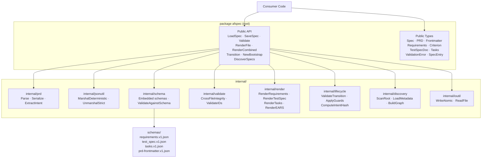
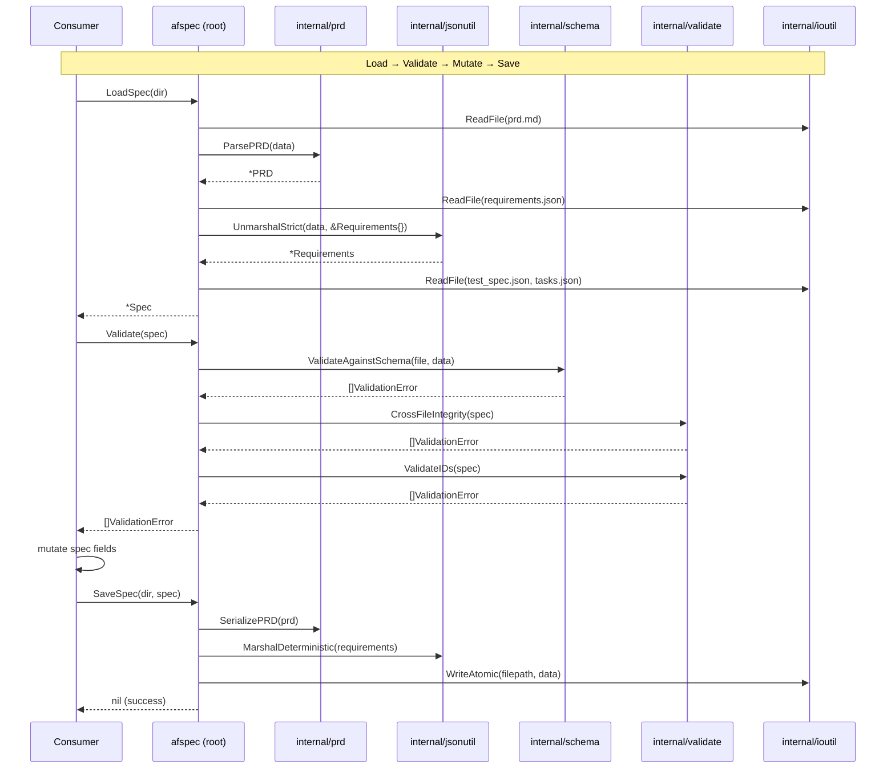

# Design Document: Go Spec-Format Library (afspec)

## Overview

The `afspec` library provides a complete Go API for the agent-fox specification format (v1). It exposes all public types and functions from the root package (`github.com/agent-fox/afspec`), with implementation details in `internal/` sub-packages. The library is designed for concurrent use, deterministic output, and idempotent round-trips.

## Architecture





### Module Responsibilities

1. **Root package (`afspec`)** — All exported types (Spec, PRD, Requirements, etc.) and public API functions (LoadSpec, SaveSpec, Validate, Render*, Transition, NewBootstrap, DiscoverSpecs). No implementation logic beyond delegation.
2. **`internal/prd`** — PRD-specific I/O: parsing YAML frontmatter from markdown, serializing with fixed field order, extracting the `## Intent` section body.
3. **`internal/jsonutil`** — Deterministic JSON marshaling (sorted keys, 2-space indent, trailing newline) and strict unmarshaling (reject unknown fields).
4. **`internal/schema`** — Embeds JSON Schema files via `//go:embed`. Validates data against schemas using a JSON Schema library.
5. **`internal/validate`** — Cross-file integrity checks (7 rules from §9.2), ID format validation, glossary cross-check.
6. **`internal/render`** — Markdown rendering for requirements, test_spec, and tasks. EARS sentence rendering from templates.
7. **`internal/lifecycle`** — Lifecycle transition validation, guard enforcement, intent hash computation with normalization.
8. **`internal/discovery`** — Spec root directory scanning, metadata loading from PRD frontmatter, dependency graph construction and cycle detection.
9. **`internal/ioutil`** — Atomic file writing (write-to-temp-then-rename), file reading helpers. SaveSpec tracks successfully written paths and removes them on failure to guarantee all-or-nothing semantics across the four-file write sequence (01-REQ-3.E2).

## Execution Paths

### Path 1: Load spec from disk

1. `load.go: LoadSpec(dir)` — validates dir exists, orchestrates load
2. `internal/ioutil/read.go: ReadFile(prd.md)` → `[]byte`
3. `internal/prd/parse.go: ParsePRD(data)` → `*PRD` — splits frontmatter/body, parses YAML
4. `internal/prd/intent.go: ExtractIntent(body)` → `string` — extracts `## Intent` section
5. `internal/ioutil/read.go: ReadFile(requirements.json)` → `[]byte`
6. `internal/jsonutil/unmarshal.go: UnmarshalStrict(data, &Requirements{})` → `*Requirements`
7. `internal/ioutil/read.go: ReadFile(test_spec.json)` → `[]byte`
8. `internal/jsonutil/unmarshal.go: UnmarshalStrict(data, &TestSpecDoc{})` → `*TestSpecDoc`
9. `internal/ioutil/read.go: ReadFile(tasks.json)` → `[]byte`
10. `internal/jsonutil/unmarshal.go: UnmarshalStrict(data, &Tasks{})` → `*Tasks`
11. Returns `*Spec` containing all four parsed artifacts

### Path 2: Save spec to disk

1. `save.go: SaveSpec(dir, spec)` — validates dir exists, orchestrates save
2. `save.go: computeFields(spec)` → `*Spec` — set `updated_at` to current UTC timestamp, compute `coverage` from test/requirement cross-references
3. `internal/prd/serialize.go: SerializePRD(prd)` → `[]byte` — YAML frontmatter with fixed field order + body
4. `internal/jsonutil/marshal.go: MarshalDeterministic(requirements)` → `[]byte` — sorted keys, 2-space indent
5. `internal/jsonutil/marshal.go: MarshalDeterministic(testSpec)` → `[]byte`
6. `internal/jsonutil/marshal.go: MarshalDeterministic(tasks)` → `[]byte`
7. `internal/ioutil/write.go: WriteAtomic(prd.md, data)` — side effect: file written; path recorded
8. `internal/ioutil/write.go: WriteAtomic(requirements.json, data)` — side effect: file written; path recorded
9. `internal/ioutil/write.go: WriteAtomic(test_spec.json, data)` — side effect: file written; path recorded
10. `internal/ioutil/write.go: WriteAtomic(tasks.json, data)` — side effect: file written; path recorded
11. On error at any step 7–10: `save.go: rollbackWritten(written)` — removes files successfully written in steps prior to the failure, ensuring no partial results remain (01-REQ-3.E2)

### Path 3: Validate spec (full)

1. `validate.go: Validate(spec)` — orchestrates all validation
2. `internal/schema/validate.go: ValidateAgainstSchema("prd-frontmatter", frontmatterJSON)` → `[]ValidationError`
3. `internal/schema/validate.go: ValidateAgainstSchema("requirements", reqJSON)` → `[]ValidationError`
4. `internal/schema/validate.go: ValidateAgainstSchema("test_spec", tsJSON)` → `[]ValidationError`
5. `internal/schema/validate.go: ValidateAgainstSchema("tasks", tasksJSON)` → `[]ValidationError`
6. `internal/validate/crossfile.go: CrossFileIntegrity(spec)` → `[]ValidationError` — 7 rules
7. `internal/validate/ids.go: ValidateIDs(spec)` → `[]ValidationError` — format + consistency
8. Returns aggregated `[]ValidationError`

### Path 4: Render per-file (requirements)

1. `render.go: RenderRequirements(req)` → `[]byte` — entry point
2. `internal/render/requirements.go: renderRequirements(req)` → `[]byte` — header, glossary, requirements
3. `internal/render/ears.go: RenderEARS(criterion)` → `string` — one EARS sentence from template
4. Returns `[]byte` — rendered markdown

### Path 5: Render combined

1. `render.go: RenderCombined(spec)` → `[]byte` — entry point
2. `spec.PRD.Body` → PRD markdown included verbatim (no rendering)
3. `internal/render/requirements.go: renderRequirements(spec.Requirements)` → `[]byte`
4. `internal/render/testspec.go: renderTestSpec(spec.TestSpec)` → `[]byte`
5. `internal/render/tasks.go: renderTasks(spec.Tasks)` → `[]byte`
6. Returns `[]byte` — concatenated: PRD body + separator + requirements + separator + test_spec + separator + tasks

### Path 6: Lifecycle transition

1. `lifecycle.go: Transition(spec, targetState)` → `(*Spec, error)` — entry point
2. `internal/lifecycle/transitions.go: ValidateTransition(current, target)` → `error` — checks allowed edges
3. `internal/lifecycle/guards.go: ApplyGuards(spec, current, target)` → `error` — mutation restrictions
4. `internal/lifecycle/intent.go: ComputeIntentHash(body)` → `string` — for draft→active, normalizes + SHA-256
5. Returns new `*Spec` with updated Status (and intent_hash if draft→active) — original spec is not modified

### Path 7: Bootstrap new spec

1. `bootstrap.go: NewBootstrap(dir, specID, specName)` → `(*Bootstrap, error)` — creates directory, returns handle
2. `bootstrap.go: (b *Bootstrap) WritePRD(prd)` → `error` — validates schema, writes prd.md
3. `bootstrap.go: (b *Bootstrap) WriteRequirements(req)` → `error` — validates schema, writes requirements.json
4. `bootstrap.go: (b *Bootstrap) WriteTestSpec(ts)` → `error` — validates schema, writes test_spec.json
5. `bootstrap.go: (b *Bootstrap) WriteTasks(tasks)` → `error` — validates schema, writes tasks.json
6. `bootstrap.go: (b *Bootstrap) Finalize()` → `(*Spec, error)` — runs full validation, returns complete Spec
7. Side effect: spec folder created on disk with all 4 files

### Path 8: Discover specs in root

1. `discover.go: DiscoverSpecs(root)` → `(*DiscoveryResult, error)` — entry point
2. `internal/discovery/scan.go: ScanRoot(root)` → `[]string` — finds dirs matching `{NN}_{snake_case}`, skips `archive/`
3. `internal/discovery/metadata.go: LoadMetadata(dir)` → `(*SpecEntry, error)` — reads PRD frontmatter only
4. `internal/discovery/graph.go: BuildGraph(entries, root)` → `(*DependencyGraph, error)` — reads tasks.json deps, detects cycles
5. Returns `*DiscoveryResult` with entries and dependency graph

## Components and Interfaces

### Public API Functions

```go
package afspec

// LoadSpec reads all four spec files from dir and returns a populated Spec.
func LoadSpec(dir string) (*Spec, error)

// SaveSpec writes all four spec files to dir deterministically.
func SaveSpec(dir string, spec *Spec) error

// Validate runs schema validation, cross-file integrity, and ID validation.
// Returns all errors found (empty slice means valid).
func Validate(spec *Spec) ([]ValidationError, error)

// ValidateSchema runs only JSON Schema validation per file.
func ValidateSchema(spec *Spec) ([]ValidationError, error)

// ValidateCrossFile runs only cross-file integrity checks (7 rules).
func ValidateCrossFile(spec *Spec) ([]ValidationError, error)

// RenderRequirements renders requirements.json to markdown.
func RenderRequirements(req *Requirements) ([]byte, error)

// RenderTestSpec renders test_spec.json to markdown.
func RenderTestSpec(ts *TestSpecDoc) ([]byte, error)

// RenderTasks renders tasks.json to markdown.
func RenderTasks(tasks *Tasks) ([]byte, error)

// RenderCombined produces a single document: PRD verbatim + rendered JSON artifacts.
func RenderCombined(spec *Spec) ([]byte, error)

// Transition applies a lifecycle state transition.
// Returns a new Spec with updated state (original is not modified).
func Transition(spec *Spec, target Status) (*Spec, error)

// NewBootstrap creates a new spec folder and returns a Bootstrap handle
// for writing files one at a time.
func NewBootstrap(dir string, specID string, specName string) (*Bootstrap, error)

// DiscoverSpecs scans root for spec folders and builds a dependency graph.
// If root is empty, uses the current working directory.
func DiscoverSpecs(root string) (*DiscoveryResult, error)
```

### Core Data Types

```go
// Spec is the complete in-memory representation of a four-artifact spec package.
type Spec struct {
    PRD          *PRD
    Requirements *Requirements
    TestSpec     *TestSpecDoc
    Tasks        *Tasks
    Dir          string // absolute path to spec folder on disk
}

// PRD represents prd.md: YAML frontmatter + markdown body.
type PRD struct {
    Frontmatter Frontmatter
    Body        string // full markdown body (everything after frontmatter)
}

// Frontmatter contains the 12 YAML frontmatter fields with fixed serialization order.
type Frontmatter struct {
    SpecID        string   `yaml:"spec_id"        json:"spec_id"`
    SpecName      string   `yaml:"spec_name"      json:"spec_name"`
    Title         string   `yaml:"title"          json:"title"`
    Status        Status   `yaml:"status"         json:"status"`
    CreatedAt     string   `yaml:"created_at"     json:"created_at"`   // ISO 8601
    UpdatedAt     string   `yaml:"updated_at"     json:"updated_at"`   // ISO 8601
    Owner         string   `yaml:"owner"          json:"owner"`
    Source        string   `yaml:"source"         json:"source"`
    Supersedes    []string `yaml:"supersedes"     json:"supersedes"`
    Tags          []string `yaml:"tags"           json:"tags"`
    IntentHash    *string  `yaml:"intent_hash"    json:"intent_hash"`  // nullable
    SchemaVersion int      `yaml:"schema_version" json:"schema_version"`
}

type Status string

const (
    StatusDraft      Status = "draft"
    StatusActive     Status = "active"
    StatusSealed     Status = "sealed"
    StatusSuperseded Status = "superseded"
    StatusArchived   Status = "archived"
)
```

### Requirements Types

```go
type Requirements struct {
    Schema                string                `json:"$schema"`
    SpecID                string                `json:"spec_id"`
    SpecName              string                `json:"spec_name"`
    SchemaVersion         int                   `json:"schema_version"`
    Introduction          string                `json:"introduction"`
    Glossary              map[string]string     `json:"glossary"`
    Requirements          []Requirement         `json:"requirements"`
    CorrectnessProperties []CorrectnessProperty `json:"correctness_properties"`
    ExecutionPaths        []ExecutionPath       `json:"execution_paths"`
    ErrorHandling         []ErrorHandlingEntry  `json:"error_handling"`
}

type Requirement struct {
    ID                 string      `json:"id"`      // {spec_id}-REQ-{N}
    Title              string      `json:"title"`
    UserStory          UserStory   `json:"user_story"`
    AcceptanceCriteria []Criterion `json:"acceptance_criteria"`
    EdgeCases          []Criterion `json:"edge_cases"`
}

type UserStory struct {
    Role    string `json:"role"`
    Goal    string `json:"goal"`
    Benefit string `json:"benefit"`
}

// Criterion is the EARS discriminated union. EarsPattern determines which
// pattern-specific fields are populated. Common fields are always present.
type Criterion struct {
    // Common fields (all patterns)
    ID             string  `json:"id"`
    EarsPattern    string  `json:"ears_pattern"`
    System         string  `json:"system"`
    Action         string  `json:"action"`
    ReturnContract *string `json:"return_contract"` // always serialized (null or string)

    // Pattern-specific fields (omitted when not applicable)
    Trigger        string `json:"trigger,omitempty"`         // event_driven, complex_event
    Condition      string `json:"condition,omitempty"`       // complex_event
    ErrorCondition string `json:"error_condition,omitempty"` // unwanted
    State          string `json:"state,omitempty"`           // state_driven
    Feature        string `json:"feature,omitempty"`         // optional
}

type CorrectnessProperty struct {
    ID        string   `json:"id"`       // {spec_id}-PROP-{N}
    Title     string   `json:"title"`
    ForAny    string   `json:"for_any"`
    Invariant string   `json:"invariant"`
    Validates []string `json:"validates"` // criterion IDs
}

type ExecutionPath struct {
    ID    string              `json:"id"` // {spec_id}-PATH-{N}
    Title string              `json:"title"`
    Steps []ExecutionPathStep `json:"steps"`
}

type ExecutionPathStep struct {
    Actor  string `json:"actor"`
    Action string `json:"action"`
}

type ErrorHandlingEntry struct {
    ID            string `json:"id"` // {spec_id}-ERR-{N}
    Condition     string `json:"condition"`
    Behavior      string `json:"behavior"`
    RequirementID string `json:"requirement_id"`
}
```

### TestSpec Types

```go
type TestSpecDoc struct {
    Schema        string          `json:"$schema"`
    SpecID        string          `json:"spec_id"`
    SpecName      string          `json:"spec_name"`
    SchemaVersion int             `json:"schema_version"`
    TestCases     []TestCase      `json:"test_cases"`
    PropertyTests []PropertyTest  `json:"property_tests"`
    EdgeCaseTests []EdgeCaseTest  `json:"edge_case_tests"`
    SmokeTests    []SmokeTest     `json:"smoke_tests"`
    Coverage      Coverage        `json:"coverage"`
}

type TestCase struct {
    ID                  string      `json:"id"` // TS-{spec_id}-{N}
    RequirementID       string      `json:"requirement_id"`
    Kind                string      `json:"kind"` // "unit" | "integration"
    Description         string      `json:"description"`
    Preconditions       []string    `json:"preconditions"`
    Input               interface{} `json:"input"`
    Expected            interface{} `json:"expected"`
    AssertionPseudocode string      `json:"assertion_pseudocode"`
}

type PropertyTest struct {
    ID              string   `json:"id"` // TS-{spec_id}-P{N}
    PropertyID      string   `json:"property_id"`
    Validates       []string `json:"validates"`
    Description     string   `json:"description"`
    ForAnyStrategy  string   `json:"for_any_strategy"`
    InvariantCheck  string   `json:"invariant_check"`
}

type EdgeCaseTest struct {
    ID                  string      `json:"id"` // TS-{spec_id}-E{N}
    RequirementID       string      `json:"requirement_id"`
    Kind                string      `json:"kind"`
    Description         string      `json:"description"`
    Preconditions       []string    `json:"preconditions"`
    Input               interface{} `json:"input"`
    Expected            interface{} `json:"expected"`
    AssertionPseudocode string      `json:"assertion_pseudocode"`
}

type SmokeTest struct {
    ID              string   `json:"id"` // TS-{spec_id}-SMOKE-{N}
    ExecutionPathID string   `json:"execution_path_id"`
    Description     string   `json:"description"`
    Trigger         string   `json:"trigger"`
    RealComponents  []string `json:"real_components"`
    Mockable        []string `json:"mockable"`
    ExpectedEffects []string `json:"expected_effects"`
}

type Coverage struct {
    RequirementsCovered []string `json:"requirements_covered"`
    PropertiesCovered   []string `json:"properties_covered"`
    PathsCovered        []string `json:"paths_covered"`
    Gaps                []string `json:"gaps"`
}
```

### Tasks Types

```go
type Tasks struct {
    Schema        string             `json:"$schema"`
    SpecID        string             `json:"spec_id"`
    SpecName      string             `json:"spec_name"`
    SchemaVersion int                `json:"schema_version"`
    TestCommands  TestCommands       `json:"test_commands"`
    Dependencies  []TaskDependency   `json:"dependencies"`
    TaskGroups    []TaskGroup        `json:"task_groups"`
    Traceability  []TraceabilityEntry `json:"traceability"`
}

type TestCommands struct {
    SpecTests string `json:"spec_tests"`
    AllTests  string `json:"all_tests"`
    Linter    string `json:"linter"`
}

type TaskDependency struct {
    DependsOnSpec string `json:"depends_on_spec"`
    FromGroup     int    `json:"from_group"`
    ToGroup       int    `json:"to_group"`
    Relationship  string `json:"relationship"`
    Sentinel      bool   `json:"sentinel"`
}

type TaskGroup struct {
    ID           int                  `json:"id"`
    Kind         string               `json:"kind"` // tests | standard | checkpoint | wiring_verification
    Title        string               `json:"title"`
    Subtasks     []Subtask            `json:"subtasks"`
    Verification VerificationSubtask  `json:"verification"`
}

type Subtask struct {
    ID              string   `json:"id"`   // {group}.{N}
    Title           string   `json:"title"`
    Details         []string `json:"details"`
    TestSpecRefs    []string `json:"test_spec_refs"`
    RequirementRefs []string `json:"requirement_refs"`
    State           SubtaskState `json:"state"`
    Optional        bool     `json:"optional"`
}

type SubtaskState string

const (
    StatePending            SubtaskState = "pending"
    StateQueued             SubtaskState = "queued"
    StateInProgress         SubtaskState = "in_progress"
    StateDone               SubtaskState = "done"
    StatePendingReevaluation SubtaskState = "pending_reevaluation"
    StateDropped            SubtaskState = "dropped"
)

// LegalTransitions returns the allowed next states for a given subtask state.
func (s SubtaskState) LegalTransitions() []SubtaskState

type VerificationSubtask struct {
    ID     string   `json:"id"` // {group}.V
    Checks []string `json:"checks"`
}

type TraceabilityEntry struct {
    RequirementID string  `json:"requirement_id"`
    TestSpecID    string  `json:"test_spec_id"`
    TaskID        string  `json:"task_id"`
    TestPath      *string `json:"test_path"` // nullable until test is written
}
```

### Validation and Error Types

```go
type ValidationError struct {
    File     string   `json:"file"`     // e.g., "requirements.json"
    Path     string   `json:"path"`     // JSON path, e.g., "/requirements/0/acceptance_criteria/1"
    Rule     string   `json:"rule"`     // e.g., "schema", "integrity-1", "id-format"
    Message  string   `json:"message"`  // human-readable description
    Severity Severity `json:"severity"` // "error" or "warning"
}

type Severity string

const (
    SeverityError   Severity = "error"
    SeverityWarning Severity = "warning"
)

// LifecycleError is returned when a lifecycle transition is rejected.
type LifecycleError struct {
    Current Status
    Target  Status
    Reason  string
}

func (e *LifecycleError) Error() string

// IncompleteSpecError is returned when Finalize() is called on a partial spec.
type IncompleteSpecError struct {
    MissingFiles []string
}

func (e *IncompleteSpecError) Error() string
```

### Discovery Types

```go
type DiscoveryResult struct {
    Entries []SpecEntry
    Graph   *DependencyGraph
}

type SpecEntry struct {
    Dir      string // absolute path to spec folder
    SpecID   string
    SpecName string
    Status   Status
    Complete bool   // true if all 4 files present
}

type DependencyGraph struct {
    // Adjacency list: spec_id → list of spec_ids it depends on.
    Edges map[string][]string
}

// TopologicalOrder returns spec_ids in dependency order.
// Returns an error if a cycle is detected.
func (g *DependencyGraph) TopologicalOrder() ([]string, error)
```

### Bootstrap Type

```go
type Bootstrap struct {
    dir      string
    specID   string
    specName string
    written  map[string]bool // tracks which files have been written
    mu       sync.Mutex      // guards concurrent access
}

func (b *Bootstrap) WritePRD(prd *PRD) error
func (b *Bootstrap) WriteRequirements(req *Requirements) error
func (b *Bootstrap) WriteTestSpec(ts *TestSpecDoc) error
func (b *Bootstrap) WriteTasks(tasks *Tasks) error
func (b *Bootstrap) Finalize() (*Spec, error)
```

## Data Models

### JSON Schema Files

Four JSON Schema files are bundled via `//go:embed` in `schemas/`:

| Schema file | Validates | Key constraints |
|---|---|---|
| `prd-frontmatter.v1.json` | YAML frontmatter of `prd.md` | 12 required fields, `status` enum, `spec_id`/`spec_name` as strings, `supersedes`/`tags` as string arrays, `intent_hash` as string-or-null |
| `requirements.v1.json` | `requirements.json` | Discriminated `oneOf` on `ears_pattern` enforcing correct field set per variant, ID format patterns, `glossary` as object, nested arrays |
| `test_spec.v1.json` | `test_spec.json` | `kind` enum (`unit`/`integration`), ID format patterns, `coverage` object structure |
| `tasks.v1.json` | `tasks.json` | `kind` enum (`tests`/`standard`/`checkpoint`/`wiring_verification`), `state` enum (6 values), subtask ID format, task group 1 must be kind `tests`, last group must be kind `wiring_verification` |

### YAML Frontmatter Serialization Order

Fixed order for deterministic output:

```yaml
---
spec_id: "05"
spec_name: "my_feature"
title: "Human-readable title"
status: "draft"
created_at: "2026-05-18T12:00:00Z"
updated_at: "2026-05-18T12:00:00Z"
owner: "author-name"
source: "https://github.com/org/repo/issues/42"
supersedes: []
tags: []
intent_hash: null
schema_version: 1
---
```

### Intent Hash Normalization Pipeline

```
Input: raw ## Intent section body (text between ## Intent and next ## or EOF)
  → Step 1: Normalize line endings to LF (\r\n → \n, \r → \n)
  → Step 2: Collapse multiple consecutive blank lines into one blank line
  → Step 3: Lower-case entire text
  → Step 4: Trim leading and trailing whitespace
  → Step 5: Compute SHA-256 of resulting UTF-8 bytes
Output: lowercase hex-encoded hash string (64 characters)
```

### JSON Serialization Rules

- Keys sorted alphabetically at all nesting levels
- 2-space indentation
- Trailing newline after closing brace/bracket
- `null` for nil pointer fields (not omitted)
- `[]` for empty slices (not `null`)
- No trailing commas
- UTF-8 encoding, no BOM

### EARS Rendering Templates

| Pattern | Template |
|---|---|
| `ubiquitous` | `THE {system} SHALL {action}` |
| `event_driven` | `WHEN {trigger}, THE {system} SHALL {action}` |
| `complex_event` | `WHEN {trigger} AND {condition}, THE {system} SHALL {action}` |
| `state_driven` | `WHILE {state}, THE {system} SHALL {action}` |
| `unwanted` | `IF {error_condition}, THEN THE {system} SHALL {action}` |
| `optional` | `WHERE {feature}, THE {system} SHALL {action}` |

When `return_contract` is non-null AND non-empty, append ` AND return {return_contract}` to the rendered sentence. If `return_contract` is null or an empty string, omit the return contract clause entirely.

### Subtask State Transitions

| Current State | Allowed Next States |
|---|---|
| `pending` | `queued`, `dropped` |
| `queued` | `in_progress`, `pending`, `dropped` |
| `in_progress` | `done`, `pending_reevaluation` |
| `done` | `pending_reevaluation` |
| `pending_reevaluation` | `pending`, `dropped` |
| `dropped` | _(terminal)_ |

### Lifecycle State Transitions

| Current State | Allowed Next States |
|---|---|
| `draft` | `active`, `archived` |
| `active` | `sealed` |
| `sealed` | `superseded`, `archived` |
| `superseded` | _(terminal)_ |
| `archived` | _(terminal)_ |

## Operational Readiness

### Observability

The library does not emit logs, metrics, or traces. Consumers are responsible for wrapping calls with their own observability. All errors are returned as values — no panics, no os.Exit.

### Rollout

The library is versioned via semantic versioning. Breaking changes require a major version bump. The Go module proxy handles distribution via `github.com/agent-fox/afspec` tags.

### Migration

No migration concerns for v1. Future schema versions will require a migration path (documented when needed).

## Correctness Properties

### Property 1: Round-Trip Idempotency

*For any* valid spec loaded from disk, saving it to a new directory and reloading produces byte-identical files and deeply-equal in-memory structures.

**Validates: Requirements 01-REQ-3.4**

### Property 2: EARS Rendering Determinism

*For any* EARS criterion with a valid `ears_pattern` and populated fields, rendering it to markdown twice produces byte-identical output.

**Validates: Requirements 01-REQ-6.1, 01-REQ-6.2**

### Property 3: Lifecycle Monotonicity

*For any* sequence of lifecycle transitions applied to a spec starting in `draft`, the status only advances through legal edges in the transition graph (draft→active→sealed→superseded|archived) and never moves backward.

**Validates: Requirements 01-REQ-7.1, 01-REQ-7.E1**

### Property 4: Cross-File Referential Integrity

*For any* spec that passes `ValidateCrossFile()` with zero errors, every ID referenced in `test_spec.json` and `tasks.json` resolves to an existing entity in `requirements.json`, and every requirement/property/path has corresponding test coverage.

**Validates: Requirements 01-REQ-5.1, 01-REQ-5.2, 01-REQ-5.3, 01-REQ-5.4, 01-REQ-5.5**

### Property 5: Intent Hash Stability

*For any* spec in `active` state, `ComputeIntentHash(spec.PRD.Body)` produces the same hash as `spec.PRD.Frontmatter.IntentHash` if and only if the `## Intent` section body has not been modified since the draft→active transition.

**Validates: Requirements 01-REQ-7.2, 01-REQ-7.E2**

### Property 6: Schema Validation Soundness

*For any* JSON data that fails schema validation, at least one of the following holds: a required field is missing, a field has an incorrect type, a pattern-specific field constraint is violated, or an unknown field is present.

**Validates: Requirements 01-REQ-4.1, 01-REQ-4.2, 01-REQ-4.4, 01-REQ-4.E1, 01-REQ-4.E2**

### Property 7: Discovery Completeness

*For any* spec root directory containing N directories matching `{NN}_{snake_case_name}` (excluding `archive/`), `DiscoverSpecs()` returns exactly N entries, each with correct `spec_id` and `spec_name` extracted from the directory name.

**Validates: Requirements 01-REQ-9.1, 01-REQ-9.2, 01-REQ-9.3**

### Property 8: Bootstrap Deferred Validation

*For any* bootstrap session where fewer than four files have been written, no cross-file validation error is raised until `Finalize()` is called.

**Validates: Requirements 01-REQ-8.2, 01-REQ-8.4, 01-REQ-5.E1**

### Property 9: ID Format Consistency

*For any* ID string that passes `ValidateIDs()`, parsing the ID extracts a `spec_id` component that matches the file's declared `spec_id`, and the numeric components are positive integers.

**Validates: Requirements 01-REQ-10.1, 01-REQ-10.2, 01-REQ-10.3, 01-REQ-10.E1**

### Property 10: Null Preservation

*For any* spec containing null-valued fields (e.g., `return_contract: null`, `intent_hash: null`), a round-trip (load → save → load) preserves the null representation: null in JSON is loaded as nil pointer and serialized back as JSON `null`, not omitted from output.

**Validates: Requirements 01-REQ-1.E1, 01-REQ-3.4**

### Property 11: Computed Coverage Accuracy

*For any* spec saved via the library, the `coverage` field in test_spec.json SHALL accurately reflect the coverage state: `requirements_covered` SHALL list all requirement and edge case IDs that have a test case, `gaps` SHALL list all IDs that lack coverage, and the union of `requirements_covered` and `gaps` SHALL equal all requirement and edge case IDs in requirements.json.

**Validates: Requirements 01-REQ-3.6**

## Error Handling

| Error Condition | Behavior | Requirement |
|---|---|---|
| Spec folder path does not exist | Return error with path | 01-REQ-2.E5 |
| Spec folder missing required files | Return error listing missing files | 01-REQ-2.E1 |
| Malformed JSON in spec file | Return parse error with file name and details | 01-REQ-2.E2 |
| Malformed YAML frontmatter | Return parse error | 01-REQ-2.E3 |
| Missing `## Intent` section in PRD | Return validation error | 01-REQ-2.E4 |
| Target directory does not exist (save) | Return error, do not create directory | 01-REQ-3.E1 |
| File write failure mid-operation | Return error, no partial files left | 01-REQ-3.E2 |
| Unknown field in JSON (schema) | Reject with error identifying field path | 01-REQ-4.E1 |
| EARS pattern-field mismatch | Reject with error identifying criterion and field | 01-REQ-4.E2 |
| Cross-file validation failures | Return all violations with rule number and details | 01-REQ-5.1 |
| Illegal lifecycle transition | Return error naming current and target states | 01-REQ-7.E1 |
| Intent hash mismatch on mutation | Reject with intent-tamper error | 01-REQ-7.E2 |
| Finalize before all files written | Return incompleteness error listing missing files | 01-REQ-8.E1 |
| Bootstrap on existing folder | Return error preventing overwrite | 01-REQ-8.E3 |
| Spec root directory not found | Return error | 01-REQ-9.E1 |
| Dependency cycle detected | Return error identifying cycle participants | 01-REQ-9.E3 |
| ID spec_id mismatch | Return validation error with mismatched ID | 01-REQ-10.E1 |
| Non-sequential IDs | Return validation warning | 01-REQ-10.E2 |

## Technology Stack

| Technology | Purpose | Version |
|---|---|---|
| Go | Implementation language | 1.26+ |
| `gopkg.in/yaml.v3` | YAML frontmatter parsing/serialization | latest |
| `github.com/santhosh-tekuri/jsonschema/v6` | JSON Schema validation (draft 2020-12) | v6.x |
| Go standard library `encoding/json` | JSON marshaling/unmarshaling | (stdlib) |
| Go standard library `crypto/sha256` | Intent hash computation | (stdlib) |
| Go standard library `embed` | Bundling JSON Schema files | (stdlib) |
| Go standard library `sync` | Mutex for Bootstrap thread safety | (stdlib) |

## Definition of Done

A task group is complete when ALL of the following are true:

1. All subtasks within the group are checked off (`[x]`)
2. All spec tests (`test_spec.md` entries) for the task group pass
3. All property tests for the task group pass
4. All previously passing tests still pass (no regressions)
5. No linter warnings or errors introduced
6. Code is committed on a feature branch and merged into `develop`
7. Feature branch is merged back to `develop`
8. `tasks.md` checkboxes are updated to reflect completion

## Testing Strategy

### Unit Tests

Each internal package has unit tests covering its public functions. Tests use table-driven patterns with subtests. Key areas:

- `internal/prd`: Frontmatter parsing, Intent extraction, serialization with fixed field order
- `internal/jsonutil`: Deterministic marshaling (key ordering, indentation), strict unmarshaling
- `internal/render/ears.go`: All six EARS templates, null return_contract, empty fields
- `internal/lifecycle`: Transition validation, guard checks, intent hash computation
- `internal/validate/ids.go`: All ID format patterns, spec_id matching

### Property-Based Tests

Use `testing/quick` or a property-testing library to verify:

- Round-trip idempotency (Property 1)
- EARS rendering determinism (Property 2)
- Null preservation (Property 10)
- ID format parsing consistency (Property 9)

### Integration Tests

End-to-end tests using temporary directories:

- LoadSpec → Validate → SaveSpec round-trip
- Bootstrap → WritePRD → WriteRequirements → WriteTestSpec → WriteTasks → Finalize
- DiscoverSpecs on a multi-spec root with dependencies
- Lifecycle transitions: draft → active → sealed → superseded

### Test Fixtures

Golden files in `testdata/` for:

- A complete valid spec (all 4 files)
- An incomplete spec (missing files)
- A spec with validation errors (broken cross-references)
- A spec with each EARS pattern variant
- Edge cases: null fields, empty arrays, unicode content
