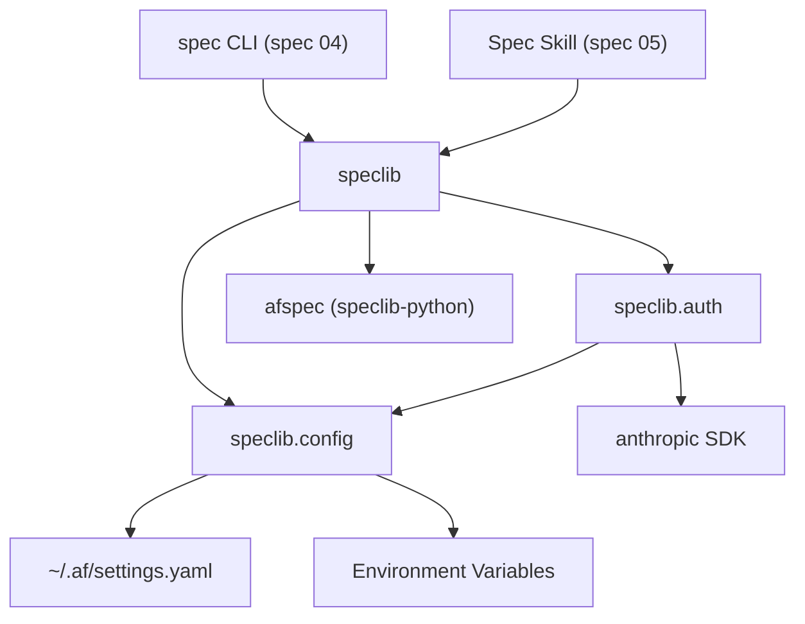

# Design Document: Project Scaffold and Configuration

## Overview

This spec establishes the speclib Python package structure and its two
foundational modules: configuration loading and Anthropic client creation.
The package reuses `afspec` (speclib-python) for all spec-format operations
and adds campaign management, session state, AI-driven authoring, a CLI,
and a skill on top.

## Architecture



### Module Responsibilities

1. **speclib/** — Top-level package. Re-exports key types from submodules.
2. **speclib/config.py** — Configuration loading from YAML and environment
   variables. Defines `SpecToolConfig` and `load_config()`.
3. **speclib/auth.py** — Anthropic client factory. Defines `create_client()`
   which returns the appropriate SDK client based on configuration.
4. **speclib/errors.py** — Exception hierarchy: `SpeclibError`, `ConfigError`.

## Execution Paths

### Path 1: Configuration loading

1. `speclib.config:load_config` — reads `~/.af/settings.yaml`, parses `spec_tool` section
2. `speclib.config:load_config` — reads environment variables, overrides YAML values
3. Returns `SpecToolConfig` with resolved values

### Path 2: Client creation

1. `speclib.auth:create_client` — receives optional `SpecToolConfig`
2. `speclib.config:load_config` — called if no config provided
3. `speclib.auth:create_client` — checks `AF_SPEC_AUTH` env var, then config.auth_method
4. `speclib.auth:_create_api_key_client` or `_create_bedrock_client` or `_create_vertex_client` — instantiates the appropriate SDK client
5. Returns `(client, model_name)` tuple

## Components and Interfaces

### SpecToolConfig

```python
@dataclass
class SpecToolConfig:
    model: str = "claude-sonnet-4-6"
    auth_method: str = "api_key"      # "api_key" | "bedrock" | "vertex"
    api_key: str | None = None
    vertex_project: str | None = None
    vertex_region: str | None = None
```

### Functions

```python
def load_config() -> SpecToolConfig:
    """Load configuration from ~/.af/settings.yaml and env vars."""
    ...

def create_client(
    config: SpecToolConfig | None = None,
) -> tuple[anthropic.Anthropic | anthropic.AnthropicBedrock | anthropic.AnthropicVertex, str]:
    """Create an Anthropic client based on configuration.
    
    Returns (client, model_name).
    """
    ...
```

## Data Models

### settings.yaml structure (spec_tool section)

```yaml
spec_tool:
  model: claude-sonnet-4-6
  auth:
    method: api_key          # api_key | bedrock | vertex
    api_key: sk-ant-...      # for method: api_key
    vertex_project: my-proj  # for method: vertex
    vertex_region: us-east5  # for method: vertex
```

### Environment Variables

| Variable | Purpose | Overrides |
|----------|---------|-----------|
| `AF_SPEC_MODEL` | Model name | `spec_tool.model` |
| `AF_SPEC_AUTH` | Auth method | `spec_tool.auth.method` |
| `ANTHROPIC_API_KEY` | API key | `spec_tool.auth.api_key` |
| `AF_SPEC_VERTEX_PROJECT` | GCP project | `spec_tool.auth.vertex_project` |
| `AF_SPEC_VERTEX_REGION` | GCP region | `spec_tool.auth.vertex_region` |

## Correctness Properties

### Property 1: Environment variables override YAML

*For any* configuration key that has both an environment variable and a
settings.yaml value, THE configuration module SHALL use the environment
variable value.

**Validates: Requirements 01-REQ-2.2**

### Property 2: Default values are consistent

*For any* invocation of `load_config()` with no settings file and no
environment variables, THE configuration module SHALL return a
`SpecToolConfig` with `model="claude-sonnet-4-6"` and
`auth_method="api_key"`.

**Validates: Requirements 01-REQ-2.4**

### Property 3: Client type matches auth method

*For any* valid `SpecToolConfig`, `create_client()` SHALL return a client
whose type matches the `auth_method` field: `api_key` → `Anthropic`,
`bedrock` → `AnthropicBedrock`, `vertex` → `AnthropicVertex`.

**Validates: Requirements 01-REQ-3.1, 01-REQ-3.2, 01-REQ-3.3**

## Error Handling

| Error Condition | Behavior | Requirement |
|----------------|----------|-------------|
| settings.yaml invalid YAML | Raise ConfigError with path and detail | 01-REQ-2.E1 |
| No spec_tool section in YAML | Use defaults, no error | 01-REQ-2.E2 |
| Unknown keys in spec_tool | Ignore, no error | 01-REQ-2.E3 |
| Unknown AF_SPEC_AUTH value | Raise ConfigError listing valid methods | 01-REQ-3.E1 |
| api_key auth with no key | Raise ConfigError explaining requirement | 01-REQ-3.E2 |
| vertex auth without project | Raise ConfigError listing required env vars | 01-REQ-3.E3 |

## Technology Stack

- Python 3.14+
- `afspec` (speclib-python) — spec format models, validation, rendering, I/O
- `anthropic` — Anthropic Python SDK (with `[vertex]` and `[bedrock]` extras)
- `click` — CLI framework (used by spec 04)
- `pyyaml` — YAML parsing for settings.yaml
- `pydantic` — transitively via afspec
- `uv` — package management, no pip

## Definition of Done

A task group is complete when ALL of the following are true:

1. All subtasks within the group are checked off (`[x]`)
2. All spec tests (`test_spec.md` entries) for the task group pass
3. All property tests for the task group pass
4. All previously passing tests still pass (no regressions)
5. No linter warnings or errors introduced
6. Code is committed on a feature branch and merged into `develop`
7. `tasks.md` checkboxes are updated to reflect completion

## Operational Readiness

- **Packaging:** Distributed as a Python package installable via `uv`. No
  deployment, monitoring, or rollback concerns — this is a local CLI tool.
- **Configuration:** Settings file at `~/.af/settings.yaml` is optional;
  defaults are functional without it.
- **Secrets:** API keys are read from environment variables or the settings
  file. Never logged or persisted beyond the config source.

## Testing Strategy

- **Unit tests** for `load_config()` using temp YAML files and env var patching.
- **Unit tests** for `create_client()` with mocked SDK constructors.
- **Property tests** for config precedence (env var always wins over YAML).
- **Integration smoke test** verifying the full load → create_client path.
