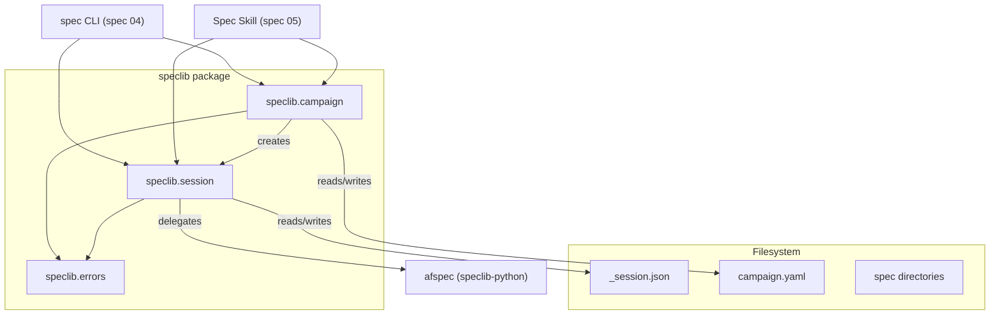
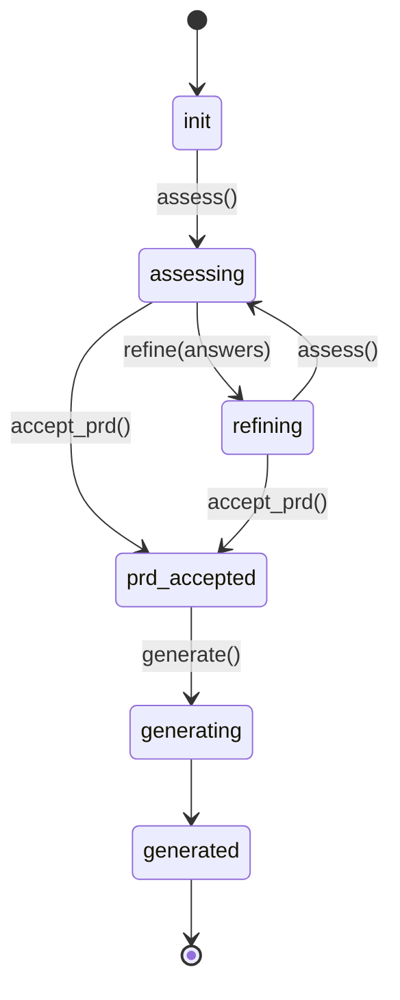

# Design Document: Campaign Management and Spec Authoring Session Model

## Overview

This spec implements the campaign directory management and spec authoring
session model. A campaign is a working directory containing `campaign.yaml`
and one or more numbered spec subdirectories. A SpecSession tracks the
stateful lifecycle of authoring a single spec within a campaign — from PRD
input through assessment, refinement, and generation.

The session enforces a state machine, persists its state to `_session.json`,
and delegates spec-format operations (validation, rendering) to `afspec`.
The `assess()` and `generate()` methods are stub interfaces in this spec;
spec 03 provides their agent implementations.

## Architecture



### Module Responsibilities

1. **speclib/campaign.py** — Campaign directory lifecycle: creation, opening,
   spec enumeration, and new-spec provisioning. Defines `Campaign` and
   `CampaignMetadata`.
2. **speclib/session.py** — Spec authoring session state machine, persistence,
   and delegation to afspec for validation and rendering. Defines
   `SpecSession`, `SessionState`, and all session data types.
3. **speclib/errors.py** — Extended with `CampaignError` and `SessionError`
   (both inheriting from `SpeclibError`).

## Execution Paths

### Path 1: Campaign creation

1. `Campaign.create(path, name, description)` — validates path
2. `Campaign.create` — creates directory if it does not exist
3. `Campaign.create` — checks for existing `campaign.yaml` or non-empty dir
4. `Campaign.create` — writes `campaign.yaml` with `CampaignMetadata`
5. Returns `Campaign` instance bound to the path

### Path 2: Campaign opening and spec listing

1. `Campaign.open(path)` — checks for `campaign.yaml` existence
2. `Campaign.open` — reads and parses `campaign.yaml` into `CampaignMetadata`
3. Returns `Campaign` instance
4. `campaign.specs()` — scans directory for `{NN}_{snake_case}` subdirs
5. Returns sorted list of `Path` objects

### Path 3: Spec creation within a campaign

1. `campaign.new_spec(spec_name, prd, mode)` — validates `spec_name`
2. `campaign.new_spec` — computes next numeric prefix from existing specs
3. `campaign.new_spec` — creates spec directory `{NN}_{spec_name}`
4. `campaign.new_spec` — writes `prd.md` (from string or copies from Path)
5. `campaign.new_spec` — writes initial `_session.json` in `init` state
6. `campaign.new_spec` — updates `campaign.yaml` `updated_at` timestamp
7. Returns `SpecSession` instance

### Path 4: Session state machine traversal (full lifecycle)

1. `SpecSession` starts in `init` state
2. `session.assess()` — transitions `init` to `assessing` (stub: raises NotImplementedError)
3. `session.refine(answers)` — transitions `assessing` to `refining` (stub)
4. `session.accept_prd()` — transitions `refining` (or `assessing`) to `prd_accepted`
5. `session.generate()` — transitions `prd_accepted` to `generating` (stub)
6. Each transition persists state to `_session.json`

### Path 5: Session resume

1. `SpecSession.resume(spec_dir)` — reads `_session.json`
2. `SpecSession.resume` — deserializes state, assessment history, Q&A exchanges
3. Returns `SpecSession` in the persisted state

### Path 6: Validation and rendering

1. `session.validate()` — checks all four required artifacts exist
2. `session.validate` — calls `afspec.load_spec()` on the spec directory
3. `session.validate` — calls `afspec.validate()` on the loaded spec
4. Returns `ValidationResult`
5. `session.render(combined)` — loads spec via afspec, calls `render_combined()` or renders individually

## Components and Interfaces

### Campaign

```python
@dataclass
class CampaignMetadata:
    name: str
    description: str
    created_at: str   # ISO 8601
    updated_at: str   # ISO 8601


class Campaign:
    @staticmethod
    def create(path: Path, name: str, description: str) -> "Campaign":
        """Create a new campaign directory with campaign.yaml.

        Raises CampaignError if:
        - path already contains campaign.yaml
        - path exists, is non-empty, and is not a campaign
        - parent directory does not exist
        """
        ...

    @staticmethod
    def open(path: Path) -> "Campaign":
        """Open an existing campaign directory.

        Raises CampaignError if:
        - path does not contain campaign.yaml
        - campaign.yaml contains invalid YAML
        """
        ...

    def new_spec(
        self,
        spec_name: str,
        prd: str | Path,
        mode: str = "interactive",
    ) -> "SpecSession":
        """Create a new spec directory and return its session.

        Raises CampaignError if:
        - spec_name is invalid (not matching [a-z][a-z0-9_]*)
        - prd is a Path that does not exist
        """
        ...

    def specs(self) -> list[Path]:
        """List spec subdirectories sorted by numeric prefix."""
        ...

    @property
    def path(self) -> Path:
        """Campaign root directory path."""
        ...

    @property
    def metadata(self) -> CampaignMetadata:
        """Campaign metadata from campaign.yaml."""
        ...
```

### SpecSession

```python
class SessionState(str, Enum):
    INIT = "init"
    ASSESSING = "assessing"
    REFINING = "refining"
    PRD_ACCEPTED = "prd_accepted"
    GENERATING = "generating"
    GENERATED = "generated"


@dataclass
class Question:
    id: str
    text: str
    context: str
    options: list[str]
    required: bool


@dataclass
class Assessment:
    quality: str
    summary: str
    gaps: list[str]
    questions: list[Question]


@dataclass
class RepairSuggestion:
    artifact: str
    description: str
    patch: str
    auto_fixable: bool


@dataclass
class ValidationResult:
    valid: bool
    schema_errors: list[str]
    integrity_errors: list[str]
    repair_suggestions: list[RepairSuggestion]


@dataclass
class GenerateResult:
    artifacts: list[str]
    validation: ValidationResult
    warnings: list[str]


class SpecSession:
    @staticmethod
    def resume(spec_dir: Path) -> "SpecSession":
        """Resume a session from _session.json.

        Raises SessionError if:
        - _session.json does not exist
        - _session.json contains invalid JSON
        """
        ...

    def assess(self) -> Assessment:
        """Begin or continue PRD assessment.

        Transitions: init -> assessing
        Stub in this spec: raises NotImplementedError.
        Raises SessionError if current state does not allow assessment.
        """
        ...

    def refine(self, answers: dict[str, str]) -> Assessment:
        """Refine assessment with user answers.

        Transitions: assessing -> refining
        Stub in this spec: raises NotImplementedError.
        Raises SessionError if current state is not assessing.
        """
        ...

    def accept_prd(self) -> None:
        """Accept the PRD as-is (skip or complete assessment).

        Transitions: assessing -> prd_accepted, refining -> prd_accepted
        Raises SessionError if current state is not assessing or refining.
        Also callable from init state for one-shot mode:
        Transitions: init -> prd_accepted (when mode is one-shot or user
        chooses to skip assessment).
        """
        ...

    def generate(self) -> GenerateResult:
        """Generate spec artifacts from the accepted PRD.

        Transitions: prd_accepted -> generating
        Stub in this spec: raises NotImplementedError.
        Raises SessionError if current state is not prd_accepted.
        """
        ...

    def validate(self) -> ValidationResult:
        """Validate the spec using afspec.

        Raises SessionError if required artifacts are missing.
        """
        ...

    def render(self, combined: bool = False) -> str | dict[str, str]:
        """Render the spec using afspec.

        combined=True: returns single combined markdown string.
        combined=False: returns dict mapping artifact name to markdown.
        Raises SessionError if required artifacts are missing.
        """
        ...

    @property
    def state(self) -> SessionState:
        """Current session state."""
        ...

    @property
    def spec_dir(self) -> Path:
        """Spec directory path."""
        ...

    @property
    def assessment(self) -> Assessment | None:
        """Most recent assessment, or None if not yet assessed."""
        ...
```

### Error Types

```python
class CampaignError(SpeclibError):
    """Raised for campaign directory operation failures."""
    pass


class SessionError(SpeclibError):
    """Raised for session state machine or persistence failures."""
    pass
```

## Data Models

### campaign.yaml structure

```yaml
name: "My Campaign"
description: "A collection of related specs"
created_at: "2026-06-09T12:00:00Z"
updated_at: "2026-06-09T12:00:00Z"
```

### _session.json structure

```json
{
  "state": "init",
  "prd_path": "prd.md",
  "assessment_history": [],
  "qa_exchanges": [],
  "generated_artifacts": [],
  "mode": "interactive"
}
```

### Spec directory naming

Pattern: `{NN}_{snake_case_name}` where:
- `NN` is a zero-padded two-digit number (01, 02, ... 99)
- `snake_case_name` matches `[a-z][a-z0-9_]*`
- Next prefix is `max(existing numeric prefixes) + 1`, starting from 01

### State machine transitions



Legal transitions (source -> target):
- `init` -> `assessing`
- `assessing` -> `refining`
- `assessing` -> `prd_accepted`
- `refining` -> `assessing`
- `refining` -> `prd_accepted`
- `prd_accepted` -> `generating`
- `generating` -> `generated`

## Correctness Properties

### Property 1: State machine transitions are total and exclusive

*For any* `SessionState` value `s` and method invocation `m`, THE session
SHALL either (a) transition to exactly one well-defined target state and
persist that state, or (b) raise a `SessionError` naming the current state
and the disallowed operation. No silent state corruption is possible.

**Validates: Requirements 02-REQ-4.2, 02-REQ-4.3**

### Property 2: Session persistence is idempotent on resume

*For any* `SpecSession` instance `sess`, IF `sess` persists to
`_session.json` and a new session is constructed via
`SpecSession.resume(sess.spec_dir)`, THEN the resumed session's `state`,
`assessment` (if any), and `spec_dir` SHALL be equal to the original
session's values at the time of persistence.

**Validates: Requirements 02-REQ-5.1, 02-REQ-5.2**

### Property 3: Spec directory numbering is monotonically increasing and gap-free from 01

*For any* campaign with `n` specs created sequentially by `new_spec()`,
THE spec directories SHALL have prefixes `01, 02, ..., n` with no gaps and
no duplicates.

**Validates: Requirements 02-REQ-3.3**

### Property 4: Campaign.create is atomic with respect to campaign.yaml

*For any* successful call to `Campaign.create(path, name, description)`,
THE resulting directory SHALL contain a `campaign.yaml` with matching
`name` and `description` fields. *For any* failed call (exception raised),
THE directory SHALL either not exist or not contain `campaign.yaml`.

**Validates: Requirements 02-REQ-1.1, 02-REQ-1.2, 02-REQ-1.E1**

### Property 5: validate() and render() require all four artifacts

*For any* `SpecSession` whose spec directory is missing one or more of the
four required artifacts (`prd.md`, `requirements.md`, `design.md`,
`test_spec.md`), THE `validate()` and `render()` methods SHALL raise a
`SessionError` listing the missing artifact names.

**Validates: Requirements 02-REQ-6.1, 02-REQ-6.E1**

### Property 6: accept_prd() is only callable from assessing or refining states

*For any* `SpecSession` in a state other than `assessing` or `refining`,
calling `accept_prd()` SHALL raise a `SessionError`.

**Validates: Requirements 02-REQ-4.4**

## Error Handling

| Error Condition | Behavior | Requirement |
|----------------|----------|-------------|
| `Campaign.create` on existing campaign | Raise `CampaignError` ("campaign already exists") | 02-REQ-1.2 |
| `Campaign.create` on non-empty non-campaign dir | Raise `CampaignError` ("directory not empty and not a campaign") | 02-REQ-1.E1 |
| `Campaign.create` when parent dir missing | Raise `CampaignError` ("parent directory does not exist") | 02-REQ-1.E2 |
| `Campaign.open` without `campaign.yaml` | Raise `CampaignError` ("not a campaign directory") | 02-REQ-2.E1 |
| `Campaign.open` with invalid YAML | Raise `CampaignError` with parse error detail | 02-REQ-2.E2 |
| `new_spec` with invalid `spec_name` | Raise `CampaignError` with validation message | 02-REQ-3.E1 |
| `new_spec` with non-existent PRD path | Raise `CampaignError` ("PRD file does not exist") | 02-REQ-3.E2 |
| Illegal state transition | Raise `SessionError` naming current and required state | 02-REQ-4.3 |
| `generate()` from non-`prd_accepted` state | Raise `SessionError` | 02-REQ-4.E1 |
| `assess()` from `generated` state | Raise `SessionError` | 02-REQ-4.E2 |
| `resume()` without `_session.json` | Raise `SessionError` | 02-REQ-5.E1 |
| `resume()` with invalid JSON | Raise `SessionError` with parse detail | 02-REQ-5.E2 |
| `validate()`/`render()` with missing artifacts | Raise `SessionError` listing missing artifacts | 02-REQ-6.E1 |

## Technology Stack

- Python 3.14+
- `afspec` (speclib-python) — spec format models, validation, rendering, I/O
- `pyyaml` — YAML parsing for campaign.yaml
- `uv` — package management, no pip
- `json` (stdlib) — session persistence
- `dataclasses` (stdlib) — data models
- `enum` (stdlib) — SessionState

## Definition of Done

A task group is complete when ALL of the following are true:

1. All subtasks within the group are checked off (`[x]`)
2. All spec tests (`test_spec.md` entries) for the task group pass
3. All property tests for the task group pass
4. All previously passing tests still pass (no regressions)
5. No linter warnings or errors introduced
6. Code is committed on a feature branch and merged into `develop`
7. `tasks.md` checkboxes are updated to reflect completion

## Operational Readiness

- **Packaging:** Campaign and session modules are part of the speclib package.
  No standalone deployment concerns.
- **Persistence:** `_session.json` and `campaign.yaml` use atomic writes
  (temp-then-rename) for crash safety. No database or external storage.
- **Recovery:** Interrupted sessions are resumable via `SpecSession.resume()`.
  Partial state is always recoverable from `_session.json`.

## Testing Strategy

- **Unit tests** for `Campaign.create`, `Campaign.open`, `campaign.new_spec`,
  `campaign.specs` using temp directories.
- **Unit tests** for `SpecSession` state machine transitions — each legal
  transition and each illegal transition.
- **Unit tests** for `SpecSession.resume` with valid and invalid
  `_session.json` files.
- **Unit tests** for `validate()` and `render()` with mocked afspec calls.
- **Property tests** for state machine completeness (Hypothesis: generate
  random sequences of method calls, verify either success or SessionError).
- **Property tests** for session persistence round-trip (create session,
  persist, resume, compare).
- **Property tests** for spec directory numbering monotonicity.
- **Integration smoke tests** for full execution paths: campaign creation
  through spec creation, session lifecycle, and validation/rendering.
