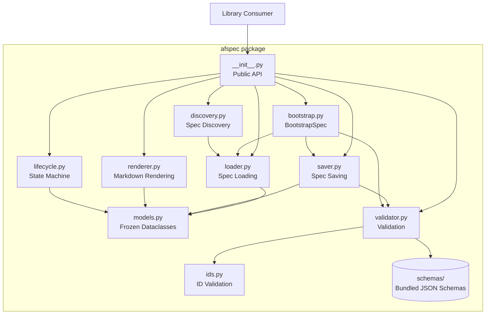
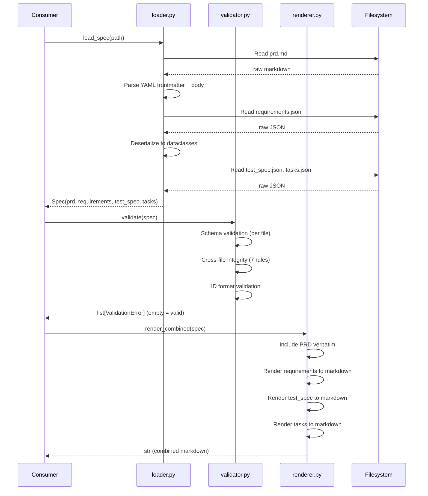

# Design Document: Python Spec-Format Library (afspec)

## Overview

The `afspec` Python package provides a complete implementation of the agent-fox spec-format v1. It mirrors the Go library (spec 01) in functionality: data modeling via frozen dataclasses, deterministic file I/O with atomic writes, JSON Schema and cross-file validation, EARS-based markdown rendering, lifecycle state machine enforcement, bootstrap mode for incremental spec creation, and spec root discovery with dependency graph construction. The library targets Python 3.10+ with minimal external dependencies (PyYAML, jsonschema).

## Architecture



### Data Flow: Load → Validate → Render



### Module Responsibilities

1. **`models.py`** — Frozen dataclasses for all spec-format entities: PRD, Requirements, TestSpec, Tasks, and all nested types. EARS criterion subclasses with factory method. Subtask state enum with transition validation.
2. **`loader.py`** — Read spec folder from disk. Parse YAML frontmatter, deserialize JSON files, construct dataclass instances.
3. **`saver.py`** — Write dataclass instances to disk with atomic writes. Compute `updated_at` and `coverage` before writing. Deterministic JSON and YAML output.
4. **`validator.py`** — Schema validation using bundled JSON Schema files via `jsonschema`. Cross-file integrity checks (seven rules). Collects all errors.
5. **`renderer.py`** — Deterministic markdown rendering of JSON artifacts. EARS sentence templates. Per-file and combined rendering with section headlines.
6. **`lifecycle.py`** — Lifecycle state machine (draft, active, sealed, superseded, archived). Transition validation, intent hash computation, mutation guards.
7. **`bootstrap.py`** — `BootstrapSpec` context manager for incremental spec creation. Defers cross-file validation until finalization.
8. **`discovery.py`** — Scan spec root for valid spec folders, load metadata, build dependency graph, detect cycles.
9. **`ids.py`** — ID format validation for all entity types. Regex-based pattern matching, spec_id consistency checks, sequential numbering warnings.
10. **`exceptions.py`** — Typed exception hierarchy: `SpecValidationError`, `LifecycleError`, `IncompleteSpecError`.

## Execution Paths

### Path 1: Load a spec from disk

1. `afspec/__init__.py: load_spec(path)` — public entry point
2. `afspec/loader.py: _load_prd(path / "prd.md")` → `PRD` — parse YAML frontmatter and markdown body
3. `afspec/loader.py: _load_json(path / "requirements.json", Requirements)` → `Requirements` — deserialize JSON to dataclass
4. `afspec/loader.py: _load_json(path / "test_spec.json", TestSpec)` → `TestSpec`
5. `afspec/loader.py: _load_json(path / "tasks.json", Tasks)` → `Tasks`
6. `afspec/loader.py: Spec(prd, requirements, test_spec, tasks)` → `Spec` — assemble and return

### Path 2: Save a spec to disk

1. `afspec/__init__.py: save_spec(spec, path)` — public entry point
2. `afspec/saver.py: _update_computed_fields(spec)` → `Spec` — compute `updated_at` and `coverage`
3. `afspec/saver.py: _write_prd(prd, path / "prd.md")` — serialize YAML frontmatter + body, atomic write
4. `afspec/saver.py: _write_json(requirements, path / "requirements.json")` — deterministic JSON, atomic write
5. `afspec/saver.py: _write_json(test_spec, path / "test_spec.json")` — deterministic JSON, atomic write
6. `afspec/saver.py: _write_json(tasks, path / "tasks.json")` — deterministic JSON, atomic write
7. Side effect: four files written atomically to `path`

### Path 3: Validate a spec

1. `afspec/__init__.py: validate(spec)` — public entry point
2. `afspec/validator.py: _validate_schemas(spec)` → `list[ValidationError]` — per-file JSON Schema validation
3. `afspec/validator.py: _validate_ids(spec)` → `list[ValidationError]` — ID format checks via `ids.py`
4. `afspec/validator.py: _validate_cross_file(spec)` → `list[ValidationError]` — seven cross-file integrity rules
5. Return: aggregated `list[ValidationError]`

### Path 4: Render combined markdown

1. `afspec/__init__.py: render_combined(spec)` — public entry point
2. `afspec/renderer.py: _render_prd(prd)` → `str` — return PRD body verbatim
3. `afspec/renderer.py: render_requirements(requirements)` → `str` — render EARS sentences, glossary, properties, paths, error handling
4. `afspec/renderer.py: render_test_spec(test_spec)` → `str` — render test cases, property tests, edge cases, smoke tests, coverage matrix
5. `afspec/renderer.py: render_tasks(tasks)` → `str` — render task groups, subtasks, traceability
6. `afspec/renderer.py: _join_with_headlines(prd_md, req_md, ts_md, tasks_md)` → `str` — concatenate under section headlines
7. Return: combined markdown string

### Path 5: Lifecycle transition (draft → active)

1. `afspec/__init__.py: transition(spec, "active")` — public entry point
2. `afspec/lifecycle.py: _check_transition(spec.prd.frontmatter.status, "active")` — validate transition is legal
3. `afspec/lifecycle.py: _compute_intent_hash(spec.prd.body)` → `str` — normalize intent section, compute SHA-256
4. `afspec/lifecycle.py: _apply_transition(spec, "active", intent_hash)` → `Spec` — create new Spec with updated status and intent_hash
5. Return: updated `Spec` with `status="active"` and `intent_hash` set

### Path 6: Bootstrap spec creation

1. Consumer: `with BootstrapSpec(spec_root, spec_id, spec_name) as bs:`
2. `afspec/bootstrap.py: BootstrapSpec.__enter__()` — create spec folder, return self
3. `afspec/bootstrap.py: bs.write_prd(prd)` — write prd.md with per-file schema validation
4. `afspec/bootstrap.py: bs.write_requirements(requirements)` — write requirements.json with per-file validation
5. `afspec/bootstrap.py: bs.write_test_spec(test_spec)` — write test_spec.json with per-file validation
6. `afspec/bootstrap.py: bs.write_tasks(tasks)` — write tasks.json with per-file validation
7. `afspec/bootstrap.py: BootstrapSpec.__exit__()` → `Spec` — run full validation (schema + cross-file), return completed Spec
8. Side effect: spec folder with four validated files on disk

### Path 7: Spec discovery

1. `afspec/__init__.py: discover(spec_root)` — public entry point
2. `afspec/discovery.py: _scan_folders(spec_root)` → `list[Path]` — find directories matching `{NN}_{snake_case_name}`, skip `archive/`
3. `afspec/discovery.py: _load_metadata(folder)` → `SpecEntry` — read PRD frontmatter only for each folder
4. `afspec/discovery.py: _build_dependency_graph(entries)` → `DependencyGraph` — read tasks.json dependency declarations, detect cycles
5. Return: `DiscoveryResult(entries, dependency_graph)`

## Components and Interfaces

### Public API (`afspec/__init__.py`)

```python
def load_spec(path: Path) -> Spec: ...
def save_spec(spec: Spec, path: Path) -> None: ...
def validate(spec: Spec) -> list[ValidationError]: ...
def render_requirements(requirements: Requirements) -> str: ...
def render_test_spec(test_spec: TestSpec) -> str: ...
def render_tasks(tasks: Tasks) -> str: ...
def render_combined(spec: Spec) -> str: ...
def transition(spec: Spec, target_status: str) -> Spec: ...
def discover(spec_root: Path | None = None) -> DiscoveryResult: ...
def schema_version() -> int: ...
```

### Core Data Types (`afspec/models.py`)

```python
@dataclass(frozen=True)
class PRDFrontmatter:
    spec_id: str
    spec_name: str
    title: str
    status: str
    created_at: str
    updated_at: str
    owner: str
    source: str
    supersedes: list[str]
    tags: list[str]
    intent_hash: str | None
    schema_version: int

@dataclass(frozen=True)
class PRD:
    frontmatter: PRDFrontmatter
    body: str

@dataclass(frozen=True)
class Spec:
    prd: PRD
    requirements: Requirements
    test_spec: TestSpec
    tasks: Tasks

@dataclass(frozen=True)
class EARSCriterion:
    id: str
    ears_pattern: str
    system: str
    action: str
    return_contract: str | None

    @classmethod
    def from_dict(cls, data: dict) -> EARSCriterion: ...

@dataclass(frozen=True)
class UbiquitousCriterion(EARSCriterion): ...

@dataclass(frozen=True)
class EventDrivenCriterion(EARSCriterion):
    trigger: str

@dataclass(frozen=True)
class ComplexEventCriterion(EARSCriterion):
    trigger: str
    condition: str

@dataclass(frozen=True)
class StateDrivenCriterion(EARSCriterion):
    state: str

@dataclass(frozen=True)
class UnwantedCriterion(EARSCriterion):
    error_condition: str

@dataclass(frozen=True)
class OptionalCriterion(EARSCriterion):
    feature: str

class SubtaskState(enum.Enum):
    PENDING = "pending"
    QUEUED = "queued"
    IN_PROGRESS = "in_progress"
    DONE = "done"
    PENDING_REEVALUATION = "pending_reevaluation"
    DROPPED = "dropped"

    def can_transition_to(self, target: SubtaskState) -> bool: ...
```

### Exception Hierarchy (`afspec/exceptions.py`)

```python
class AfspecError(Exception): ...

class SpecValidationError(AfspecError):
    errors: list[ValidationError]

class LifecycleError(AfspecError):
    current_state: str
    target_state: str | None
    field: str | None

class IncompleteSpecError(AfspecError):
    missing_files: list[str]
```

### Validation Results (`afspec/validator.py`)

```python
@dataclass(frozen=True)
class ValidationError:
    file: str
    path: str
    rule: str      # e.g., "schema", "integrity-1", "id-format"
    message: str
    severity: str  # "error" | "warning"
```

### Discovery Results (`afspec/discovery.py`)

```python
@dataclass(frozen=True)
class SpecEntry:
    spec_id: str
    spec_name: str
    status: str
    path: Path
    complete: bool

@dataclass(frozen=True)
class DependencyGraph:
    edges: list[DependencyEdge]

    def topological_sort(self) -> list[str]: ...
    def has_cycle(self) -> bool: ...

@dataclass(frozen=True)
class DiscoveryResult:
    entries: list[SpecEntry]
    dependency_graph: DependencyGraph
```

## Data Models

### JSON Schema Files (bundled in `afspec/schemas/`)

| File | Validates | Source |
|------|-----------|--------|
| `requirements.v1.json` | `requirements.json` | Derived from spec-format.md §5 |
| `test_spec.v1.json` | `test_spec.json` | Derived from spec-format.md §6 |
| `tasks.v1.json` | `tasks.json` | Derived from spec-format.md §7 |
| `prd-frontmatter.v1.json` | YAML frontmatter of `prd.md` | Derived from spec-format.md §4.1 |

### YAML Frontmatter Field Order

Fixed serialization order for deterministic output:

```yaml
---
spec_id: "05"
spec_name: "my_feature"
title: "Human-readable title"
status: "draft"
created_at: "2026-05-18T12:00:00Z"
updated_at: "2026-05-18T12:00:00Z"
owner: "author-name"
source: "https://github.com/org/repo/issues/42"
supersedes: []
tags: []
intent_hash: null
schema_version: 1
---
```

### EARS Rendering Templates

| Pattern | Template |
|---------|----------|
| ubiquitous | THE {system} SHALL {action} |
| event_driven | WHEN {trigger}, THE {system} SHALL {action} |
| complex_event | WHEN {trigger} AND {condition}, THE {system} SHALL {action} |
| state_driven | WHILE {state}, THE {system} SHALL {action} |
| unwanted | IF {error_condition}, THEN THE {system} SHALL {action} |
| optional | WHERE {feature}, THE {system} SHALL {action} |

When `return_contract` is non-None AND non-empty, append ` AND return {return_contract}` to the rendered sentence. If `return_contract` is None or an empty string, omit the return contract clause entirely.

### Subtask State Transition Table

| From State | Allowed Next States |
|------------|-------------------|
| pending | queued, dropped |
| queued | in_progress, pending, dropped |
| in_progress | done, pending_reevaluation |
| done | pending_reevaluation |
| pending_reevaluation | pending, dropped |
| dropped | (terminal) |

## Operational Readiness

### Observability

- Validation errors are structured (`ValidationError` dataclass) with file, JSON path, message, and severity.
- All exceptions carry context fields (current state, target state, field name, missing files) for diagnostics.
- No logging framework dependency. Errors are surfaced via return values and exceptions.

### Compatibility

- Python 3.10+ required.
- External dependencies: PyYAML, jsonschema. Both are stable, widely-used packages.
- JSON Schema files are bundled and versioned (`schema_version: 1`). Schema evolution will use new version numbers, not in-place edits.

### Rollout

- Distributed via GitHub releases (source archive). No PyPI.
- Semantic versioning via git tags (`afspec-v1.0.0`).

## Correctness Properties

### Property 1: Idempotent Round-Trip

*For any* valid spec loaded from disk, the library SHALL produce byte-identical files when saved without modification, and a subsequent load SHALL produce identical in-memory state.

**Validates: Requirements 02-REQ-3.4**

### Property 2: EARS Criterion Type Safety

*For any* EARS criterion constructed via the `from_dict` factory, the returned instance SHALL be the correct subclass for the declared `ears_pattern` AND SHALL expose only the fields valid for that pattern.

**Validates: Requirements 02-REQ-1.4**

### Property 3: Subtask State Machine Legality

*For any* subtask state transition attempt, the library SHALL accept the transition if and only if it appears in the legal transition table (pending→queued, pending→dropped, queued→in_progress, queued→pending, queued→dropped, in_progress→done, in_progress→pending_reevaluation, done→pending_reevaluation, pending_reevaluation→pending, pending_reevaluation→dropped).

**Validates: Requirements 02-REQ-1.5**

### Property 4: Lifecycle Transition Legality

*For any* lifecycle transition attempt, the library SHALL accept the transition if and only if it appears in the legal transition graph (draft→active, active→sealed, sealed→superseded, sealed→archived, draft→archived) AND SHALL reject all other transitions with a `LifecycleError`.

**Validates: Requirements 02-REQ-7.1, 02-REQ-7.E1**

### Property 5: Intent Hash Immutability

*For any* spec in active state, the library SHALL reject saves where the recomputed intent hash differs from the stored `intent_hash`, AND the hash SHALL remain identical across any number of load-save cycles when the intent body is unchanged.

**Validates: Requirements 02-REQ-7.2, 02-REQ-7.3, 02-REQ-7.E2**

### Property 6: Cross-File Reference Integrity

*For any* valid spec that passes cross-file validation, every `requirement_id` referenced in test_spec and tasks traceability SHALL exist in requirements, every criterion and edge case SHALL have a test case, every property SHALL have a property test, and every execution path SHALL have a smoke test.

**Validates: Requirements 02-REQ-5.2, 02-REQ-5.3, 02-REQ-5.4, 02-REQ-5.5**

### Property 7: ID Format Consistency

*For any* ID field in a valid spec, the embedded `spec_id` component SHALL match the file's declared `spec_id`, numeric components SHALL be positive integers, and the overall format SHALL match the pattern defined in spec-format.md Appendix A.

**Validates: Requirements 02-REQ-10.1, 02-REQ-10.2, 02-REQ-10.3**

### Property 8: Deterministic Rendering

*For any* in-memory spec state, rendering the same state multiple times SHALL produce byte-identical markdown output, regardless of call order or intermediate operations.

**Validates: Requirements 02-REQ-6.1**

### Property 9: Schema Validation Completeness

*For any* JSON artifact with a structural violation (missing required field, wrong type, unknown field, EARS pattern mismatch), schema validation SHALL report the violation with the file name, JSON path, and a human-readable description.

**Validates: Requirements 02-REQ-4.1, 02-REQ-4.2, 02-REQ-4.4, 02-REQ-4.E1, 02-REQ-4.E2**

### Property 10: Atomic Write Safety

*For any* save operation that fails mid-write, the target directory SHALL remain in its pre-save state with no partially-written files visible.

**Validates: Requirements 02-REQ-3.1, 02-REQ-3.E2**

### Property 11: Computed Coverage Accuracy

*For any* spec saved via the library, the `coverage` field in test_spec.json SHALL accurately reflect the coverage state: `requirements_covered` SHALL list all requirement and edge case IDs that have a test case, `gaps` SHALL list all IDs that lack coverage, and the union of `requirements_covered` and `gaps` SHALL equal all requirement and edge case IDs in requirements.json.

**Validates: Requirements 02-REQ-3.6**

## Error Handling

| Error Condition | Behavior | Requirement |
|----------------|----------|-------------|
| Spec folder missing required files | Raise `IncompleteSpecError` listing absent files | 02-REQ-2.E1 |
| Malformed JSON in spec file | Raise parse error with file name and details | 02-REQ-2.E2 |
| Malformed YAML frontmatter | Raise parse error | 02-REQ-2.E3 |
| Missing `## Intent` section in PRD | Raise `SpecValidationError` | 02-REQ-2.E4 |
| Spec folder path does not exist | Raise `FileNotFoundError` | 02-REQ-2.E5 |
| Target save directory does not exist | Raise error without creating directory | 02-REQ-3.E1 |
| Write failure mid-save | Raise error, clean up temp files, preserve pre-save state | 02-REQ-3.E2 |
| Unknown field in JSON schema | Reject with error identifying field path | 02-REQ-4.E1 |
| EARS field mismatch for pattern | Reject with error identifying criterion ID and field | 02-REQ-4.E2 |
| Cross-file integrity violation | Return all violations, not just the first | 02-REQ-5.1 |
| Bootstrap finalize before all files written | Raise `IncompleteSpecError` | 02-REQ-8.E1 |
| Bootstrap on existing spec folder | Raise error to prevent overwrite | 02-REQ-8.E3 |
| Illegal lifecycle transition | Raise `LifecycleError` naming current and target state | 02-REQ-7.E1 |
| Intent tampered in active spec | Raise `LifecycleError` for intent hash mismatch | 02-REQ-7.E2 |
| Mutation on sealed/superseded/archived spec | Raise `LifecycleError` identifying current state | 02-REQ-7.4 |
| Spec root directory does not exist | Raise error | 02-REQ-9.E1 |
| Dependency graph cycle | Raise error identifying spec IDs in cycle | 02-REQ-9.E3 |
| ID spec_id mismatch | Validation error identifying mismatched ID | 02-REQ-10.E1 |

## Technology Stack

| Component | Technology | Purpose |
|-----------|-----------|---------|
| Language | Python 3.10+ | Runtime |
| Type hints | `from __future__ import annotations` | Modern union syntax (`X \| Y`) |
| Data modeling | `dataclasses` (stdlib) | Frozen immutable model objects |
| Enums | `enum.Enum` (stdlib) | Subtask state, lifecycle state |
| YAML parsing | PyYAML | PRD frontmatter serialization |
| JSON Schema | jsonschema | Per-file schema validation |
| Hashing | hashlib (stdlib) | SHA-256 for intent hash |
| File I/O | pathlib, tempfile (stdlib) | Atomic writes via temp file + rename |
| Package resources | importlib.resources (stdlib) | Bundled JSON Schema access |
| Testing | pytest | Test framework |
| Linting | ruff | Code linting |
| Type checking | mypy | Static type checking |
| Package management | uv | Dependency management |
| Packaging | pyproject.toml | Package metadata and build config |

## Definition of Done

A task group is complete when ALL of the following are true:

1. All subtasks within the group are checked off (`[x]`)
2. All spec tests (`test_spec.md` entries) for the task group pass
3. All property tests for the task group pass
4. All previously passing tests still pass (no regressions)
5. No linter warnings or errors introduced
6. Code is committed on a feature branch and merged into `develop`
7. Feature branch is merged back to `develop`
8. `tasks.md` checkboxes are updated to reflect completion

## Testing Strategy

- **Unit tests**: One test per acceptance criterion and edge case, located in `afspec/tests/`. Test each module in isolation using in-memory dataclass fixtures.
- **Property-based tests**: Use `hypothesis` to generate random EARS criteria, subtask state sequences, lifecycle transitions, and spec structures. Verify invariants hold for all generated inputs.
- **Integration tests**: End-to-end tests that exercise full load→validate→render and load→save→load paths using fixture specs on the filesystem (tmpdir).
- **Golden fixture tests**: Load shared golden fixtures from `testdata/golden/`, process them (round-trip, render), and compare output byte-for-byte against expected files. These fixtures are shared with the Go library for cross-library consistency verification.
- **Smoke tests**: One per execution path. Exercise the full path from public API entry point to observable side effect using real components (no mocking of afspec internals).
