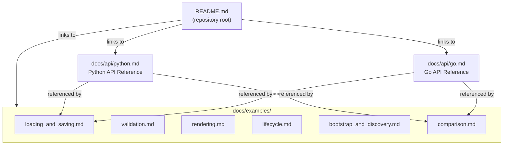

# Design Document: afspec Library Documentation

## Overview

This spec produces the documentation suite for both afspec libraries. The deliverables are markdown files: two API references, six example files, and an updated monorepo README. No runtime code is produced. The documentation is authored from the public API surfaces defined in specs 01 (Go) and 02 (Python) design documents.

## Architecture



### Module Responsibilities

1. **`README.md`** — Entry point for the repository. Introduces both libraries, provides quick-start snippets, links to all other documentation.
2. **`docs/api/go.md`** — Complete Go API reference organized by functional category.
3. **`docs/api/python.md`** — Complete Python API reference organized by functional category.
4. **`docs/examples/*.md`** — Six focused example files covering common operations in both languages.

## Execution Paths

### Path 1: Developer discovers library via README

1. `Developer` — visits the repository and reads README.md
2. `README.md` — presents project overview, quick-start for Go and Python, links to docs
3. `Developer` — clicks link to docs/api/go.md or docs/api/python.md
4. `API reference` — developer finds the function they need and reads its signature, description, and example

### Path 2: Developer looks up a specific Go function

1. `Developer` — opens docs/api/go.md
2. `Go API reference` — developer navigates to the function's category section (e.g., Validation)
3. `Function entry` — developer reads the signature, parameters, return type, errors, and usage example
4. `Developer` — applies the function in their code

### Path 3: Developer looks up a specific Python function

1. `Developer` — opens docs/api/python.md
2. `Python API reference` — developer navigates to the function's category section
3. `Function entry` — developer reads the signature, parameters, return type, exceptions, and usage example
4. `Developer` — applies the function in their code

### Path 4: Developer learns from examples

1. `Developer` — opens a file in docs/examples/
2. `Example file` — developer reads the prose description and code snippets
3. `Developer` — copies and adapts the example for their use case

### Path 5: Developer translates between Go and Python

1. `Developer` — opens docs/examples/comparison.md
2. `Comparison document` — developer finds the operation they want to translate
3. `Go/Python blocks` — developer reads the equivalent code in both languages, noting differences
4. `Developer` — writes the equivalent code in their target language

## Components and Interfaces

### Go API Reference Structure (`docs/api/go.md`)

```markdown
# Go API Reference: afspec

## Loading
### LoadSpec
{signature, description, parameters, returns, errors, example}

## Saving
### SaveSpec
{signature, description, parameters, returns, errors, example}

## Validation
### Validate
### ValidateSchema
### ValidateCrossFile
{each with signature, description, parameters, returns, errors}

## Rendering
### RenderRequirements
### RenderTestSpec
### RenderTasks
### RenderCombined
{each with signature, description, parameters, returns, errors}

## Lifecycle
### Transition
{signature, description, parameters, returns, errors, example}

## Bootstrap
### NewBootstrap
### Bootstrap.WritePRD / WriteRequirements / WriteTestSpec / WriteTasks
### Bootstrap.Finalize
{each with signature, description, parameters, returns, errors, example}

## Discovery
### DiscoverSpecs
{signature, description, parameters, returns, errors, example}

## Types
### Spec / PRD / Frontmatter / Status
### Requirements / Requirement / Criterion / CorrectnessProperty / ExecutionPath
### TestSpecDoc / TestCase / PropertyTest / SmokeTest / Coverage
### Tasks / TaskGroup / Subtask / SubtaskState / TraceabilityEntry
### ValidationError / LifecycleError / IncompleteSpecError
### DiscoveryResult / SpecEntry / DependencyGraph
### Bootstrap
{each with field table}
```

### Python API Reference Structure (`docs/api/python.md`)

```markdown
# Python API Reference: afspec

## Loading
### load_spec
{signature, description, parameters, returns, exceptions, example}

## Saving
### save_spec
{signature, description, parameters, returns, exceptions, example}

## Validation
### validate
{signature, description, parameters, returns, exceptions}

## Rendering
### render_requirements / render_test_spec / render_tasks / render_combined
{each with signature, description, parameters, returns, exceptions}

## Lifecycle
### transition
{signature, description, parameters, returns, exceptions, example}

## Bootstrap
### BootstrapSpec (context manager)
{signature, description, methods, example}

## Discovery
### discover / schema_version
{each with signature, description, parameters, returns, exceptions}

## Types
### Spec / PRD / PRDFrontmatter
### Requirements / EARSCriterion subclasses / SubtaskState
### TestSpec / Tasks / ValidationError
### DiscoveryResult / SpecEntry / DependencyGraph
### Exceptions: AfspecError / SpecValidationError / LifecycleError / IncompleteSpecError
{each with field table}
```

### Example File Structure

Each example file follows this template:

```markdown
# {Topic} Examples

Brief intro paragraph.

## Go

### {Operation Name}

{Prose description of what this example demonstrates.}

```go
package main

import "github.com/agent-fox/afspec"

func main() {
    // complete example
}
```

## Python

### {Operation Name}

{Prose description.}

```python
import afspec

# complete example
```
```

### README Structure

```markdown
# af-spec

{One-paragraph overview}

## Quick Start

### Go
{minimal load → validate → render example}

### Python
{minimal load → validate → render example}

## Documentation

- [Go API Reference](docs/api/go.md)
- [Python API Reference](docs/api/python.md)
- [Usage Examples](docs/examples/)
- [Spec Format Specification](docs/spec-format.md)

## Libraries

### Go Library
{import path, minimum Go version, key features}

### Python Library
{package path, minimum Python version, key features}
```

## Data Models

This spec produces no runtime data models. All deliverables are markdown files.

### File Inventory

| File | Purpose |
|------|---------|
| `README.md` | Repository entry point |
| `docs/api/go.md` | Go API reference |
| `docs/api/python.md` | Python API reference |
| `docs/examples/loading_and_saving.md` | Load/save examples |
| `docs/examples/validation.md` | Validation examples |
| `docs/examples/rendering.md` | Rendering examples |
| `docs/examples/lifecycle.md` | Lifecycle examples |
| `docs/examples/bootstrap_and_discovery.md` | Bootstrap and discovery examples |
| `docs/examples/comparison.md` | Cross-library comparison |

Total: 9 files (1 updated, 8 new).

### Go Public API Surface (from spec 01 design.md)

Functions to document:

| Function | Category |
|----------|----------|
| `LoadSpec(dir string) (*Spec, error)` | Loading |
| `SaveSpec(dir string, spec *Spec) error` | Saving |
| `Validate(spec *Spec) ([]ValidationError, error)` | Validation |
| `ValidateSchema(spec *Spec) ([]ValidationError, error)` | Validation |
| `ValidateCrossFile(spec *Spec) ([]ValidationError, error)` | Validation |
| `RenderRequirements(req *Requirements) ([]byte, error)` | Rendering |
| `RenderTestSpec(ts *TestSpecDoc) ([]byte, error)` | Rendering |
| `RenderTasks(tasks *Tasks) ([]byte, error)` | Rendering |
| `RenderCombined(spec *Spec) ([]byte, error)` | Rendering |
| `Transition(spec *Spec, target Status) (*Spec, error)` | Lifecycle |
| `NewBootstrap(dir, specID, specName string) (*Bootstrap, error)` | Bootstrap |
| `DiscoverSpecs(root string) (*DiscoveryResult, error)` | Discovery |

Types to document: 24 (Spec, PRD, Frontmatter, Status, Requirements, Requirement, UserStory, Criterion, CorrectnessProperty, ExecutionPath, ExecutionPathStep, ErrorHandlingEntry, TestSpecDoc, TestCase, PropertyTest, EdgeCaseTest, SmokeTest, Coverage, Tasks, TestCommands, TaskDependency, TaskGroup, Subtask, SubtaskState, VerificationSubtask, TraceabilityEntry, ValidationError, Severity, LifecycleError, IncompleteSpecError, DiscoveryResult, SpecEntry, DependencyGraph, Bootstrap).

### Python Public API Surface (from spec 02 design.md)

Functions to document:

| Function | Category |
|----------|----------|
| `load_spec(path: Path) -> Spec` | Loading |
| `save_spec(spec: Spec, path: Path) -> None` | Saving |
| `validate(spec: Spec) -> list[ValidationError]` | Validation |
| `render_requirements(requirements: Requirements) -> str` | Rendering |
| `render_test_spec(test_spec: TestSpec) -> str` | Rendering |
| `render_tasks(tasks: Tasks) -> str` | Rendering |
| `render_combined(spec: Spec) -> str` | Rendering |
| `transition(spec: Spec, target_status: str) -> Spec` | Lifecycle |
| `discover(spec_root: Path \| None = None) -> DiscoveryResult` | Discovery |
| `schema_version() -> int` | Discovery |

Types to document: Spec, PRD, PRDFrontmatter, Requirements, Requirement, UserStory, EARSCriterion (+ 6 subclasses), CorrectnessProperty, ExecutionPath, ExecutionPathStep, ErrorHandlingEntry, TestSpec, TestCase, PropertyTest, EdgeCaseTest, SmokeTest, Coverage, Tasks, TestCommands, TaskDependency, TaskGroup, Subtask, SubtaskState, VerificationSubtask, TraceabilityEntry, ValidationError, SpecEntry, DependencyGraph, DiscoveryResult, BootstrapSpec, AfspecError, SpecValidationError, LifecycleError, IncompleteSpecError.

## Operational Readiness

Not applicable — this spec produces documentation files only.

## Correctness Properties

### Property 1: Go API Coverage Completeness

*For any* public function listed in spec 01 design.md (Components and Interfaces section), the Go API reference SHALL contain a matching documentation entry with the correct function signature.

**Validates: Requirements 03-REQ-1.1, 03-REQ-6.1**

### Property 2: Python API Coverage Completeness

*For any* public function listed in spec 02 design.md (Components and Interfaces section), the Python API reference SHALL contain a matching documentation entry with the correct function signature.

**Validates: Requirements 03-REQ-2.1, 03-REQ-6.2**

### Property 3: Example Operation Coverage

*For any* operation category (loading, saving, validation, rendering, lifecycle, bootstrap, discovery), the documentation SHALL contain at least one Go example and one Python example demonstrating that operation.

**Validates: Requirements 03-REQ-3.1, 03-REQ-3.3**

### Property 4: Cross-Reference Integrity

*For any* link in README.md pointing to a documentation file, the target file SHALL exist at the referenced path.

**Validates: Requirements 03-REQ-5.3, 03-REQ-5.E1**

### Property 5: Type Documentation Completeness

*For any* public type listed in the design documents (specs 01 and 02), the corresponding API reference SHALL contain a type entry listing all fields with correct types.

**Validates: Requirements 03-REQ-1.3, 03-REQ-2.3, 03-REQ-6.3**

## Error Handling

| Error Condition | Behavior | Requirement |
|----------------|----------|-------------|
| Public function missing from API reference | Authoring task must add the entry before completion | 03-REQ-1.1, 03-REQ-2.1 |
| Documented signature doesn't match design doc | Authoring task must correct the signature | 03-REQ-6.1, 03-REQ-6.2 |
| README link points to non-existent file | Add a note that the file is a planned location | 03-REQ-5.E1 |
| Operation missing from comparison doc | Authoring task must add the comparison entry | 03-REQ-4.2 |
| Go-only or Python-only function in comparison | Note the absence and describe the closest alternative | 03-REQ-4.E1 |

## Technology Stack

| Technology | Purpose |
|-----------|---------|
| Markdown | Documentation format |
| Mermaid | Architecture diagrams (in markdown) |

## Definition of Done

A task group is complete when ALL of the following are true:

1. All subtasks within the group are checked off (`[x]`)
2. All spec tests (`test_spec.md` entries) for the task group pass
3. All property tests for the task group pass
4. All previously passing tests still pass (no regressions)
5. No linter warnings or errors introduced
6. Code is committed on a feature branch and merged into `develop`
7. Feature branch is merged back to `develop`
8. `tasks.md` checkboxes are updated to reflect completion

## Testing Strategy

Since this spec produces documentation (markdown files), testing verifies:

- **File existence**: All required documentation files exist at their specified paths.
- **Structural completeness**: Required sections are present in each file (headings, function entries, type entries).
- **API surface coverage**: Every public function and type from the design docs has a corresponding entry in the API reference.
- **Link integrity**: All relative links in README.md point to existing files.
- **Content accuracy**: Documented function signatures match the design documents.

Tests are implemented as Python scripts that parse the markdown files and check structure and content. They do not compile Go examples or run Python examples.
