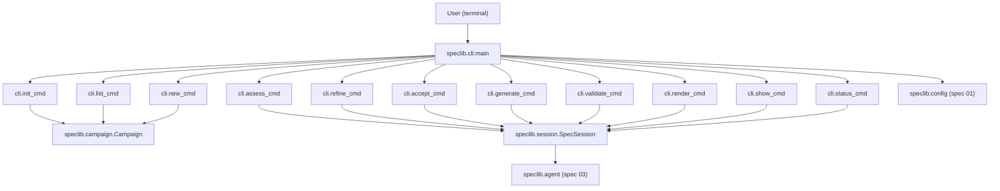

# Design Document: spec CLI

## Overview

This spec implements the `spec` command-line interface using Click. The CLI
is a thin presentation layer that delegates all business logic to speclib's
Campaign (spec 02), SpecSession (spec 02), and agent pipeline (spec 03).
The CLI is responsible for argument parsing, campaign/spec resolution, output
formatting, and error presentation.

## Architecture



### Module Responsibilities

1. **speclib/cli.py** — Main CLI module. Contains the Click group, all
   subcommand functions, shared helpers (spec resolution, campaign resolution,
   output formatting), and the error-handling wrapper.

### Key Design Patterns

1. **Click group with pass_context:** The `main` function is a
   `@click.group()` that stores the resolved campaign directory in the Click
   context (`ctx.obj`). Subcommands access it via `@click.pass_context`.

2. **Spec resolution helper:** A shared `resolve_spec(campaign, spec_arg)`
   function scans campaign spec directories and returns the matching path.
   Used by all spec authoring commands.

3. **Error boundary:** A decorator or try/except block at each command
   function catches `CampaignError`, `SessionError`, and `ValidationError`
   from speclib, formats them as user-friendly messages, and calls
   `sys.exit(1)`. Unexpected exceptions produce a generic error and
   `sys.exit(2)`.

4. **Async bridge:** Commands that call async session methods (`assess`,
   `refine`, `generate`) use `asyncio.run()` to execute the coroutine within
   Click's synchronous command handler.

## Execution Paths

### Path 1: Campaign init

1. `cli:main` — parses `--campaign-dir` (not used for init)
2. `cli:init_cmd` — receives `path`, `--name`, `--description` arguments
3. `cli:init_cmd` — resolves relative path to absolute
4. `Campaign.create(path, name, description)` — creates directory and campaign.yaml
5. `cli:init_cmd` — prints confirmation with absolute path, exits 0

### Path 2: Campaign list

1. `cli:main` — resolves campaign directory from CWD or `--campaign-dir`
2. `cli:list_cmd` — receives optional `campaign_dir` argument
3. `Campaign.open(campaign_dir)` — opens the campaign
4. `campaign.specs()` — returns list of spec directory paths
5. For each spec: `SpecSession.resume(spec_dir)` — loads session state
6. `cli:list_cmd` — formats and prints table (number, name, state, artifact count)
7. Exits 0

### Path 3: Spec new

1. `cli:main` — resolves campaign directory
2. `cli:new_cmd` — receives `prd_file`, `--name`, `--one-shot` arguments
3. `cli:new_cmd` — validates PRD file exists, derives name if not provided
4. `campaign.new_spec(name, prd_content, mode)` — creates spec dir and session
5. `cli:new_cmd` — prints created spec directory name, exits 0

### Path 4: Spec assess

1. `cli:main` — resolves campaign directory
2. `cli:assess_cmd` — receives `spec` argument
3. `cli:resolve_spec(campaign, spec)` — finds matching spec directory
4. `SpecSession.resume(spec_dir)` — loads session
5. `asyncio.run(session.assess())` — runs assessment via agent pipeline
6. `cli:assess_cmd` — formats and prints assessment summary, exits 0

### Path 5: Spec refine

1. `cli:main` — resolves campaign directory
2. `cli:refine_cmd` — receives `spec`, `--answers` arguments
3. `cli:resolve_spec(campaign, spec)` — finds spec directory
4. `cli:refine_cmd` — reads and parses answers JSON file
5. `SpecSession.resume(spec_dir)` — loads session
6. `asyncio.run(session.refine(answers))` — runs refinement
7. `cli:refine_cmd` — prints updated assessment summary, exits 0

### Path 6: Spec accept

1. `cli:main` — resolves campaign directory
2. `cli:accept_cmd` — receives `spec` argument
3. `cli:resolve_spec(campaign, spec)` — finds spec directory
4. `SpecSession.resume(spec_dir)` — loads session
5. `session.accept_prd()` — transitions state to prd_accepted
6. `cli:accept_cmd` — prints confirmation with new state, exits 0

### Path 7: Spec generate

1. `cli:main` — resolves campaign directory
2. `cli:generate_cmd` — receives `spec` argument
3. `cli:resolve_spec(campaign, spec)` — finds spec directory
4. `SpecSession.resume(spec_dir)` — loads session
5. `asyncio.run(session.generate())` — generates artifacts via agent pipeline
6. `cli:generate_cmd` — prints progress and summary of generated artifacts, exits 0

### Path 8: Spec validate

1. `cli:main` — resolves campaign directory
2. `cli:validate_cmd` — receives `spec` argument
3. `cli:resolve_spec(campaign, spec)` — finds spec directory
4. `SpecSession.resume(spec_dir)` — loads session
5. `session.validate()` — runs validation via afspec
6. `cli:validate_cmd` — prints success message or error table, exits 0 or 1

### Path 9: Spec render

1. `cli:main` — resolves campaign directory
2. `cli:render_cmd` — receives `spec`, `--combined` arguments
3. `cli:resolve_spec(campaign, spec)` — finds spec directory
4. `SpecSession.resume(spec_dir)` — loads session
5. `session.render(combined=combined)` — renders markdown
6. `cli:render_cmd` — prints markdown to stdout, exits 0

### Path 10: Spec show

1. `cli:main` — resolves campaign directory
2. `cli:show_cmd` — receives `spec`, `--artifact` arguments
3. `cli:resolve_spec(campaign, spec)` — finds spec directory
4. If `--artifact`: reads artifact file from spec dir, prints content
5. If no `--artifact`: `SpecSession.resume(spec_dir)`, prints session state
6. Exits 0

### Path 11: Status command

1. `cli:main` — resolves campaign directory
2. `cli:status_cmd` — receives optional `spec` argument
3. If no spec: same as `list` but focused on state display
4. If spec provided: `cli:resolve_spec`, `SpecSession.resume`, prints detailed state
5. Exits 0

## Components and Interfaces

### CLI Entry Point

```python
@click.group()
@click.option("--campaign-dir", "-C", type=click.Path(exists=True),
              default=None, help="Campaign directory (default: CWD)")
@click.pass_context
def main(ctx: click.Context, campaign_dir: str | None) -> None:
    """spec: local spec authoring tool."""
    ctx.ensure_object(dict)
    ctx.obj["campaign_dir"] = Path(campaign_dir) if campaign_dir else Path.cwd()
```

### Campaign Commands

```python
@main.command("init")
@click.argument("path", type=click.Path())
@click.option("--name", default=None, help="Campaign name (default: directory basename)")
@click.option("--description", default="", help="Campaign description")
def init_cmd(path: str, name: str | None, description: str) -> None:
    """Create a new campaign working directory."""
    ...

@main.command("list")
@click.argument("campaign_dir", required=False, type=click.Path(exists=True))
@click.pass_context
def list_cmd(ctx: click.Context, campaign_dir: str | None) -> None:
    """List specs in a campaign directory with their session state."""
    ...
```

### Spec Authoring Commands

```python
@main.command("new")
@click.argument("prd_file", type=click.Path(exists=True))
@click.option("--name", default=None, help="Spec name (default: derived from filename)")
@click.option("--one-shot", is_flag=True, help="Skip interactive refinement")
@click.pass_context
def new_cmd(ctx: click.Context, prd_file: str, name: str | None, one_shot: bool) -> None:
    """Create a new spec from a PRD."""
    ...

@main.command("assess")
@click.argument("spec")
@click.pass_context
def assess_cmd(ctx: click.Context, spec: str) -> None:
    """Run or re-run PRD assessment."""
    ...

@main.command("refine")
@click.argument("spec")
@click.option("--answers", required=True, type=click.Path(exists=True),
              help="JSON file with answers to assessment questions")
@click.pass_context
def refine_cmd(ctx: click.Context, spec: str, answers: str) -> None:
    """Submit answers and update PRD."""
    ...

@main.command("accept")
@click.argument("spec")
@click.pass_context
def accept_cmd(ctx: click.Context, spec: str) -> None:
    """Accept the PRD, ending refinement loop."""
    ...

@main.command("generate")
@click.argument("spec")
@click.pass_context
def generate_cmd(ctx: click.Context, spec: str) -> None:
    """Generate JSON artifacts from accepted PRD."""
    ...

@main.command("validate")
@click.argument("spec")
@click.pass_context
def validate_cmd(ctx: click.Context, spec: str) -> None:
    """Run schema and cross-file checks."""
    ...

@main.command("render")
@click.argument("spec")
@click.option("--combined", is_flag=True, help="Render as single combined document")
@click.pass_context
def render_cmd(ctx: click.Context, spec: str, combined: bool) -> None:
    """Render spec as markdown."""
    ...

@main.command("show")
@click.argument("spec")
@click.option("--artifact", default=None, help="Artifact name to display")
@click.pass_context
def show_cmd(ctx: click.Context, spec: str, artifact: str | None) -> None:
    """Display an artifact or session state."""
    ...

@main.command("status")
@click.argument("spec", required=False)
@click.pass_context
def status_cmd(ctx: click.Context, spec: str | None) -> None:
    """Print session state."""
    ...
```

### Shared Helpers

```python
def resolve_campaign(ctx: click.Context) -> Campaign:
    """Open the campaign from the context's campaign_dir.

    Raises click.ClickException if not a campaign directory.
    """
    ...

def resolve_spec(campaign: Campaign, spec_arg: str) -> Path:
    """Resolve a spec argument to a spec directory path.

    Matches by full directory name or numeric prefix.
    Raises click.ClickException if no match, listing available specs.
    """
    ...

def format_table(headers: list[str], rows: list[list[str]]) -> str:
    """Format data as a plain-text table.

    Uses Rich Table if available, falls back to simple column alignment.
    """
    ...

def format_assessment(assessment: dict) -> str:
    """Format an assessment result for terminal display.

    Shows quality score, gaps, and questions with section headers.
    """
    ...

def format_validation_errors(errors: list[dict]) -> str:
    """Format validation errors as a table with file, path, message columns."""
    ...

def handle_error(err: Exception) -> None:
    """Print a user-friendly error message and exit with appropriate code.

    CampaignError, SessionError → exit 1
    Other exceptions → exit 2
    """
    ...
```

## Data Models

### Click Context Object

The Click context `ctx.obj` is a dictionary containing:

```python
ctx.obj = {
    "campaign_dir": Path,  # Resolved campaign directory path
}
```

### Output Formats

**List/Status table:**

```
 #  Name            State          Artifacts
 01 data_models     generated      4
 02 api_endpoints   refining       1
 03 auth_module     init           0
```

**Assessment output:**

```
Assessment for: 01_data_models

Quality: 7/10

Gaps:
  1. Missing error handling for edge case X
  2. No mention of performance requirements

Questions:
  Q1: What is the expected data volume?
  Q2: Should the API support pagination?
```

**Validation error output:**

```
Validation errors for: 01_data_models

 File              Path                    Message
 requirements.md   /requirements/0/id      Missing requirement ID
 design.md         /components/2/interface  Interface references undefined type
```

## Correctness Properties

### Property 1: Spec resolution is deterministic

*For any* campaign containing specs and *for any* valid spec argument
(full name or numeric prefix), `resolve_spec()` SHALL return the same path
on every call, and the path SHALL correspond to a directory that exists.

**Validates: Requirements 04-REQ-CC.4**

### Property 2: All subcommands produce non-zero exit on error

*For any* subcommand invocation that encounters a CampaignError or
SessionError, THE CLI SHALL exit with code 1, never code 0.

**Validates: Requirements 04-REQ-CC.6**

### Property 3: Campaign directory resolution precedence

*For any* invocation with `--campaign-dir`, THE CLI SHALL use the provided
path and ignore CWD. *For any* invocation without `--campaign-dir`, THE CLI
SHALL use CWD.

**Validates: Requirements 04-REQ-CC.1, 04-REQ-CC.2**

### Property 4: Init command idempotency guard

*For any* path that already contains a `campaign.yaml`, `spec init` SHALL
fail with exit code 1. It SHALL never overwrite or modify an existing campaign.

**Validates: Requirements 04-REQ-1.4 (via Campaign.create raising CampaignError)**

### Property 5: State gate enforcement

*For any* spec authoring command that requires a specific session state, THE
CLI SHALL exit with code 1 and a descriptive message when the session is in a
different state. The CLI SHALL never silently ignore state mismatches.

**Validates: Requirements 04-REQ-4.3, 04-REQ-5.4, 04-REQ-6.2, 04-REQ-7.3**

## Error Handling

| Error Condition | Behavior | Exit Code | Requirement |
|----------------|----------|-----------|-------------|
| CWD is not a campaign dir | Print error with `--campaign-dir` hint | 1 | 04-REQ-CC.3 |
| `--campaign-dir` path is not a campaign | Print error | 1 | 04-REQ-CC.3 |
| Spec argument matches no spec | List available specs | 1 | 04-REQ-CC.5 |
| Init on existing campaign | Print "campaign already exists" | 1 | 04-REQ-1.4 |
| PRD file not found | Print "file not found" with path | 1 | 04-REQ-3.4 |
| Invalid spec name | Print naming rules | 1 | 04-REQ-3.E1 |
| Wrong state for assess | Print current vs required state | 1 | 04-REQ-4.3 |
| Agent error during assess | Print error to stderr | 2 | 04-REQ-4.E1 |
| Answers file not found | Print "file not found" | 1 | 04-REQ-5.2 |
| Invalid JSON in answers | Print parse error | 1 | 04-REQ-5.3 |
| Wrong state for refine | Print current vs required state | 1 | 04-REQ-5.4 |
| Invalid answers schema | Print schema rules | 1 | 04-REQ-5.E1 |
| Wrong state for accept | Print current vs required state | 1 | 04-REQ-6.2 |
| Wrong state for generate | Print state and "accept PRD first" | 1 | 04-REQ-7.3 |
| Agent error during generate | Print error to stderr | 2 | 04-REQ-7.E1 |
| Missing artifacts for validate | List missing artifacts | 1 | 04-REQ-8.E1 |
| Missing artifacts for render | List missing artifacts | 1 | 04-REQ-9.E1 |
| Artifact not found for show | List available artifacts | 1 | 04-REQ-10.5 |
| Unexpected exception | Generic error + traceback hint | 2 | 04-REQ-CC.6 |

## Technology Stack

- Python 3.14+
- `click` — CLI framework (argument parsing, help generation, context)
- `speclib.campaign` — Campaign class (spec 02)
- `speclib.session` — SpecSession class (spec 02)
- `speclib.agent` — Agent pipeline (spec 03)
- `speclib.config` — Configuration loading (spec 01)
- `speclib.errors` — Exception hierarchy (spec 01)
- `rich` (optional) — Terminal formatting for tables and colored output
- `asyncio` — Bridge for async session methods

## Operational Readiness

N/A for CLI tool -- no deployment, monitoring, or rollback concerns. The CLI
is installed as a console script via pyproject.toml and runs locally on the
user's machine. There is no server process, no persistent state beyond the
filesystem, and no infrastructure to manage.

## Definition of Done

A task group is complete when ALL of the following are true:

1. All subtasks within the group are checked off (`[x]`)
2. All spec tests (`test_spec.md` entries) for the task group pass
3. All property tests for the task group pass
4. All previously passing tests still pass (no regressions)
5. No linter warnings or errors introduced
6. Code is committed on a feature branch and merged into `develop`
7. `tasks.md` checkboxes are updated to reflect completion

## Testing Strategy

- **Unit tests** using Click's `CliRunner` for each subcommand. Mock Campaign
  and SpecSession to isolate CLI logic from business logic.
- **Integration tests** using `CliRunner` with real Campaign and SpecSession
  instances on temp directories.
- **Property tests** for spec resolution determinism and exit code correctness.
- **Edge case tests** for every error condition in the error handling table.
- **Smoke tests** for full end-to-end paths (init → new → assess → accept →
  generate → validate → render).
