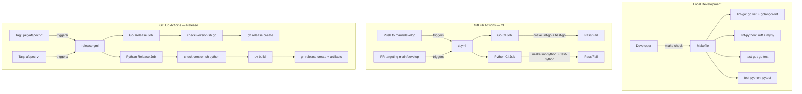

# Design Document: afspec Build and Release

## Overview

The build and release infrastructure consists of five files: two GitHub Actions workflow files (`ci.yml`, `release.yml`), an updated `Makefile`, a Go linter configuration (`.golangci.yml`), and a version validation script (`scripts/check-version.sh`). CI uses the same `make` targets as local development to ensure behavioral parity. The release workflow validates version consistency between git tags and code before creating GitHub releases.

## Architecture



### Module Responsibilities

1. **`.github/workflows/ci.yml`** — Defines the CI pipeline triggered by pushes and PRs to `main`/`develop`. Contains two jobs: Go CI and Python CI.
2. **`.github/workflows/release.yml`** — Defines the release pipeline triggered by tag pushes. Contains two conditional jobs: Go release and Python release.
3. **`Makefile`** — Provides unified build targets for local development and CI. Handles graceful degradation for missing languages.
4. **`.golangci.yml`** — Configures the Go linter aggregator with enabled linter rules.
5. **`scripts/check-version.sh`** — Validates that a git tag version matches the version embedded in library code. Used by the release workflow.

## Execution Paths

### Path 1: Local quality gate (`make check`)

1. Developer runs `make check` from the repo root
2. `Makefile: check` → depends on `lint` then `test`
3. `Makefile: lint` → runs `lint-go` then `lint-python`
4. `Makefile: lint-go` → checks `go.mod` exists → runs `go vet ./...` and `golangci-lint run` → exit code 0 or 1
5. `Makefile: lint-python` → checks `pyproject.toml` exists → runs `uv run ruff check` and `uv run mypy afspec/` (or prints skip message) → exit code 0
6. `Makefile: test` → runs `test-go` then `test-python`
7. `Makefile: test-go` → checks `go.mod` exists → runs `go test -count=1 ./...` → exit code 0 or 1
8. `Makefile: test-python` → checks `pyproject.toml` exists → runs `uv run pytest -q` (or prints skip message) → exit code 0
9. Side effect: exit code 0 if all present-language checks pass

### Path 2: CI pipeline on push/PR

1. Push to `main`/`develop` or PR targeting `main`/`develop` → triggers `.github/workflows/ci.yml`
2. `ci.yml: go` job → `actions/checkout@v4` → `actions/setup-go@v5` (go-version-file: go.mod) → `golangci/golangci-lint-action@v6` (install + run) → `make lint-go` → `make test-go`
3. `ci.yml: python` job (conditional: `hashFiles('pyproject.toml') != ''`) → `actions/checkout@v4` → `actions/setup-python@v5` (matrix: 3.10, 3.13) → `astral-sh/setup-uv@v4` → `make lint-python` → `make test-python`
4. Side effect: commit/PR status check (pass/fail)

### Path 3: Go release on tag push

1. Push tag `pkg/afspec/v{X.Y.Z}` → triggers `.github/workflows/release.yml`
2. `release.yml: release-go` job (condition: `startsWith(github.ref_name, 'pkg/afspec/v')`) → `actions/checkout@v4`
3. `scripts/check-version.sh go "$TAG"` → extracts `{X.Y.Z}` from tag → reads `Version` constant from `internal/version/version.go` → compares → exit 0 (match) or exit 1 (mismatch)
4. `gh release create "$TAG" --generate-notes` → side effect: GitHub release created with auto-generated source archives

### Path 4: Python release on tag push

1. Push tag `afspec-v{X.Y.Z}` → triggers `.github/workflows/release.yml`
2. `release.yml: release-python` job (condition: `startsWith(github.ref_name, 'afspec-v')`) → `actions/checkout@v4` → `actions/setup-python@v5` → `astral-sh/setup-uv@v4`
3. `scripts/check-version.sh python "$TAG"` → extracts `{X.Y.Z}` from tag → reads `version` from `pyproject.toml` `[project]` section → compares → exit 0 or exit 1
4. `uv build` → produces `dist/*.whl` and `dist/*.tar.gz`
5. `gh release create "$TAG" --generate-notes dist/*` → side effect: GitHub release created with wheel and sdist attached

## Components and Interfaces

### CI Workflow (`ci.yml`)

```yaml
# Trigger configuration
on:
  push:
    branches: [main, develop]
  pull_request:
    branches: [main, develop]

# Jobs: go, python
# Go job: checkout → setup-go → golangci-lint-action → make lint-go → make test-go
# Python job: checkout → setup-python (matrix) → setup-uv → make lint-python → make test-python
# Python job condition: hashFiles('pyproject.toml') != ''
```

### Release Workflow (`release.yml`)

```yaml
# Trigger configuration
on:
  push:
    tags:
      - 'pkg/afspec/v*'
      - 'afspec-v*'

permissions:
  contents: write

# Jobs: release-go, release-python
# release-go condition: startsWith(github.ref_name, 'pkg/afspec/v')
# release-python condition: startsWith(github.ref_name, 'afspec-v')
```

### Makefile Targets

| Target | Dependencies | Action |
|--------|-------------|--------|
| `check` | `lint test` | Quality gate |
| `test` | `test-go test-python` | Run all tests |
| `lint` | `lint-go lint-python` | Run all linters |
| `test-go` | — | `go test -count=1 ./...` (or skip) |
| `test-python` | — | `uv run pytest -q` (or skip) |
| `lint-go` | — | `go vet ./... && golangci-lint run` (or skip) |
| `lint-python` | — | `uv run ruff check && uv run mypy afspec/` (or skip) |
| `build` | — | `go build -o bin/af ./cmd/af/` |

### Version Validation Script (`scripts/check-version.sh`)

```
Usage: scripts/check-version.sh <language> <tag>
  language: "go" or "python"
  tag: full git tag string (e.g., "pkg/afspec/v1.2.3" or "afspec-v1.2.3")

Exit codes:
  0 — version match
  1 — version mismatch or invalid input

Go version extraction:
  Tag: strip "pkg/afspec/v" prefix → "1.2.3"
  Code: grep 'const Version' internal/version/version.go → extract quoted string

Python version extraction:
  Tag: strip "afspec-v" prefix → "1.2.3"
  Code: grep 'version' pyproject.toml → extract from [project] section
```

### golangci-lint Configuration (`.golangci.yml`)

```yaml
linters:
  enable:
    - govet
    - staticcheck
```

## Data Models

### Tag Format Patterns

| Language | Tag Pattern | Regex | Example |
|----------|-------------|-------|---------|
| Go | `pkg/afspec/v{MAJOR}.{MINOR}.{PATCH}` | `^pkg/afspec/v(0\|[1-9][0-9]*)\.(0\|[1-9][0-9]*)\.(0\|[1-9][0-9]*)$` | `pkg/afspec/v1.0.0` |
| Python | `afspec-v{MAJOR}.{MINOR}.{PATCH}` | `^afspec-v(0\|[1-9][0-9]*)\.(0\|[1-9][0-9]*)\.(0\|[1-9][0-9]*)$` | `afspec-v1.0.0` |

### Version Source Locations

| Language | File | Field/Constant | Example Value |
|----------|------|----------------|---------------|
| Go | `internal/version/version.go` | `const Version` | `"1.0.0"` |
| Python | `pyproject.toml` | `[project].version` | `"1.0.0"` |

## Operational Readiness

- **Observability**: GitHub Actions provides built-in job logs, timing, and status badges. No additional observability hooks needed.
- **Rollout**: Workflow files are deployed by merging to `main`/`develop`. No staged rollout needed — CI runs are isolated.
- **Rollback**: Revert the commit that added/modified workflow files. Git tags can be deleted and re-pushed if a release was created incorrectly.
- **Migration**: The existing `Makefile` is updated in-place. The existing `test` and `lint` targets are renamed to `test-go` and `lint-go`; new combined `test` and `lint` targets aggregate both languages. This preserves backward compatibility for `make check`, `make test`, and `make lint`.

## Correctness Properties

### Property 1: Tag Pattern Exclusivity

*For any* git tag string consumed by the release workflow, the tag SHALL match exactly one of the two patterns (`pkg/afspec/v{MAJOR}.{MINOR}.{PATCH}` or `afspec-v{MAJOR}.{MINOR}.{PATCH}`), never both and never neither.

**Validates: Requirements 04-REQ-2.4, 04-REQ-3.1, 04-REQ-3.2**

### Property 2: Version Extraction Correctness

*For any* valid semver version string V, `scripts/check-version.sh` SHALL extract V identically from both the tag string and the code file, producing a match (exit 0).

**Validates: Requirements 04-REQ-2.3, 04-REQ-3.3, 04-REQ-3.4**

### Property 3: Makefile Graceful Degradation

*For any* combination of present/absent Go and Python project structures, `make check` SHALL exit with code 0 if and only if all checks for present languages pass.

**Validates: Requirements 04-REQ-4.4, 04-REQ-4.5, 04-REQ-4.6**

### Property 4: CI Trigger Correctness

*For any* push or pull_request event, the CI workflow SHALL trigger if and only if the target branch is `main` or `develop`.

**Validates: Requirements 04-REQ-1.1, 04-REQ-1.2**

## Error Handling

| Error Condition | Behavior | Requirement |
|----------------|----------|-------------|
| Python project missing in CI | Skip Python CI job | 04-REQ-1.E1 |
| Test or lint failure in CI | Job exits non-zero | 04-REQ-1.E2 |
| Tag version ≠ code version | Release workflow fails with mismatch message | 04-REQ-2.E1 |
| `uv build` failure | Release workflow fails, no release created | 04-REQ-2.E2 |
| Tag not valid semver | Release workflow fails with format error | 04-REQ-3.E1 |
| Both Go and Python missing | `make check` exits 0 with warning | 04-REQ-4.E1 |
| `.golangci.yml` missing | golangci-lint uses defaults | 04-REQ-5.E1 |

## Technology Stack

- **CI/CD**: GitHub Actions (workflow YAML v2)
- **Build tool (Go)**: Go toolchain (`go test`, `go vet`, `go build`)
- **Build tool (Python)**: `uv` (build, pytest, ruff, mypy)
- **Linter (Go)**: `golangci-lint` with `govet` and `staticcheck`
- **Linter (Python)**: `ruff` (linting), `mypy` (type checking)
- **Release**: `gh` CLI (`gh release create`)
- **Version validation**: Bash shell script (`grep`, `sed`, string comparison)
- **GitHub Actions**: `actions/checkout@v4`, `actions/setup-go@v5`, `actions/setup-python@v5`, `astral-sh/setup-uv@v4`, `golangci/golangci-lint-action@v6`

## Definition of Done

A task group is complete when ALL of the following are true:

1. All subtasks within the group are checked off (`[x]`)
2. All spec tests (`test_spec.md` entries) for the task group pass
3. All property tests for the task group pass
4. All previously passing tests still pass (no regressions)
5. No linter warnings or errors introduced
6. Code is committed on a feature branch and merged into `develop`
7. Feature branch is merged back to `develop`
8. `tasks.md` checkboxes are updated to reflect completion

## Testing Strategy

Tests are implemented as Go test functions in `internal/ci/ci_test.go`. The test file uses `gopkg.in/yaml.v3` for parsing workflow YAML and golangci-lint configuration, and `os/exec` for running Makefile targets and the version validation script.

| Test Category | Approach | Framework |
|--------------|----------|-----------|
| Workflow YAML structure | Parse YAML, inspect keys and values | Go unit test + yaml.v3 |
| Makefile targets | Run `make` via `exec.Command`, check exit codes and output | Go integration test |
| Version validation script | Run script with test inputs via `exec.Command` | Go unit test |
| golangci-lint config | Parse YAML, check enabled linters | Go unit test |
| Tag format validation | Regex matching against valid/invalid tag strings | Go property test (testing/quick) |
| Graceful degradation | Run `make` targets in temp directories with missing files | Go integration test |

Tests that run `make` targets or shell scripts use the repo root as working directory, found by navigating up from the test file's `runtime.Caller(0)` path.
