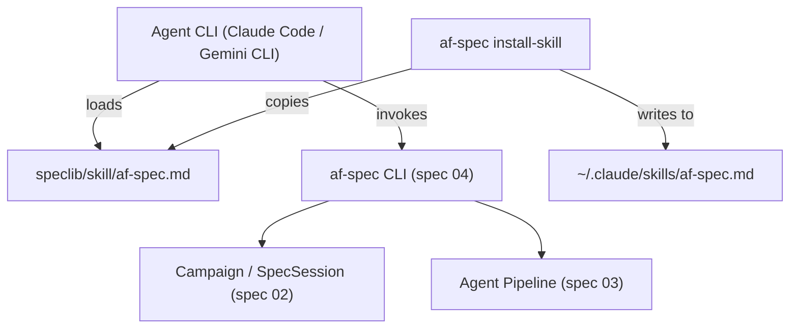

# Design Document: Agent CLI Skill for Spec Authoring

## Overview

This spec delivers two artifacts: (1) a markdown skill prompt file that
instructs agent CLIs how to author specs using `af-spec` CLI commands, and
(2) an `af-spec install-skill` CLI command that copies the skill file to
the appropriate agent configuration directory. The skill file is
self-contained, shipped inside the speclib Python package, and requires no
Python API knowledge from the agent.

## Architecture



### Module Responsibilities

1. **speclib/skill/af-spec.md** — The skill prompt file. Markdown document
   containing workflow instructions, command reference, examples, and error
   handling guidance. Loaded by agent CLIs as context.
2. **speclib/skill/__init__.py** — Package marker. Exports `SKILL_FILE_PATH`
   constant pointing to the skill markdown file within the package.
3. **speclib/cli.py** (extended) — Adds the `install-skill` subcommand to the
   existing `af-spec` CLI group defined in spec 04.

## Execution Paths

### Path 1: Interactive mode workflow (driven by skill instructions)

1. User asks agent to create a spec
2. Agent reads skill file, follows interactive workflow
3. Agent runs `af-spec init <campaign-dir>` or opens existing campaign
4. Agent runs `af-spec new --prd <path> <spec-name>` to create a spec session
5. Agent runs `af-spec assess <spec-dir>` and presents result to user
6. Agent parses questions from assess output, presents them conversationally
7. User answers questions in natural language
8. Agent maps answers to Question IDs, runs `af-spec refine <spec-dir> --answers '<json>'`
9. Agent repeats assess/refine cycle or asks user to accept
10. Agent runs `af-spec accept <spec-dir>` to lock the PRD
11. Agent runs `af-spec generate <spec-dir>` and presents the rendered spec

### Path 2: One-shot mode workflow (driven by skill instructions)

1. User provides PRD and asks for immediate generation
2. Agent reads skill file, follows one-shot workflow
3. Agent runs `af-spec init <campaign-dir>` if needed
4. Agent runs `af-spec new <prd-file> --one-shot --name <spec-name>`
5. Agent presents the final generated spec for review

### Path 3: Skill installation

1. User runs `af-spec install-skill` (or with `--target`)
2. Command resolves the skill source path from `speclib.skill.SKILL_FILE_PATH`
3. Command detects target agent CLI or uses `--target` override
4. Command creates target directory if needed
5. Command copies skill file to target location
6. Command prints success message with installed path

## Components and Interfaces

### Skill File (speclib/skill/af-spec.md)

The skill file is structured with these sections:

```markdown
# af-spec — Spec Authoring Skill

## Trigger
[When to activate this skill]

## Command Reference
[All af-spec commands with usage and examples]

## Interactive Workflow
[Step-by-step instructions for interactive mode]

## One-Shot Workflow
[Instructions for one-shot generation]

## Question Handling
[How to present questions and map answers]

## Error Handling
[Common errors and recovery steps]
```

### SKILL_FILE_PATH constant

```python
# speclib/skill/__init__.py
from pathlib import Path

SKILL_FILE_PATH: Path = Path(__file__).parent / "af-spec.md"
```

### install-skill CLI command

```python
# Added to speclib/cli.py

@cli.command("install-skill")
@click.option("--target", type=click.Choice(["claude", "gemini"]),
              default=None, help="Target agent CLI")
def install_skill(target: str | None) -> None:
    """Install the af-spec skill to an agent CLI."""
    ...
```

### Target Detection Logic

```python
AGENT_TARGETS: dict[str, Path] = {
    "claude": Path.home() / ".claude" / "skills",
    "gemini": Path.home() / ".gemini" / "skills",
}

def detect_agent_cli() -> str | None:
    """Detect installed agent CLI by checking config directories."""
    for name, skill_dir in AGENT_TARGETS.items():
        if skill_dir.parent.exists():
            return name
    return None
```

## Data Models

This spec introduces no persistent data models. The skill file is a static
markdown asset. The install command is a simple file-copy operation.

## Correctness Properties

### Property 1: Skill file is package-complete

*For any* installation of the speclib package, the file at
`speclib/skill/af-spec.md` SHALL exist and be non-empty.

**Validates: Requirement 05-REQ-1.1**

### Property 2: Installed skill matches source

*For any* successful `af-spec install-skill` invocation, the installed file
SHALL be byte-identical to the source `speclib/skill/af-spec.md`.

**Validates: Requirements 05-REQ-5.2, 05-REQ-5.4**

### Property 3: All documented commands appear in the skill

*For any* command listed in 05-REQ-1.3 (`init`, `new`, `assess`, `refine`,
`accept`, `generate`, `status`, `validate`, `render`), the skill file SHALL
contain at least one usage example of that command.

**Validates: Requirements 05-REQ-1.3, 05-REQ-1.4**

## Error Handling

| Error Condition | Behavior | Requirement |
|----------------|----------|-------------|
| No agent CLI detected, no --target | Exit with error listing supported CLIs | 05-REQ-5.E1 |
| Target skill directory missing | Create directory, then copy | 05-REQ-5.E2 |
| Skill source file missing from package | Raise SpeclibError | 05-REQ-5.E3 |
| af-spec not on PATH (in skill) | Skill instructs agent to tell user to install | 05-REQ-6.E1 |

## Technology Stack

- Python 3.14+
- Click — for the `install-skill` subcommand
- `shutil.copy2` — for file copying
- Markdown — skill file format
- No additional dependencies beyond those in spec 01

## Definition of Done

A task group is complete when ALL of the following are true:

1. All subtasks within the group are checked off (`[x]`)
2. All spec tests (`test_spec.md` entries) for the task group pass
3. All property tests for the task group pass
4. All previously passing tests still pass (no regressions)
5. No linter warnings or errors introduced
6. Code is committed on a feature branch and merged into `develop`
7. `tasks.md` checkboxes are updated to reflect completion

## Testing Strategy

- **Unit tests** for `detect_agent_cli()` using mocked home directories.
- **Unit tests** for the `install-skill` command via Click's test runner.
- **Content tests** for the skill file: verify structure, command coverage,
  section presence.
- **Property tests** for installed file matching source.
- **Integration test** for the full install flow with a temp home directory.
