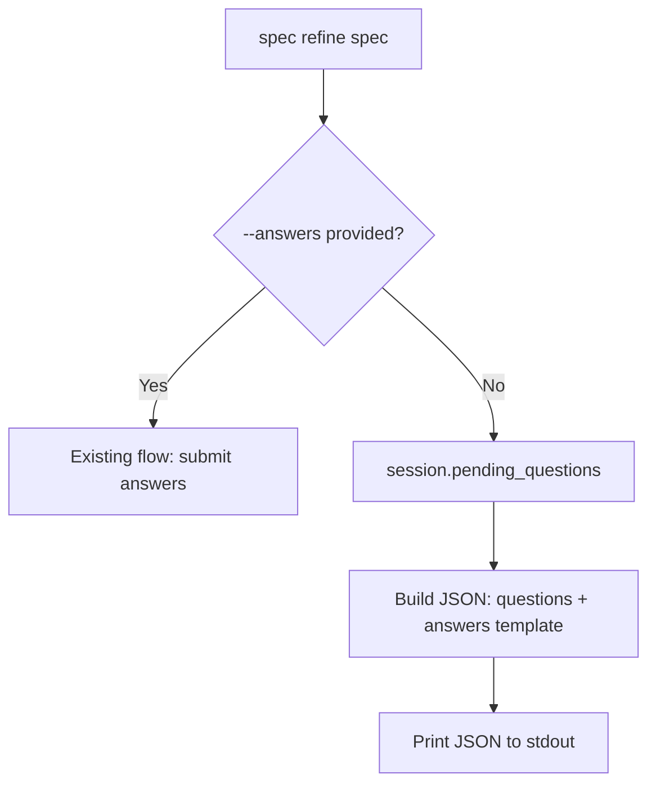

# Design Document: Refine Question Export

## Overview

Adds a question-export mode to the `spec refine` CLI command. When
`--answers` is omitted, the command reads the session's latest assessment
and outputs structured JSON containing question details and an answer template.
A new `pending_questions()` method on `SpecSession` provides the underlying
data extraction.

## Architecture



### Module Responsibilities

1. `speclib/cli.py` — CLI command layer; routes between question export and
   answer submission based on `--answers` presence.
2. `speclib/session.py` — Session state machine; exposes `pending_questions()`
   to extract questions from the latest assessment.

## Execution Paths

### Path 1: Question export (refine without --answers)

1. `speclib/cli.py: refine_cmd` — invoked by Click, detects `answers is None`
2. `speclib/cli.py: refine_cmd` — calls `resolve_campaign()` and
   `resolve_spec()` to locate spec directory
3. `speclib/cli.py: refine_cmd` — calls `SpecSession.resume(spec_dir)` to
   load the session
4. `speclib/session.py: SpecSession.pending_questions()` → `list[dict]` —
   extracts questions from latest assessment as serializable dicts
5. `speclib/cli.py: refine_cmd` — builds output dict with `questions` and
   `answers` keys, serializes to JSON, writes to stdout via `click.echo`

### Path 2: Answer submission (refine with --answers) — unchanged

1. `speclib/cli.py: refine_cmd` — invoked by Click, detects `answers is not None`
2. Existing flow: validate JSON, resolve campaign/spec, call `session.refine()`

## Components and Interfaces

### CLI Changes (`speclib/cli.py`)

The `--answers` option changes from `required=True` to `required=False`
(default `None`). The command body branches on whether `answers` is `None`.

### Session API (`speclib/session.py`)

```python
def pending_questions(self) -> list[dict[str, Any]]:
    """Return questions from the latest assessment as serializable dicts.

    Returns an empty list if no assessment exists. Does not trigger a
    state transition.
    """
```

### Output Format

```json
{
  "questions": [
    {
      "id": "q1",
      "text": "Question text?",
      "context": "Why this matters.",
      "options": ["opt1", "opt2"],
      "required": true
    }
  ],
  "answers": {
    "q1": "",
    "q2": ""
  }
}
```

## Data Models

No new data models. Uses existing `Question` dataclass fields serialized
to dicts.

## Correctness Properties

### Property 1: Answer Template Completeness

*For any* session with a non-empty assessment history, the `answers` dict
returned by the question-export path SHALL contain exactly the same set of
keys as the set of `id` values in the `questions` array.

**Validates: Requirements 06-REQ-1.2, 06-REQ-1.3**

### Property 2: Pending Questions Fidelity

*For any* session with assessment history, `pending_questions()` SHALL return
a list whose length equals the number of questions in the latest assessment,
and each dict SHALL contain the same `id`, `text`, `context`, `options`, and
`required` values as the corresponding `Question` object.

**Validates: Requirements 06-REQ-2.1, 06-REQ-2.E1**

### Property 3: Read-Only Invariant

*For any* call to `pending_questions()`, the session state, assessment history,
and persisted `_session.json` SHALL remain unchanged before and after the call.

**Validates: Requirement 06-REQ-2.3**

### Property 4: Existing Behavior Preservation

*For any* invocation of `refine_cmd` where `--answers` is provided, the
behavior SHALL be identical to the pre-change implementation: answers are
validated, `session.refine()` is called, and the assessment is printed.

**Validates: Requirement 06-REQ-1.4**

## Error Handling

| Error Condition | Behavior | Requirement |
|----------------|----------|-------------|
| No assessment in session (question export) | Print error to stderr, exit 1 | 06-REQ-1.E1 |
| Zero questions in assessment | Output JSON with empty arrays, exit 0 | 06-REQ-1.E2 |
| No assessment history (`pending_questions`) | Return empty list | 06-REQ-2.2 |

## Operational Readiness

No new operational concerns. This feature is a read-only CLI output mode with
no side effects, no new external dependencies, and no state mutations.

## Technology Stack

- Python 3.10+
- Click (CLI framework, already in use)
- `json` stdlib module (for JSON serialization)

## Definition of Done

A task group is complete when ALL of the following are true:

1. All subtasks within the group are checked off (`[x]`)
2. All spec tests (`test_spec.md` entries) for the task group pass
3. All property tests for the task group pass
4. All previously passing tests still pass (no regressions)
5. No linter warnings or errors introduced
6. Code is committed on a feature branch and merged into `develop`
7. Feature branch is merged back to `develop`
8. `tasks.md` checkboxes are updated to reflect completion

## Testing Strategy

- **Unit tests** verify `pending_questions()` return values for various
  assessment states.
- **Property tests** verify answer-template/question-array key parity using
  generated assessment data.
- **CLI tests** verify the two branches of `refine_cmd` (with and without
  `--answers`) using Click's `CliRunner`.
- **Integration smoke test** runs the full path from CLI invocation through
  session resume to JSON output.
