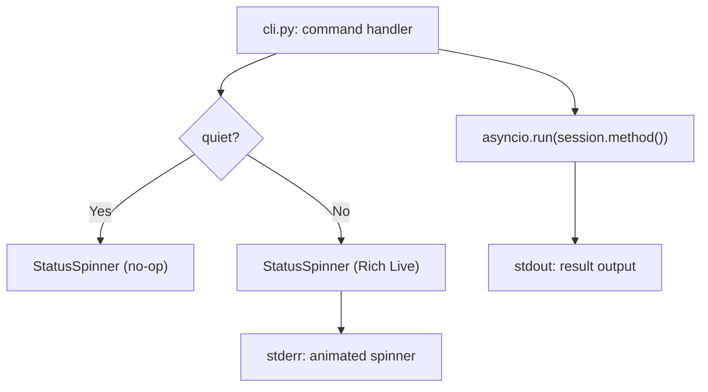

# Design Document: CLI Progress Feedback

## Overview

Adds a `StatusSpinner` context manager in `speclib/ui.py` using Rich's
`Live` + `Spinner`, integrates it into `assess`, `refine --answers`, and
`generate` commands, and adds a `--quiet` global flag.

## Architecture



### Module Responsibilities

1. `speclib/ui.py` — `StatusSpinner` context manager wrapping Rich.
2. `speclib/cli.py` — Integrates spinner into commands and adds `--quiet`.

## Execution Paths

### Path 1: Assess with spinner

1. `speclib/cli.py: assess_cmd` — reads `quiet` from `ctx.obj`
2. `speclib/ui.py: StatusSpinner("Assessing PRD...", quiet=quiet).__enter__`
   — starts Rich `Live` display on stderr
3. `speclib/session.py: SpecSession.assess()` — async API call (unchanged)
4. `speclib/ui.py: StatusSpinner.__exit__` — stops spinner, clears line
5. `speclib/cli.py: assess_cmd` — prints assessment to stdout

### Path 2: Generate with per-artifact updates

1. `speclib/cli.py: generate_cmd` — creates `StatusSpinner`, enters context
2. `speclib/session.py: SpecSession.generate()` — calls
   `generate_artifacts(on_artifact=callback)`
3. `speclib/cli.py: generate_cmd` — `on_artifact` callback calls
   `spinner.update("Generating test_spec...")` and prints completion to stderr
4. `speclib/ui.py: StatusSpinner.__exit__` — stops spinner
5. `speclib/cli.py: generate_cmd` — prints final result to stdout

### Path 3: Quiet mode suppresses all feedback

1. `speclib/cli.py: assess_cmd` — `quiet=True`
2. `speclib/ui.py: StatusSpinner("...", quiet=True).__enter__` — no-op
3. `speclib/session.py: SpecSession.assess()` — async API call (unchanged)
4. `speclib/ui.py: StatusSpinner.__exit__` — no-op
5. `speclib/cli.py: assess_cmd` — prints assessment to stdout (unchanged)

## Components and Interfaces

### `StatusSpinner` class (`speclib/ui.py`)

```python
class StatusSpinner:
    def __init__(self, message: str, *, quiet: bool = False) -> None:
        """Create a spinner for stderr feedback.

        Args:
            message: Initial status message (e.g., "Assessing PRD...").
            quiet: If True, all display operations are no-ops.
        """

    def __enter__(self) -> StatusSpinner: ...
    def __exit__(self, *exc: object) -> None: ...

    def update(self, message: str) -> None:
        """Change the spinner's status message."""

    def log(self, message: str) -> None:
        """Print a permanent line above the spinner (e.g., artifact done)."""
```

### CLI changes (`speclib/cli.py`)

```python
# Global group — add --quiet
@click.group()
@click.option("--campaign-dir", "-C", ...)
@click.option("--quiet", "-q", is_flag=True, help="Suppress progress output")
@click.pass_context
def main(ctx, campaign_dir, quiet):
    ctx.ensure_object(dict)
    ctx.obj["campaign_dir"] = campaign_dir
    ctx.obj["quiet"] = quiet
```

### Command integration pattern

```python
def assess_cmd(ctx, spec):
    quiet = ctx.obj.get("quiet", False)
    # ... resolve session ...
    with StatusSpinner("Assessing PRD...", quiet=quiet):
        assessment = asyncio.run(session.assess())
    click.echo(format_assessment(assessment))
```

## Data Models

No new data models.

## Operational Readiness

No new operational concerns. The spinner is a display-only feature with no
side effects on session state or API calls.

## Correctness Properties

### Property 1: Quiet Suppresses All Spinner Output

*For any* command invoked with `--quiet`, no spinner animation or phase
message SHALL appear on stderr. Only final results and error messages
SHALL be written.

**Validates: Requirements 09-REQ-3.2, 09-REQ-3.3**

### Property 2: Spinner Writes to Stderr Only

*For any* command displaying a spinner, all spinner output (animation and
messages) SHALL be written to stderr, never stdout.

**Validates: Requirements 09-REQ-2.1**

### Property 3: Spinner Cleanup on Error

*For any* command that raises an exception while a spinner is active, the
spinner SHALL be stopped before the error message is printed.

**Validates: Requirements 09-REQ-1.E1**

### Property 4: Non-TTY Fallback

*For any* execution where stderr is not a TTY, phase messages SHALL be
printed as plain text lines without animation characters.

**Validates: Requirements 09-REQ-2.2**

## Error Handling

| Error Condition | Behavior | Requirement |
|----------------|----------|-------------|
| Exception during API call | Stop spinner, print error | 09-REQ-1.E1 |
| KeyboardInterrupt | Stop spinner cleanly | 09-REQ-1.E2 |
| Non-TTY stderr | Print plain text, no animation | 09-REQ-2.2 |

## Technology Stack

- Python 3.10+
- `rich` (>=13.0) — `Console`, `Live`, `Spinner`, `Text`
- `click` (already in use)

## Definition of Done

A task group is complete when ALL of the following are true:

1. All subtasks within the group are checked off (`[x]`)
2. All spec tests (`test_spec.md` entries) for the task group pass
3. All property tests for the task group pass
4. All previously passing tests still pass (no regressions)
5. No linter warnings or errors introduced
6. Code is committed on a feature branch and merged into `develop`
7. Feature branch is merged back to `develop`
8. `tasks.md` checkboxes are updated to reflect completion

## Testing Strategy

- **Unit tests** verify `StatusSpinner` in quiet mode (no-op), normal mode
  (captures stderr), and update/log methods.
- **CLI tests** verify `--quiet` flag is propagated and that spinner output
  appears/disappears on stderr as expected.
- **Property tests** verify stderr-only output and quiet suppression across
  all commands.
- **Integration smoke test** invokes `assess` with mocked agent and verifies
  spinner output on stderr and assessment on stdout.
