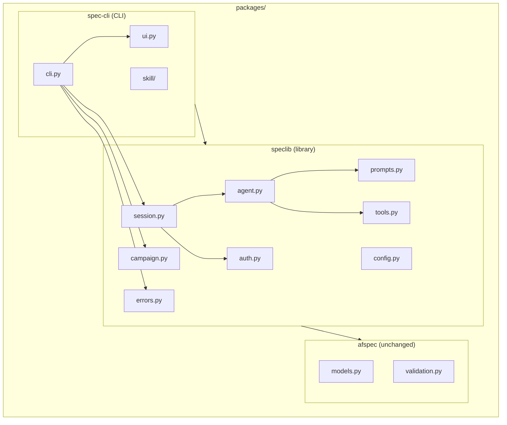

# Design Document: Monorepo Restructure

## Overview

This restructure transforms the speclib repository from a single
installable package into a monorepo with three packages:

- `packages/afspec/` — spec-format library (unchanged)
- `packages/speclib/` — core library (agent pipeline, sessions, campaigns)
- `packages/spec-cli/` — CLI wrapper (the `spec` command)

The restructure is primarily a file-movement operation with import path
adjustments. No business logic changes. The key architectural decision
is the dependency direction: `spec-cli` → `speclib` → `afspec`.

## Architecture



### Module Responsibilities

1. **`packages/speclib/speclib/agent.py`** — SpecAgent wrapping the
   Anthropic client for PRD assessment, refinement, and artifact
   generation.
2. **`packages/speclib/speclib/session.py`** — SpecSession state machine
   managing the lifecycle of authoring a single spec.
3. **`packages/speclib/speclib/campaign.py`** — Campaign directory
   lifecycle management.
4. **`packages/speclib/speclib/config.py`** — Configuration loading from
   YAML and environment variables.
5. **`packages/speclib/speclib/auth.py`** — Anthropic client factory with
   auth method autodetection.
6. **`packages/speclib/speclib/prompts.py`** — Prompt templates for agent
   pipeline operations.
7. **`packages/speclib/speclib/tools.py`** — Tool definitions for
   structured output via Anthropic tool use.
8. **`packages/speclib/speclib/errors.py`** — Exception hierarchy for
   speclib.
9. **`packages/spec-cli/spec_cli/cli.py`** — Click CLI entry point
   providing the `spec` command group.
10. **`packages/spec-cli/spec_cli/ui.py`** — StatusSpinner for terminal
    progress feedback.
11. **`packages/spec-cli/spec_cli/skill/`** — Skill file and install
    logic for agent CLIs.

## Execution Paths

### Path 1: User runs `spec new prd.md`

1. Shell invokes `spec` → `spec_cli.cli:main` (Click group)
2. `spec_cli.cli:new_cmd` — resolves campaign, reads PRD file
3. `speclib.campaign:Campaign.open` → `Campaign`
4. `speclib.campaign:Campaign.new_spec(name, prd_content)` → `SpecSession`
5. `speclib.session:SpecSession._create` — creates `_session.json`
6. Side effect: spec directory created with `prd.md` and `_session.json`

### Path 2: User runs `spec assess <spec>`

1. Shell invokes `spec` → `spec_cli.cli:main`
2. `spec_cli.cli:assess_cmd` — resolves campaign and spec
3. `speclib.session:SpecSession.resume(spec_dir)` → `SpecSession`
4. `speclib.session:SpecSession.assess()` → `Assessment`
5. `speclib.agent:SpecAgent.assess_prd(prd_text, spec_name)` → `Assessment`
6. Side effect: assessment displayed via `spec_cli.cli:format_assessment`

### Path 3: User imports speclib as a library

1. `from speclib import Campaign, SpecSession` — no Click/Rich imported
2. `Campaign.open(path)` → `Campaign`
3. `campaign.new_spec(name, prd)` → `SpecSession`
4. `await session.assess()` → `Assessment`
5. No side effects beyond what the caller initiates

### Path 4: User installs spec-cli via uv

1. `uv pip install ./packages/spec-cli`
2. uv reads `packages/spec-cli/pyproject.toml`
3. uv resolves path dependency `speclib` → installs `packages/speclib/`
4. uv resolves path dependency `afspec` → installs `packages/afspec/`
5. uv installs Click, Rich, anthropic, pyyaml
6. uv creates console script `spec` → `spec_cli.cli:main`
7. Side effect: `spec` command available in PATH

## Components and Interfaces

### Package Dependency Graph

```
spec-cli (click, rich)
  └── speclib (anthropic, pyyaml)
        └── afspec (pydantic, pyyaml, jsonschema)
```

### pyproject.toml Structure

#### `packages/speclib/pyproject.toml`

```toml
[project]
name = "speclib"
version = "0.1.0"
requires-python = ">=3.14"
dependencies = [
    "afspec>=0.1.0",
    "anthropic[vertex,bedrock]>=0.40.0",
    "pyyaml>=6.0",
]

[build-system]
requires = ["hatchling"]
build-backend = "hatchling.build"

[tool.uv.sources]
afspec = { path = "../afspec", editable = true }
```

#### `packages/spec-cli/pyproject.toml`

```toml
[project]
name = "spec-cli"
version = "0.1.0"
requires-python = ">=3.14"
dependencies = [
    "speclib>=0.1.0",
    "click>=8.1",
    "rich>=13.0",
]

[project.scripts]
spec = "spec_cli.cli:main"

[build-system]
requires = ["hatchling"]
build-backend = "hatchling.build"

[tool.uv.sources]
speclib = { path = "../speclib", editable = true }
```

#### Root `pyproject.toml`

```toml
[project]
name = "speclib-workspace"
version = "0.0.0"
requires-python = ">=3.14"
dependencies = [
    "spec-cli>=0.1.0",
]

[tool.uv.sources]
afspec = { path = "packages/afspec", editable = true }
speclib = { path = "packages/speclib", editable = true }
spec-cli = { path = "packages/spec-cli", editable = true }
```

### CLI Interface

The `spec` command group has the same interface as the current `spec`:

```
spec [--campaign-dir PATH] [--quiet] [--version]
spec init PATH [--name NAME] [--description TEXT]
spec list [CAMPAIGN_DIR]
spec new PRD_FILE [--name NAME] [--one-shot]
spec assess SPEC
spec refine SPEC [--answers FILE]
spec accept SPEC
spec generate SPEC
spec validate SPEC
spec render SPEC [--combined]
spec show SPEC [--artifact NAME]
spec status [SPEC]
spec install-skill [--target claude|gemini]
```

## Data Models

No data model changes. All existing data classes (`Assessment`,
`Question`, `Campaign`, `CampaignMetadata`, `SpecSession`,
`SessionState`, `SpecToolConfig`, `ValidationResult`, `GenerateResult`,
`RepairSuggestion`) remain in `speclib` with identical interfaces.

## Operational Readiness

### Migration Strategy

This is a one-shot restructure performed in a single feature branch:

1. Create new directory structure under `packages/`
2. Move files using `git mv` to preserve history
3. Adjust imports in moved files
4. Update pyproject.toml files
5. Update Makefile
6. Verify with `make check`
7. Remove old directories

### Rollback

If the restructure fails at any point, `git checkout develop` restores
the previous state.

## Correctness Properties

### Property 1: Import Independence

*For any* installation of `speclib` without `spec-cli`, importing any
public symbol from `speclib` SHALL succeed without `ImportError` related
to `click` or `rich`.

**Validates: Requirements 10-REQ-1.1, 10-REQ-1.E1**

### Property 2: Dependency Completeness

*For any* package `P` in `{afspec, speclib, spec-cli}`, installing `P`
via `uv pip install ./packages/P` SHALL install all transitive
dependencies needed for `P` to function.

**Validates: Requirements 10-REQ-7.1, 10-REQ-7.2, 10-REQ-7.3, 10-REQ-7.E1**

### Property 3: CLI Functional Equivalence

*For any* subcommand `S` of the `spec` CLI, invoking `spec S <args>`
SHALL produce the same stdout/stderr output and exit code as the
pre-restructure CLI (excluding the program name in help/version
output).

**Validates: Requirements 10-REQ-6.5, 10-REQ-2.4**

### Property 4: Module Placement Correctness

*For any* Python module `M` in the restructured repo, `M` SHALL reside
in exactly one package under `packages/`, and its import path SHALL
resolve correctly when that package is installed.

**Validates: Requirements 10-REQ-1.3, 10-REQ-6.1, 10-REQ-6.2**

### Property 5: Test Isolation

*For any* package `P` with a `tests/` directory, running
`uv run pytest` from within `packages/P/` SHALL execute only `P`'s
tests and none from other packages.

**Validates: Requirements 10-REQ-4.4**

### Property 6: Cross-Package Quality Gate

*For any* invocation of `make check` from the repo root, the command
SHALL run linting and testing across all packages and SHALL return
non-zero if any package fails.

**Validates: Requirements 10-REQ-5.1, 10-REQ-5.2, 10-REQ-5.3, 10-REQ-5.E1**

## Error Handling

| Error Condition | Behavior | Requirement |
|----------------|----------|-------------|
| `speclib` imported without `afspec` | `ImportError` with clear message | 10-REQ-1.E2 |
| `spec` run without `speclib` | `ImportError` with clear message | 10-REQ-2.E2 |
| Lint failure in one package | `make check` exits non-zero | 10-REQ-5.E1 |
| Test failure in one package | `make check` exits non-zero | 10-REQ-5.E1 |

## Technology Stack

- **Python 3.14+** — required by speclib and spec-cli
- **uv** — package manager with path dependency support
- **hatchling** — build backend for all packages
- **Click 8.1+** — CLI framework (spec-cli only)
- **Rich 13.0+** — terminal UI (spec-cli only)
- **Anthropic SDK 0.40+** — API client (speclib only)
- **PyYAML 6.0+** — YAML parsing (speclib)
- **Pydantic 2.0+** — data models (afspec)
- **Make** — build orchestration

## Definition of Done

A task group is complete when ALL of the following are true:

1. All subtasks within the group are checked off (`[x]`)
2. All spec tests (`test_spec.md` entries) for the task group pass
3. All property tests for the task group pass
4. All previously passing tests still pass (no regressions)
5. No linter warnings or errors introduced
6. Code is committed on a feature branch and merged into `develop`
7. Feature branch is merged back to `develop`
8. `tasks.md` checkboxes are updated to reflect completion

## Testing Strategy

This restructure is primarily verified by structural tests (file
existence, import resolution, dependency declarations) rather than
behavioral tests. The key verification is:

1. **Import tests**: Verify that each package's public API is importable
   after installation, and that CLI dependencies are not pulled into the
   library.
2. **CLI equivalence tests**: Run each CLI subcommand and verify output
   matches the pre-restructure behavior.
3. **Makefile tests**: Verify that `make check`, `make test`, `make lint`,
   and `make clean` work from the repo root.
4. **Existing test suite**: All pre-existing tests must pass after being
   relocated to their respective packages.
