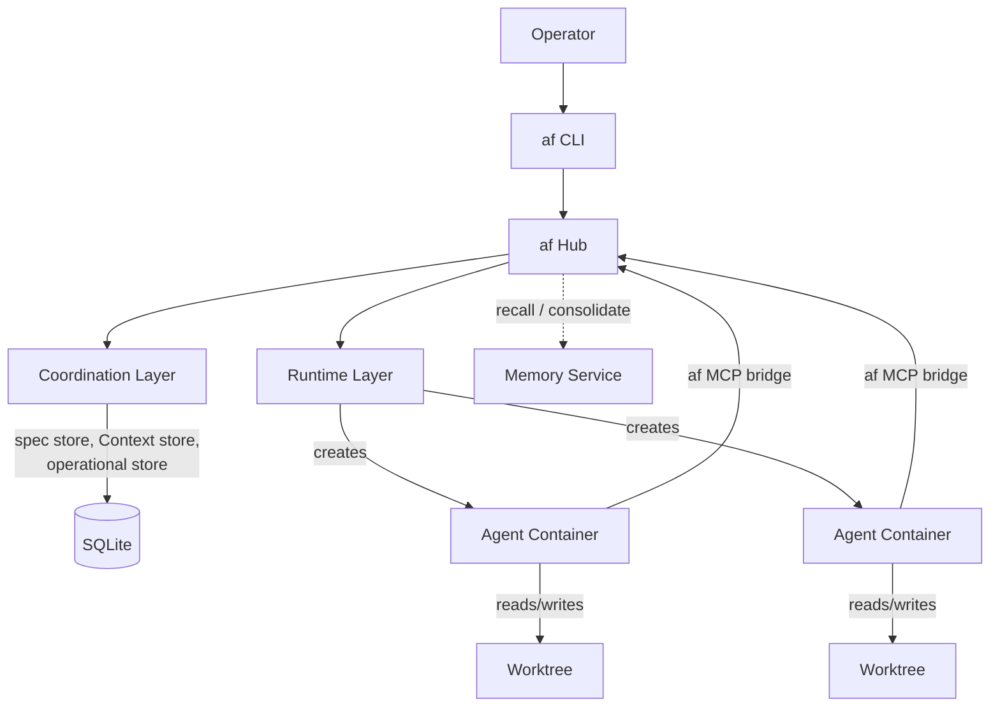

# agent-fox Agentic Development Harness

A headless harness for spec-driven, multi-agent software development. The
harness gives each unit of work an isolated workspace with its own branch,
files, and agents, and coordinates those agents through a validated
specification package rather than ad-hoc chat. It is provider-agnostic:
Claude Code, Gemini CLI, and OpenCode are interchangeable through a
single adapter interface.

The design is inspired by [Intent](https://www.intentapp.dev) from Augment
Code but diverges intentionally: headless instead of desktop, coordination
rebuilt on a structured spec package that freezes on approval, and all
grounding unified under a single Context abstraction.

---

## Architecture

The system is organized into three layers. The coordination layer owns specs,
Contexts, runs, and orchestration. The runtime layer handles containers,
worktrees, and provider adapters. The services layer defines the deployable
components that wire them together.

**Coordination layer** — the domain model: workspaces, spec packages, Contexts
(grounding), agents, multi-agent orchestration, the Coordinator pattern, and
the public API surface.

**Runtime layer** — the infrastructure: OCI container isolation, git worktree
management, harness adapters per provider, agent lifecycle, templates, sidecar
services, and the af MCP bridge.

**Services layer** — the deployable components: the af hub (single stateful
process), CLI, storage layout, communication protocols, security and isolation,
retrieval engine, CI/CD bridge, notification service, and web dashboard.

---

## Documents

| Document | Description | Read this if you are working on... |
| --- | --- | --- |
| [Coordination Layer](docs/coordination-layer.md) | Domain model, workspaces, campaigns, spec package integration, agents, multi-agent orchestration, key flows, data model, and API surface. | Spec lifecycle, Context management, orchestration, the Coordinator pattern, the public API, or anything in the domain model. |
| [Runtime Layer](docs/runtime-layer.md) | Container runtime interface, git worktree management, harness adapters (Claude Code, Gemini CLI, Codex, OpenCode), agent lifecycle, templates, sidecar services, and the af MCP bridge. | Container isolation, provider integration, agent start/stop/resume, template system, or the MCP bridge. |
| [Services Architecture](docs/services-architecture.md) | Deployable components (hub, CLI, runtime engine, MCP bridge, memory service), the spec creation tool (speclib, `spec` CLI, agent skill), storage layout, communication protocols, security, deployment modes, retrieval engine, CI/CD bridge, notifications, and web dashboard. | The af hub, CLI commands, spec authoring tool, storage schema, gRPC/HTTP protocols, deployment, or any service-level concern. |
| [Spec Format Specification](docs/spec-format_v1.2.md) | The on-disk format for a specification package: `prd.md`, `requirements.json`, `test_spec.json`, `tasks.json`, and optional `architecture.md`. Field-level schemas, EARS patterns, validation rules, ID formats, and rendering. | The spec validation library, artifact schemas, EARS patterns, cross-file integrity rules, or the renderer. |
| [Spec Tooling Reference](docs/spec-tooling.md) | Python packages that implement the spec format: `afspec` (standalone format library), `agentspec` (AI-powered spec creation), and the `spec` CLI. Models, functions, session API, and CLI commands. | Loading, validating, rendering, or creating specs programmatically. |

The **Spec Format Specification** is an independent standard. The coordination
layer references it for format details and builds harness-specific policies
(the freeze, intent hashing, runtime spec access) on top.

---

## Spec Format Overview

A specification package ("spec") is the durable artifact that captures design
intent, acceptance criteria, verification contracts, and implementation plans
for one cohesive feature. Every spec lives in a numbered directory
(`{NN}_{snake_case_name}/`) and contains four required artifacts plus one
optional artifact:

| Artifact | Format | Purpose |
| --- | --- | --- |
| `prd.md` | Markdown + YAML frontmatter | Narrative intent — the "why" and "what." Human-authored. Contains a hashed `## Intent` section that is protected after approval. |
| `requirements.json` | JSON (schema-validated) | What the system must do: EARS acceptance criteria, correctness properties, execution paths, and error handling. |
| `test_spec.json` | JSON (schema-validated) | How each requirement is verified: unit tests, property tests, edge-case tests, and smoke tests with computed coverage. |
| `tasks.json` | JSON (schema-validated) | What work to do, in what order: task groups, subtasks with a state machine, cross-spec dependencies, and requirement-to-test traceability. |
| `architecture.md` | Markdown (free-form) | Optional. Architectural context — modules, interfaces, data models, technology choices. No schema, not cross-validated. |

**Key properties:**

- **EARS patterns.** Requirements use the Easy Approach to Requirements Syntax — six
  structured patterns (`ubiquitous`, `event_driven`, `complex_event`,
  `state_driven`, `unwanted`, `optional`) that produce testable, unambiguous
  acceptance criteria from decomposed fields.
- **Two-layer validation.** Schema validation (per-file, sub-millisecond) plus
  cross-file integrity checks (referential integrity of IDs, requirement-to-test
  coverage, glossary completeness) run on every mutation.
- **Lifecycle.** A spec progresses through `draft → active → sealed`, with
  optional `superseded` and `archived` terminal states. The `## Intent` section
  is hashed at the `draft → active` transition and protected thereafter.
- **Traceability.** Bidirectional links connect every requirement through its
  test spec and task to an executable test, ensuring nothing is specified without
  verification and nothing is built without a requirement.

The full specification — field-level schemas, EARS pattern definitions, ID
formats, validation rules, subtask state machine, and rendering — is at
**[docs/spec-format_v1.2.md](docs/spec-format_v1.2.md)**. For the Python
packages that implement this format (`afspec`, `agentspec`, `spec` CLI), see
the **[Spec Tooling Reference](docs/spec-tooling.md)**.

---

## Key Concepts

| Term | Definition |
| --- | --- |
| **Campaign** | The organizational unit for specs. Every spec belongs to a campaign. Owns a goal document, a dependency graph, and orchestration state. Also the top-level directory in the spec store (`<data_dir>/specs/<campaign>/`). |
| **Workspace** | The isolation boundary for one task: a git worktree on a dedicated branch, one spec package, attached Contexts, running agents, and an activity log. References a campaign and spec. |
| **Spec package** | A validated set of four artifacts (`prd.md`, `requirements.json`, `test_spec.json`, `tasks.json`) that define and verify the work. Authored once in `draft`, frozen on approval. See [Spec Format Specification](docs/spec-format_v1.2.md). |
| **speclib / spec** | The standalone spec creation tool. speclib is the shared library; `spec` is the CLI wrapper. Creates, validates, renders, and manages spec packages on the filesystem — no hub required. Also available as an agent skill. |
| **Context** | A durable, reusable bundle of grounding: one instruction plus typed sources (files, repos, MCP servers, skills, rules). Read-only to agents; owned by the Operator. |
| **Agent** | A running model instance backed by an external provider, with a specialist role and scoped tools, executing inside a workspace. |
| **Specialist** | A named agent role (Planner, Coordinator, Implementor, Verifier, etc.) carrying a system prompt, tool policy, model tier, and actor capability. |
| **Provider** | An external agent backend (Claude Code, Gemini CLI, Codex, OpenCode) the harness drives through a uniform adapter interface. |
| **Coordinator pattern** | Agents coordinate through a shared store (the frozen spec + the operational store), not by messaging each other. The Coordinator delegates subtasks; workers write only their own execution state. |
| **af hub** | The single stateful host process: owns all three stores, manages runs, enforces the spec lifecycle, serves the coordination API, and receives MCP bridge connections. |
| **af MCP bridge** | A sidecar MCP server inside each agent container that exposes harness tools (spec read, Context search, memory recall, subtask state, file claims) to the provider. |
