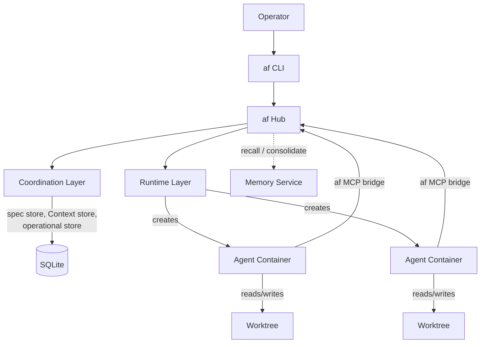

# Architecture

The system is organized into three layers. The coordination layer owns specs,
Contexts, runs, and orchestration. The runtime layer handles containers,
worktrees, and provider adapters. The services layer defines the deployable
components that wire them together.

**Coordination layer** — the domain model: workspaces, spec packages, Contexts
(grounding), agents, multi-agent orchestration, the Coordinator pattern, and
the public API surface.

**Runtime layer** — the infrastructure: OCI container isolation, git worktree
management, harness adapters per provider, agent lifecycle, templates, sidecar
services, and the af MCP bridge.

**Services layer** — the deployable components: the af hub (single stateful
process), CLI, storage layout, communication protocols, security and isolation,
retrieval engine, CI/CD bridge, notification service, and web dashboard.

## Documents

| Document | Description |
| --- | --- |
| [Coordination Layer](coordination-layer.md) | Domain model, workspaces, campaigns, spec package integration, agents, orchestration, data model, and API surface. |
| [Runtime Layer](runtime-layer.md) | Container runtime interface, git worktree management, harness adapters, agent lifecycle, templates, sidecar services, and the af SDK. |
| [Services Architecture](services-architecture.md) | Deployable components (hub, CLI, runtime engine, memory service), the spec creation tool, storage layout, communication protocols, security, and deployment modes. |
