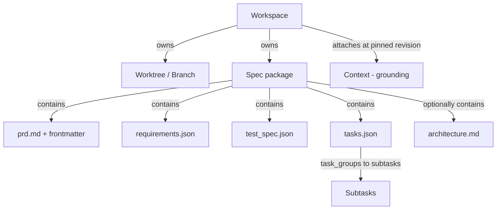

# Coordination Layer Specification

**Version:** 1.0
**Status:** Draft

This document specifies the coordination layer of the af agentic development
harness: the domain model, workspace and campaign management, spec package
integration, agent model, multi-agent orchestration, key flows, data model,
and API surface. It is the largest of the three layer specifications and the
one most developers will read first.

The runtime layer (container isolation, worktree management, harness adapters,
agent lifecycle) is specified in [runtime-layer.md](runtime-layer.md). The
services architecture (daemon, CLI, storage, protocols, deployment) is
specified in [services-architecture.md](services-architecture.md). The spec
format itself is an independent standard at
[spec-format_v1.2.md](../spec-format_v1.2.md); this document covers what the
harness builds on top of it.

---

## 1. Scope

The harness is a headless runtime that isolates each unit of work in its own
workspace, runs AI agents against pluggable providers, coordinates multi-agent
work through a structured spec package, and grounds agents in reusable
Contexts. A separate surface (TUI, web client, API consumer) sits on top;
nothing here assumes a GUI.

Two layers of input are assembled for every agent turn, and keeping them
separate is the spine of this document. **Coordination** is the spec package:
what to build and how it is verified, authored once and frozen on approval.
**Grounding** is the Context: what an agent should know while it works,
supplied by a reusable, access-controlled object the agent reads but does not
change.

### 1.1 Goals

The harness should let a caller:

1. Open a workspace against an existing repo, a clone, or an empty directory, with each workspace isolated at the filesystem and git level.
2. Run one or more agents inside a workspace, each backed by a configurable provider and model, with a tool set scoped to that workspace.
3. Author a structured spec package per unit of work, where humans own the PRD and its intent, and a Planner drafts the requirements, test specification, and task plan as validated JSON artifacts, which freeze once approved.
4. Enforce spec integrity while a spec is being authored: validate each draft write against its schema and against cross-artifact integrity rules, apply changes transactionally, and reject anything that would let an inconsistent package be approved.
5. Ground agents in one or more attached Contexts pinned to a fixed revision for the duration of a run, so grounding is consistent within a run and reproducible across re-runs.
6. Coordinate multi-agent work, where a Planner decomposes intent into task groups and subtasks, a Coordinator delegates them, and worker agents execute subtasks in parallel, reporting progress only through the subtask state they own.
7. Stream a complete, ordered activity log of everything that happened so runs are auditable and reproducible.

### 1.2 Non-goals

- Any GUI: panels, docks, themes, keyboard shortcuts. The harness is headless.
- Hosting, billing, end-user authentication. The harness is provider-agnostic.
- Building a foundation model. Agents run on external providers.
- A merge queue or CI system. The harness reads CI status and drives PRs but does not run pipelines.
- JSON Schema authoring tooling and hosted schema URLs. Schemas are bundled with the validation library.
- The Context authoring UI. This document specifies the contract, not how a Context is edited.
- Agent write-back into a Context. Contexts are read-only to agents by design.

---

## 2. Domain model

The workspace is the aggregate root. Two structures hang off it: the **spec
package** (coordination) and one or more attached **Contexts** (grounding). A
Context lives above the workspace and is referenced by it, because a Context
is reused across many workspaces. The spec package lives in the spec store,
keyed by workspace, because it is per task; agents access it through the
harness API, not as files in the worktree.



| Entity | One-line definition |
| --- | --- |
| Workspace | Isolated environment for one task: a worktree, a spec package, attached Contexts, agents, and an activity log. |
| Worktree | A git working tree on a dedicated branch, giving each workspace its own files. |
| Spec package | The validated set of four required artifacts (and one optional) that define and verify the work. Format details in [spec-format_v1.2.md](../spec-format_v1.2.md). |
| PRD (`prd.md`) | The human-authored narrative: intent, goals, non-goals, background, plus machine-read frontmatter and a hashed Intent section. |
| Requirements (`requirements.json`) | EARS acceptance criteria, correctness properties, execution paths, and error handling. |
| Test spec (`test_spec.json`) | A language-agnostic test contract derived from the requirements, with computed coverage. |
| Tasks (`tasks.json`) | The implementation plan: task groups, subtasks with a defined state machine, dependencies, and traceability. |
| Architecture (`architecture.md`) | Optional, free-form module and interface design. No schema, not cross-validated. |
| Context | A durable, owned, reusable bundle of grounding: one instruction and a set of typed sources. Lives above the workspace and is read-only to agents. |
| Source | A typed reference inside a Context, carrying a resolution strategy (pinned or retrieved) and a freshness contract (snapshot or live). Content sources and capability sources (MCP, skills, rules) are both sources. |
| Agent | A running model instance, with a specialist role, an actor capability, a provider, a model, and a scoped tool set. |
| Actor capability | The permission tier (Operator, Planner, Coordinator, or Archetype) that governs what an agent or human may write in the spec package. |
| Provider | An external agent backend (for example Claude Code, Codex, OpenCode) the harness drives through one interface. |
| Agent memory | An agent-authored body of learnings that outlives a workspace, driven through one contract (`recall` at prompt assembly, `consolidate` at session end). Distinct from a Context: agent-authored and accumulated, not Operator-curated. |

The relationship that matters most: agents do not message each other to
coordinate. They coordinate through a shared store. The Planner authors the
spec package during `draft` through a validated contract; the package freezes
on approval; the Coordinator then delegates work and monitors progress;
workers read the frozen plan and write only their own execution state. They
read attached Contexts but cannot change them. The structured package is the
coordination medium; the Contexts are the grounding medium.

---

## 3. The Workspace

### 3.1 Responsibilities

A workspace is the unit of isolation and the unit of state. It bundles, for one task:

- a git worktree on its own branch, which holds the files agents read and edit;
- one active spec package stored in the spec store, accessible to agents only through the harness API (§5.5);
- zero or more attached Contexts, each pinned to a fixed revision;
- a registry of agents (active and finished) and their conversation histories;
- managed scripts (long-running processes such as a dev server);
- an append-only activity log.

One workspace per real task. One workspace carries one spec package, and it attaches whichever Contexts describe the domain that task touches.

### 3.2 Isolation through worktrees

Isolation lets several workspaces run at once without stepping on each other. The harness implements it with `git worktree`. Creating a workspace creates a branch (named with a prefix, for example `af/add-dark-mode`) and a separate working directory checked out to that branch. The user's main branch and checkout are never touched.

A fresh worktree does not inherit untracked files. Environment files, local secrets, seeded data, and installed dependencies do not carry over. Workspace creation must run a bootstrap step (§3.4) before agents start.

The spec package does not live in the worktree. It is stored in the spec store, keyed by workspace, and agents access it only through the harness API (§5.5). Spec artifacts never appear in the project's source tree or git history.

### 3.3 Workspace lifecycle

Distinct from the spec lifecycle (§5.3); a workspace contains a spec, and the two are tracked separately.

| State | Meaning | Transitions |
| --- | --- | --- |
| Created | Branch and worktree exist; bootstrap pending or deferred (campaign-gated, §4.5). | to Active on bootstrap success; to Failed on bootstrap error. |
| Failed | Bootstrap did not complete; no agents run. | to Created (retry); to Deleted. |
| Active | Agents may run; the spec and files are live. | to Archived; to Deleted. |
| Archived | Read-only; kept for reference, hidden from default listings. | to Active (reopen); to Deleted. |
| Deleted | Harness metadata removed. | Terminal. |

Creation accepts one of three origins: a local repo path, a remote URL the harness clones, or an empty start. Creation also accepts the set of Contexts to attach and, per Context, whether to pin its current revision (default) or track it live.

Deletion removes the harness record and metadata. The git branch is left in place unless the caller asks to remove it. Attached Contexts are never deleted by deleting a workspace.

### 3.4 Bootstrap and setup scripts

Each workspace carries setup commands that run when its worktree initializes, before any agent acts: install dependencies, copy a `.env`, run a seed script. The harness runs these in the worktree, captures output into the activity log, and only marks the workspace Active when they succeed.

### 3.5 State surfaces

The harness exposes the workspace's live state through read APIs:

- file listing and file contents for the worktree;
- git status and per-file diffs;
- the spec package: each artifact in raw JSON or markdown, and a rendered combined view;
- computed coverage and traceability;
- attached Contexts and their pinned revisions;
- the activity log, filterable by agent and time.

### 3.6 Per-workspace configuration

A workspace can override global defaults for: git remote and base branch, attached Contexts and pin mode, setup scripts, and the default provider and model.

### 3.7 Workspace ownership and management

Every workspace is created and managed by the Operator. No agent creates, archives, or deletes a workspace.

**Creation.** The Operator supplies:

- an **origin**: a local repo path, a remote URL, or an empty start;
- the **Contexts** to attach, with pin mode per Context (pinned by default);
- optionally, a **Campaign** to register the workspace into, with dependency edges.

The harness provisions the branch and worktree, runs bootstrap, and transitions to `Active` on success. If registered into a Campaign with unsatisfied dependencies, bootstrap is deferred until the gate clears (§4.5).

**Management.** Archive, reopen, and delete are Operator actions. The harness does not auto-archive or auto-delete.

The one automatic transition is `Created` to `Active` (or `Failed`) on bootstrap completion. Every other lifecycle transition requires an explicit Operator action.

---

## 4. Campaigns

Using a Campaign is optional. Single-workspace flows work as described without any Campaign involved. A Campaign is an additive layer for work that decomposes into multiple dependent specs.

### 4.1 What a Campaign is

A Campaign is a named container for a goal too large for one spec. It owns a set of workspaces, a dependency graph across their specs, a goal document, and orchestration state. It sits above the workspace: a Campaign references workspaces, it does not own their internals.

A Campaign does not decompose the goal upfront. The Planner works against one PRD at a time. The human registers specs into the campaign incrementally — start with spec 01, see what it reveals, register spec 02 with a declared dependency on spec 01.

### 4.2 Campaign goal document

Each Campaign has a short human-authored goal document: a title, a description of the top-level intent, and cross-cutting constraints. Lighter than a spec PRD: no Intent hash, no schema validation, no freeze.

### 4.3 The dependency graph

Dependencies between specs are declared at task-group granularity, reusing the `depends_on_spec` / `from_group` / `to_group` field names from `tasks.json` (see [spec-format_v1.2.md §8.2](../spec-format_v1.2.md#82-dependencies)). The Campaign stores these edges centrally in the `CampaignMember` record (§9), not in any spec's `tasks.json`.

An edge reads: "spec B's workspace may not activate until spec A's task group N is complete." "Complete" means the group's verification subtask `{N}.V` has passed.

Specs with no declared dependencies are ready immediately. Specs with dependencies stay blocked until their upstream groups clear. Independent specs may run in parallel.

Because a downstream spec is often registered before it is planned, its `to_group` may be unknown at registration; the edge then targets the downstream spec as a whole, recorded as `to_group: 0`. This is a harness-level extension — the sentinel lives only in the Campaign store. The edge resolves to a concrete group once that spec's `tasks.json` exists.

### 4.4 Campaign lifecycle

| State | Meaning |
| --- | --- |
| `active` | Specs are being registered and workspaces are running. |
| `complete` | All registered specs are `sealed`. |
| `abandoned` | Stopped before completion. |

### 4.5 Workspace activation

A campaign-gated workspace defers bootstrap until its dependency gate clears. Once all upstream dependencies are satisfied, bootstrap runs and the normal `Created → Active` (or `Failed`) transition follows.

On activation the harness notifies the Operator, who then authors a PRD for that spec and continues the normal single-spec flow.

### 4.6 Shared Contexts across a Campaign

A Campaign may declare Contexts that are automatically attached to every workspace registered in it. Each workspace still pins its own revision at run start.

### 4.7 What a Campaign is not

A Campaign is not a spec (no `requirements.json`, no freeze, no traceability). It is not a workspace (no worktree, no agents). It does not replace the Planner: spec authoring still happens one spec at a time.

---

## 5. The Spec Package

The coordination layer is a validated package of artifacts, not a single prose
note. The format reference is the **Spec Format Specification** at
[spec-format_v1.2.md](../spec-format_v1.2.md); that document is the authority
on artifact structure, field-level schemas, EARS patterns, ID formats,
validation rules, and rendering. Where this document and the format spec
disagree on structure or field semantics, the format spec wins; where the
harness adopts a stricter operating policy (such as the freeze below), that
policy stands.

This section covers what the harness builds on top of the format.

### 5.1 The package structure

The spec separates four concerns:

- narrative intent (`prd.md`),
- what the system must do and guarantee (`requirements.json`),
- how each requirement is verified (`test_spec.json`),
- what work to do and in what order (`tasks.json`).

Architectural detail has an explicit, optional home in `architecture.md`. The harness treats the package as a unit: a workspace's spec is valid only when all four required artifacts are present and consistent.

For artifact structure, field definitions, and schema details, see [spec-format_v1.2.md §4-8](../spec-format_v1.2.md).

### 5.2 Identity, completeness, and bootstrap

Specs are stored in the spec store, keyed by workspace and identified by a spec id: a monotonically increasing integer, with collisions rejected at creation. During creation the harness operates in bootstrap mode, writing the four artifacts sequentially and deferring cross-artifact validation until all four exist.

A spec cannot move from `draft` to `active` while incomplete. See [spec-format_v1.2.md §3](../spec-format_v1.2.md#3-folder-layout-and-naming) for naming and completeness rules.

### 5.3 Spec lifecycle and intent protection

The spec carries its own lifecycle in `prd.md` frontmatter, separate from the workspace lifecycle.

| State | Meaning | Mutations allowed |
| --- | --- | --- |
| `draft` | Being authored | All, including Intent edits |
| `active` | Work in progress | None to the artifacts; frozen on approval. `architecture.md` may still be revised. |
| `sealed` | Complete; no further mutation | None |
| `superseded` | Replaced by another spec; moved to archive | None; deprecation banner applied |
| `archived` | Complete and put away; moved to archive | None |

Both `superseded` and `archived` are terminal. A `superseded` spec was replaced; an `archived` spec completed normally. See [spec-format_v1.2.md §9](../spec-format_v1.2.md#9-lifecycle) for full lifecycle and transition details.

At the `draft` to `active` transition the harness hashes the trimmed Intent section into `intent_hash`. The harness recomputes and checks that hash whenever it loads the spec, reporting a mismatch rather than trusting the file.

### 5.4 The write contract: author once, then freeze

A spec is authored once and not changed after that. The Planner composes the four artifacts while the spec is in `draft`, the human reviews, and the `draft` to `active` transition freezes the package. From that point the declarative content is immutable. When the requirements turn out to be wrong, the response is a new spec that supersedes this one (§8.3), not an in-place edit.

Authoring writes happen only in `draft`. The Planner composes the package as a unit and validates it whole. Within `draft`, writes are expressed as RFC 6902 JSON Patches validated against each artifact's schema.

Execution state is not spec state. Subtask progress lives in the operational store (§9), not in the frozen `tasks.json`.

Write authority:

| Scope | Operator | Planner | Coordinator | Archetype |
| --- | --- | --- | --- | --- |
| `prd.md` body and Intent, `draft` only | write | — | — | — |
| `requirements.json`, `test_spec.json`, `tasks.json`, `draft` only | review | author | — | — |
| `architecture.md`, any time, not validated | write | write (`draft` only) | — | — |
| Any frozen artifact, `active` and later | — | — | — | — |
| Subtask execution state, operational store | — | — | read | own subtask only |

The Spec Format Specification permits mutating an `active` spec; this harness deliberately does not use that latitude and freezes at approval instead. That is a stricter operating policy, not a disagreement about the format.

### 5.5 Spec access at runtime

Agents do not read spec artifacts as files. The spec package lives in the spec store, outside the worktree, and agents access it through the harness API. This enforces the freeze structurally.

The harness provides spec content through two channels:

- **Prompt assembly (§6.3).** Before each turn the harness renders the spec slice relevant to the agent's current work and includes it in the system prompt. For a worker Archetype this is its assigned subtask plus the requirements and test specs that subtask traces to.

- **Spec read tool.** A read-only tool that lets an agent query the spec package on demand: fetch a single artifact, the rendered combined view, or traceability and coverage. Supplements prompt assembly for cases where an agent needs a part of the spec outside its assembled slice.

There is no spec-write tool. The write path runs through the harness's authoring API (§10.1), available to the Planner during `draft`.

### 5.6 The task model

`tasks.json` is the canonical task store. Tasks are organized into ordered task groups, each holding subtasks plus exactly one verification subtask.

Structural rules the harness enforces through schema validation:

- Task group 1 is always `kind: "tests"`.
- The final task group is always `kind: "wiring_verification"`, and there is at most one.
- `"checkpoint"` and `"standard"` groups may appear between.
- Each group carries exactly one verification subtask `{group}.V`.

For detailed task group structure, subtask fields, verification subtask format, wiring verification requirements, and traceability, see [spec-format_v1.2.md §8](../spec-format_v1.2.md#8-tasksjson).

Subtask state is a fixed machine:

| State | Meaning | Allowed next |
| --- | --- | --- |
| `pending` | Not started | `queued`, `dropped` |
| `queued` | Selected for dispatch | `in_progress`, `pending`, `dropped` |
| `in_progress` | An archetype is executing it | `awaiting_verification`, `dropped` |
| `awaiting_verification` | Implementation complete; queued for verification | `done`, `pending_reevaluation`, `dropped` |
| `done` | Verification passed | `pending_reevaluation` |
| `pending_reevaluation` | Verification failed; needs rework | `pending`, `dropped` |
| `dropped` | Removed with explicit rationale | terminal |

The `dropped` transition from `in_progress` or `awaiting_verification` is a harness-initiated action on Operator command, not an Archetype-initiated transition. Under the freeze, `pending_reevaluation` captures a verification bounce-back (a group check or the final wiring gate failing a subtask).

The live state of each subtask is not stored in `tasks.json`: it lives in the operational store (§9), because the spec freezes on approval and `tasks.json` stays declarative.

Traceability links every requirement through its test spec and task to an executable test path. Because the spec freezes while tests are written during execution, `test_path` may be null in the frozen `tasks.json`; the harness tracks the live mapping in the operational store and exposes the merged view.

### 5.7 Validation

Two layers run on every authoring write while a spec is in `draft`:

1. **Schema validation** — rejects malformed structure, unknown fields, missing fields, EARS mismatches, illegal transitions, invalid IDs. Sub-millisecond.
2. **Cross-file integrity** — checks the four artifacts together: referential integrity of IDs, requirement-to-test coverage, glossary completeness, spec identity consistency, and traceability uniqueness.

A mutation that breaks integrity is rejected during drafting, so an inconsistent spec cannot be approved. The harness also exposes a standalone `validate()` for CI and pre-commit hooks.

For the full list of validation rules, see [spec-format_v1.2.md §10](../spec-format_v1.2.md#10-validation).

The harness eases the path to a clean commit with a **repair pass**: a required field with an inferable value, EARS field names that map cleanly to the declared pattern, or an ID one transform from valid are auto-corrected and logged. Hard rejection is reserved for semantic failures that need a human or Planner decision. Repair suggestions are recorded in the activity log.

### 5.8 Rendering

The harness provides a deterministic renderer: same JSON in produces same markdown out, byte for byte. It offers per-file rendering and a combined view (PRD, then `architecture.md` if present, then requirements, test spec, and tasks). See [spec-format_v1.2.md §11](../spec-format_v1.2.md#11-rendering).

### 5.9 Grounding: the Context

Grounding is the second layer of input attached to a workspace, distinct from the spec package. Where the spec says what to build, a Context says what to know while building it. This section unifies MCP servers, skills, and rules into one abstraction, so there is a single place grounding comes from and a single precedence order.

**A Context is one instruction plus a set of typed sources, owned by a principal and reusable across workspaces.** It lives above the workspace. A Context outlives any one task: it is the durable description of a domain, maintained once and reused.

**Sources are typed, and every source declares two contracts:**

- *Resolution strategy* — `pinned` (full content in the prompt every turn) or `retrieved` (indexed, relevant chunks pulled in per turn through a tool).
- *Freshness contract* — `snapshot` (captured at a revision, immutable) or `live` (re-resolves when the origin changes).

| Source type | Default resolution | Default freshness | Notes |
| --- | --- | --- | --- |
| Repository | retrieved | live | Indexed and searched per turn. |
| File (in-repo) | pinned | live | Full contents in the prompt every turn. |
| Linked PR / issue | retrieved or pinned by size | live | |
| Linked file | pinned | live | |
| Uploaded blob | pinned | snapshot | |
| Free text | pinned | snapshot | |
| MCP server (capability) | n/a (capability) | live | Exposes external tools. |
| Skill (capability) | pinned (on demand) | snapshot | Named instruction set for a task kind. |
| Rule (capability) | pinned | live | `AGENTS.md` and user-level rules. |

MCP, skills, and rules are source types inside a Context, not separate grounding systems. The Context is the single grounding abstraction.

When a workspace attaches a Context, the harness pins it to its current revision by default. Pinning makes a run reproducible. Tracking a Context live is an explicit opt-in. Pinned revisions are recorded in the activity log at run start.

Agents read a Context; they never write to it. There is no tool that mutates a Context and no API by which an agent edits one. Editing a Context is an Operator action performed outside a run.

A Context is owned by a principal and carries an access policy. A source the acting principal cannot read is treated as absent.

---

## 6. Agents

### 6.1 The provider abstraction

The harness contains no model. It drives an external provider, and "bring your own agent" is first-class. Each provider runs as an opaque process inside a container managed by the runtime layer (see [runtime-layer.md](runtime-layer.md)). The provider owns the model call, the tool loop, and which tool to call next.

The coordination layer extends the provider's tool set through the **af MCP bridge** (see [runtime-layer.md §8](runtime-layer.md#8-the-af-mcp-bridge)), a sidecar MCP server that exposes harness-specific tools alongside the provider's native tools.

The coordination layer interacts with a running provider through two channels: it injects configuration before the provider starts (system prompt, instructions, MCP server declarations, environment variables), and it receives tool calls and state updates through the MCP bridge during execution.

### 6.2 The agent execution model

The provider runs its own tool loop inside the container. It reads and writes files in the mounted worktree, executes shell commands, drives a browser, and calls MCP tools — including the af MCP bridge — according to its own reasoning. The coordination layer observes this through the MCP bridge and through the runtime's agent state reporting.

An agent can be stopped mid-execution with its session preserved for resume (if the harness supports it). The Coordinator can send follow-up messages to a running agent through the runtime's message injection.

### 6.3 Prompt assembly

Before each turn the harness builds the system prompt and message set from both layers of input, pinned for the run:

- the agent's specialist role and applicable rules, composed per the precedence in §6.4;
- always-on pinned sources of attached Contexts, materialized in full;
- a rendered slice of the spec relevant to the agent;
- skills loaded on demand for this task kind;
- agent memory recalled for this work, retrieved from the agent-memory service against a revision pinned at run start (§6.6);
- conversation history.

Retrieved grounding sources are not injected — they are reached through a Context search tool when the agent needs them. Recalled agent memory follows the same discipline. Context revisions and the agent-memory revision are fixed at run start, so re-running a turn assembles the same prompt.

### 6.4 Specialists, actor capabilities, and instruction precedence

A specialist is a role: a system prompt, a tool policy, a model tier, and a behavior pattern. Each specialist carries an **actor capability** that determines its write authority over the spec package (§5.4).

| Specialist  | Actor capability | Role |
| --- | --- | --- |
| Planner     | Planner          | Drafts the JSON artifacts from the PRD while the spec is in `draft`. |
| Coordinator | Coordinator      | Delegates subtasks, reads execution state, triggers verification, reports ready for review. |
| Implementor | Archetype        | Implements one assigned subtask; transitions only that subtask's state. |
| Verifier    | Archetype        | Runs verification checks and wiring verification; reports pass or fail. |
| UI Designer | Archetype        | Builds and visually checks interfaces for assigned subtasks. |
| Ralph       | n/a              | Runs an autonomous loop outside the spec package. Uses harness infrastructure but bypasses spec authoring and the actor capability model. |
| PR Reviewer | Archetype        | Reviews a pull request and gives feedback. |
| PR Shepherd | Archetype        | Drives a PR to merge-ready. |

The Operator capability is reserved for the human caller.

The format spec's actor model defines three tiers (Operator, Coordinator, Archetype). This harness splits the Coordinator into Planner (who authors during `draft`) and Coordinator (who drives execution after approval), adding a fourth tier. The split does not contradict the format spec's field semantics.

Instruction precedence: harness policy → actor-capability constraints → Context instructions → task-level instruction. A Context instruction can narrow behavior but never widens actor permissions.

### 6.5 Tools available to agents

| Tool | What it does | Notable constraint |
| --- | --- | --- |
| File read/write | Reads and edits files in the worktree. | Confined to the workspace worktree; honors file claims (§7.3). |
| File claim | Claims, renews, and releases an advisory file lease (§7.3). | Advisory; enforced at the file-write tool, not against exec writes. |
| Exec / script | Runs a shell command; long-running ones become managed scripts. | Output streamed to the activity log. |
| Browser control | Drives a headless browser over CDP. | For end-to-end UI verification. |
| Context search / get | Reads grounding from attached Contexts. | Read-only against pinned revisions. |
| Memory recall | Searches agent memory for relevant learnings. | Read-only against the pinned memory revision. |
| MCP call | Invokes a tool from an MCP server that is a Context source. | Availability follows the attached Contexts. |
| Git | Stages, commits, opens a PR, reads PR and CI status. | Commits land on the workspace branch only. |
| Issue tracker | Read, search, create, comment on, update issues. | Backend-agnostic (GitHub, GitLab, Jira, Linear). |
| Web search | Search and fetch public web content. | Read-only; provider-agnostic. Results are untrusted data, never instructions. |
| Spec read | Fetches spec artifacts, rendered views, traceability, coverage (§5.5). | Read-only; no write path. |
| CI/CD status | Queries pipeline status, job results, and logs. | Read-only; provider-agnostic. |

There is no spec-write tool, no Context-write tool, and no memory-write tool. An agent working against an active spec interacts with its contract as a read-only surface.

**Issue tracker interface:**

```
interface IssueTracker {
  search(query: IssueQuery): Promise<IssueRef[]>
  get(ref: IssueRef): Promise<Issue>
  create(input: NewIssue): Promise<IssueRef>
  comment(ref: IssueRef, body: string): Promise<void>
  update(ref: IssueRef, patch: IssuePatch): Promise<void>
}

type IssueRef = { tracker: string; project: string; key: string }
type IssueQuery = { text?: string; state?: "open" | "closed"; labels?: string[]; assignee?: string }
type NewIssue = { title: string; body: string; labels?: string[]; assignee?: string }
type IssuePatch = Partial<NewIssue> & { state?: "open" | "closed" }
type Issue = IssueRef & { title: string; body: string; state: string; labels: string[]; comments: { author: string; body: string; at: string }[] }
```

**Web search interface:**

```
interface WebSearch {
  search(query: string, opts?: {
    count?: number
    site?: string
    recency?: "day" | "week" | "month" | "year"
  }): Promise<SearchResult[]>

  fetch(url: string): Promise<{ url: string; title: string; text: string; retrievedAt: string }>
}

type SearchResult = { title: string; url: string; snippet: string; publishedAt?: string }
```

**Untrusted external content.** Web search and `fetch` return content from arbitrary third parties. Results are injected as `tool_result` events with a fixed schema, not as free text in the system prompt.

**CI/CD interface:**

```
interface CIProvider {
  listRuns(ref: CIRef): Promise<PipelineRun[]>
  getRun(runId: string): Promise<PipelineRun>
  getJobLog(jobId: string): Promise<string>
}

type CIRef = { branch?: string; sha?: string; pr?: number }
type PipelineRun = {
  id: string; ref: CIRef
  status: "queued" | "running" | "passed" | "failed" | "cancelled"
  startedAt: string; completedAt?: string
  jobs: PipelineJob[]; url: string
}
type PipelineJob = {
  id: string; name: string
  status: "queued" | "running" | "passed" | "failed" | "cancelled" | "skipped"
  startedAt?: string; completedAt?: string
}
```

### 6.6 The agent-memory contract

The harness contains no memory store. Agent memory is driven through one contract. The backend may run in-process or as an independent service; that choice sits behind the interface.

Memory is grounding, not coordination, so it never touches the spec package. It differs from a Context: a Context is Operator-curated truth about a domain; memory is agent-authored learnings from past work. The two compose without overlapping.

Two operations carry the contract:

```
interface AgentMemory {
  recall(input: {
    scope: MemoryScope
    query: string
    revision?: string
    budget?: { maxItems?: number; maxTokens?: number }
  }): Promise<{
    revision: string
    items: MemoryItem[]
  }>

  consolidate(input: {
    scope: MemoryScope
    baseRevision: string
    learnings: Learning[]
    session?: SessionRef
  }): Promise<{
    revision: string
    accepted: number
  }>
}

type MemoryScope = { principal: string; namespace: string }
type MemoryItem = { id: string; content: string; provenance: string; recordedAt: string; confidence?: number; relevance?: number }
type Learning = { content: string; provenance: string; kind?: "episodic" | "semantic" | "procedural" }
```

`recall` pins a revision at run start. `consolidate` runs once at session end, advancing the revision. Memory grows between runs, never during one.

### 6.7 Ralph: the autonomous loop

Ralph is a distinct operating mode for tasks where the goal is clear but the path is not. Rather than a Planner producing a validated spec, Ralph runs a tight agent loop against a goal statement and a verifier, iterating until the verifier passes or a circuit breaker fires. It uses the full harness infrastructure (workspace, worktree, Contexts, tools, activity log) but operates entirely outside the spec package.

**Input:**

- *Goal* — a free-text statement of what success looks like.
- *Verifier* — a machine-checkable exit condition: a shell command whose exit code determines pass or fail. Required.
- *Contexts* — attached Contexts, pinned at run start. Optional but recommended.

**The loop.** Each iteration: assemble the prompt from the goal, the verifier result from the previous iteration, the attached Contexts, and the conversation history; run one agent turn; execute tool calls; run the verifier; check circuit breakers; repeat.

**Done.** The loop exits cleanly when the verifier passes. Ralph commits, records a `loop_complete` event, and signals ready for review.

**Circuit breakers.** All three are always active; the first to fire wins:

| Breaker | What it guards against | Default |
| --- | --- | --- |
| `max_tokens` | Runaway model spending | 2,000,000 tokens |
| `max_iterations` | Tight loop with no progress | 30 iterations |
| `max_duration` | Slow crawl tying up a workspace | 4 hours |

When a breaker fires, Ralph commits partial progress, records a `loop_stopped` event, and stops. The branch is left open for review or manual continuation. No rollback.

---

## 7. Multi-agent orchestration

### 7.1 The coordinator pattern

```mermaid
sequenceDiagram
    participant H as Operator (human)
    participant S as Spec package (frozen on approval)
    participant CX as Attached Contexts (pinned, read-only)
    participant P as Planner
    participant C as Coordinator
    participant I as Implementors (parallel, Archetypes)
    participant V as Verifier (Archetype)
    participant RT as Worktree + operational store

    H->>S: author prd.md (intent, goals, non-goals)
    H->>CX: attach Contexts; pin revisions
    H->>P: request a plan from the PRD
    P->>CX: read grounding (domain, conventions)
    P->>S: draft requirements.json, test_spec.json, tasks.json (validated, while draft)
    P-->>H: present rendered spec
    H->>S: approve (draft to active; spec frozen; Intent hashed)
    H->>C: hand off approved spec for execution
    C->>I: delegate subtasks
    I->>CX: read grounding for the subtask
    I->>S: read assigned subtask, requirements, tests
    I->>RT: implement, commit, transition own subtask state
    C->>V: request verification
    V->>RT: run verification + wiring checks; transition subtask state
    V-->>C: pass / fail per subtask
    C-->>H: ready for review and merge
```

The human stays in the loop at two points: authoring/approving the spec, and reviewing before merge. The Planner drafts the spec grounded in attached Contexts. Once approved, the Coordinator delegates subtasks, monitors execution state, and drives to completion.

### 7.2 Why coordination is a blackboard

The orchestration is a blackboard model: independent workers coordinate through a shared store rather than calling each other. The store has two layers the freeze keeps distinct:

- The **spec package** (frozen, read-only during a run) — the shared plan.
- The **operational store** (subtask status, file claims) — where workers write progress.

A worker reads its subtask and the requirements it traces to from the frozen package, does the work, and advances its own subtask state. Workers start, stop, and restart without renegotiating a protocol.

Grounding sits outside this loop. Contexts are read-only and pinned, so grounding is a stable input rather than a shared mutable surface.

### 7.3 Concurrency and file claims

Concurrent writes to runtime state are safe: subtask-state transitions go through the operational store, where the harness serializes them and scopes each to its owning Archetype. The spec artifacts are frozen. The hard case is parallel Implementors editing the same source files in a shared worktree.

The harness coordinates this with an advisory file-claim mechanism:

- **Granularity.** A claim is on a file path by default; a path prefix or glob covers a wider refactor. Claims are exclusive; reads never need one.
- **Leases, not holds.** A claim is a lease with a TTL, renewed by heartbeat. It auto-releases when the agent releases it, when its run ends, or when the lease expires.
- **Yield, don't block.** A claim attempt returns immediately, granted or denied. A denied agent takes other work or is rescheduled.
- **Deadlock avoidance.** An agent claims files up front or acquires them in canonical path order. Leases are the backstop.
- **Atomic acquisition.** Taking a claim is a compare-and-set against the claim table.

Claims are runtime state in the operational store (§9). Every claim and release is an activity-log event.

### 7.4 Subtask delegation and state

When the Coordinator delegates, the harness records the assignment in the operational store and starts the worker. The worker transitions its subtask state as it progresses, ending at `awaiting_verification`. The Coordinator reads subtask state and triggers verification when ready.

### 7.5 Verification gate

An Implementor signals completion by moving its subtask to `awaiting_verification`, not to `done`. The Verifier runs:

1. The group's verification subtask checks.
2. The wiring verification group (final group): traces execution paths through production code, confirms return-value propagation, runs smoke tests with real components, audits for unreplaced stubs.

On success the harness transitions the subtask to `done`. On failure it transitions to `pending_reevaluation` (and from there to `pending` if rework is needed). The Verifier reports pass or fail per check; outcomes are recorded in the operational store. Transitioning implementation subtasks on failure is the harness's action, keeping the "own subtask only" rule intact.

Only when the wiring verification passes does the work roll up to "ready for review."

---

## 8. Key flows

### 8.1 The generic spec-driven flow

Every spec-driven task follows one flow. Variants differ in parameters (worker count, workspace origin, campaign gating), not in structure.

| Phase | Who acts | What happens |
| --- | --- | --- |
| **1. Provision** | Operator | Creates the workspace: supplies origin, attaches Contexts, optionally registers into a Campaign. |
| **2. Bootstrap** | Harness | Runs setup scripts. On success → `Active`; on failure → `Failed`. Campaign-gated workspaces defer bootstrap. |
| **3. Author** | Operator, Planner | The Operator authors the PRD. The Planner drafts the three JSON artifacts as a validated package, grounded in attached Contexts. The harness validates each write (§5.7). |
| **4. Approve** | Operator | Reviews the spec. May return it for revision. On approval: `draft` → `active`, Intent hashed, package frozen. |
| **5. Execute** | Coordinator, Implementors | The Coordinator delegates subtasks. Implementors read the frozen spec, implement, commit, transition to `awaiting_verification`. |
| **6. Verify** | Verifier, Harness | Runs group verification checks and the wiring verification. Pass → `done`; fail → `pending_reevaluation` → re-delegate. |
| **7. Deliver** | Coordinator, Operator | Coordinator signals ready. Operator reviews, merges, and seals the spec. |
| **8. Close** | Operator | Archives the workspace. |

The two human checkpoints are phase 4 (approve the plan) and phase 7 (review the result). Everything between is agent-driven.

### 8.2 Variants

**Single worker vs. parallel workers.** The flow is identical. The difference is the shape of `tasks.json` authored in phase 3.

**Empty origin.** Phase 1 supplies an empty directory. Phase 3 produces a `tasks.json` whose first group includes scaffolding.

**Campaign.** Wraps multiple instances of the flow with a dependency graph. Phase 2 is deferred until upstream dependencies clear. Phases 3-8 proceed independently per spec.

### 8.3 Superseding a spec

Supersession is the modeled escape when the frozen plan is wrong.

**Superseding a completed spec.** The new spec sets `supersedes`. The harness transitions the prior spec to `superseded`, applies a deprecation banner, and moves it to the archive.

**Superseding mid-flight.** The harness:

1. Stops all running agents in the workspace.
2. Transitions every `in_progress` or `awaiting_verification` subtask to `dropped` with rationale "spec superseded."
3. Commits partial work on the branch.
4. Transitions the spec to `superseded`.

The workspace stays `Active`. The Operator authors a corrective PRD, restarting from phase 3 on the same branch, so partial commits carry forward.

### 8.4 The Ralph flow

Ralph replaces phases 3-7 with a goal-and-verifier loop. Phases 1, 2, and 8 are identical.

| Phase | Who acts | What happens |
| --- | --- | --- |
| **1. Provision** | Operator | Same as the generic flow. |
| **2. Bootstrap** | Harness | Same. |
| **3-7. Loop** | Ralph | Iterates: prompt → agent turn → tool calls → verifier → circuit breakers. On pass: commit and signal ready. On breaker: commit partial progress and stop. |
| **8. Close** | Operator | Reviews the branch, merges, archives. |

No spec is authored, frozen, or sealed. The deliverable is a branch.

---

## 9. Data model and persistence

The harness persists state across three stores so a process restart resumes cleanly.

- **Spec store.** Holds the spec artifacts (the four required files plus optional `architecture.md`), keyed by workspace and spec id. Source of truth for spec content.
- **Context store.** Holds Contexts and their sources above the workspace, keyed by Context id and revision.
- **Operational store.** Holds everything else: workspace and campaign state, agent and run records, subtask execution state, file claims, conversation history, and the activity log.

### 9.1 Spec store

| Entity | Key fields | Notes |
| --- | --- | --- |
| SpecArtifacts | workspace id, spec_id | Contains `prd.md`, `requirements.json`, `test_spec.json`, `tasks.json`, optionally `architecture.md`. Agents access these through the spec-read tool and prompt assembly (§5.5). |

### 9.2 Context store

| Entity | Key fields | Notes |
| --- | --- | --- |
| Context | id, name, owner principal, access policy, instruction, current revision, timestamps | Lives above workspaces. Many workspaces may attach the same Context. Edited only by the Operator outside a run (§5.9). |
| Source | id, context id, type, locator, resolution strategy, freshness contract, revision | A typed reference inside a Context. Types include content sources and capability sources. |

### 9.3 Operational store

**Workspace and campaign layer.**

| Entity | Key fields | Notes |
| --- | --- | --- |
| Workspace | id, name, status, owner, origin, branch, worktree path, base branch, remote, campaign_id, timestamps | The aggregate root. `status` follows §3.3. |
| WorkspaceConfig | workspace id, setup scripts, default provider, default model | Per-workspace overrides (§3.6). |
| Campaign | id, name, status, goal document, shared Context ids, timestamps | Optional; `status` is `active`, `complete`, or `abandoned` (§4.4). |
| CampaignMember | campaign id, workspace id, spec_id, dependency edges | `to_group: 0` is a harness-level sentinel for "downstream spec as a whole" (§4.3). |
| ContextAttachment | workspace id, context id, pinned revision, pin mode, attached_at | Records which Context revision a workspace is pinned to. |

**Spec lifecycle layer.**

| Entity | Key fields | Notes |
| --- | --- | --- |
| SpecRef | workspace id, spec_id, spec_name, status, intent_hash, schema_version, supersedes, timestamps | Lightweight summary of spec identity and lifecycle. Artifacts live in the spec store. |

**Run and execution layer.**

| Entity | Key fields | Notes |
| --- | --- | --- |
| Run | id, workspace id, spec_id, kind, status, circuit breaker state, timestamps | The unit of execution. A spec-driven run covers phases 5-6; a Ralph run covers the loop. |
| Agent | id, workspace id, run id, specialist role, actor capability, provider, model, phase, activity, parent agent id, timestamps | Phase tracks the container lifecycle; activity tracks what the agent is doing within `running`. See [runtime-layer.md §5](runtime-layer.md#5-agent-lifecycle). |
| SubtaskExecution | workspace id, spec_id, subtask id, run id, assigned agent id, state, drop rationale, timestamps | The live execution state. Transitions are harness-enforced (§5.6). |
| VerificationOutcome | workspace id, spec_id, run id, group id, verification subtask id, check id, result, detail, recorded_at | One row per check. The Verifier reports; the harness records and transitions accordingly (§7.5). |
| FileClaim | workspace id, file path/glob, holder agent id, run id, acquired_at, lease expiry, state | Advisory lease (§7.3). Database-backed with atomic acquisition. |
| ManagedScript | workspace id, agent id, run id, command, pid, status, timestamps | Long-running process tracked for cleanup. |

**Conversation layer.**

| Entity | Key fields | Notes |
| --- | --- | --- |
| Message | id, agent id, role, content, parent message id, timestamp | `parent_message_id` supports conversation forking. |

**Observability layer.**

| Entity | Key fields | Notes |
| --- | --- | --- |
| MemoryPin | workspace id, run id, memory scope, pinned revision, recorded_at | Records which memory revision a run read. |
| ActivityEvent | id, workspace id, run id, agent id, type, payload, timestamp | Append-only event stream. Types: `text`, `thinking`, `tool_call`, `tool_result`, `spec_patch`, `context_pin`, `memory_pin`, `file_claim`, `commit`, `status_change`, `verification_outcome`, `loop_iteration`, `loop_complete`, `loop_stopped`, `script_start`, `script_stop`. |

### 9.4 Persistence and recovery

All three stores are durable. The `ActivityEvent` stream is the recovery backbone: it records every spec patch, Context and memory pin, subtask transition, verification outcome, and agent action. A run's full history is reconstructable from the event stream alone.

File claims survive daemon restarts. Stale claims (held by agents that exited while the daemon was down) are expired during crash recovery. See [services-architecture.md §2.4](services-architecture.md#24-crash-recovery).

---

## 10. Harness public surface

The API is split by audience. **Operator-facing** operations are for the human caller. **Agent-facing** operations are exposed as tools during a run. **Observability** operations are available to both.

### 10.1 Operator-facing API

**Workspace.**

- Create: supply origin, owner, Contexts with pin mode, optionally a Campaign with dependency edges.
- Get, list (filterable by status, campaign, owner).
- Archive, reopen, delete.
- Read worktree: file listing, file contents, git status, diffs.
- Managed scripts: list, stop.

**Campaign (optional).**

- Create with goal document and optional shared Contexts.
- Register a workspace with dependency edges.
- Query status, dependency graph, blocked/unblocked workspaces.
- Abandon.

**Spec lifecycle.**

- Create a spec (bootstrap four artifacts), get next spec id.
- Transition: `draft` → `active` (freeze, hash Intent); `active` → `sealed`; supersede (§8.3).
- Read `intent_hash` and lifecycle state.

**Spec authoring (`draft` only).**

- Apply a validated JSON Patch, single or multi-artifact atomic. Schema validation, cross-artifact integrity, and actor-permission check in one transaction, with repair pass (§5.7).

**Spec read and render.**

- Fetch any artifact, the combined rendered view, coverage, traceability, or standalone `validate()`.

**Contexts.**

- Create, get, list. Add/remove sources. Set instruction, ownership, access policy. Cut a new revision.
- Attach to a workspace (with revision + pin mode); detach.

**Agent memory.**

- Configure backend and scope. The harness drives `recall` and `consolidate` internally (§6.6).

**Runs.**

- Start spec-driven: supply workspace and spec. The harness creates a Run, pins revisions, starts the Coordinator.
- Start Ralph: supply workspace, goal, verifier, optional circuit breaker overrides. The harness creates a Run and starts the loop.
- Get status; list runs.
- Stop a run (stops agents, commits partial work).

**Agents.**

- Start with specialist role, provider, and model within a run.
- Send a message; stop; fork from an earlier message.
- Subscribe to event stream.

**Orchestration.**

- Start a Planner on a PRD.
- Approve a drafted spec, or return with feedback.
- Hand off to the Coordinator.
- Query subtask execution state and verification outcomes.
- Force re-delegate a subtask.

**File claims (Operator override).**

- List active claims. Force-release a stuck lease.

**Config.**

- Set global and per-workspace defaults: providers, models, Contexts, memory backend, issue tracker, web search, CI/CD, notifications, setup scripts.

### 10.2 Agent-facing API (tools)

These operations are exposed as tools during a run (§6.5). Each is scoped to the agent's workspace and governed by its actor capability.

| Tool | Operations | Reference |
| --- | --- | --- |
| File read/write | Read and edit files. Writes honor file claims. | §6.5, §7.3 |
| File claim | Claim, renew, release advisory leases. | §7.3 |
| Exec / script | Run shell commands; long-running → managed scripts. | §6.5 |
| Browser control | Drive a headless browser over CDP. | §6.5 |
| Spec read | Fetch artifacts, rendered views, traceability, coverage. Read-only. | §5.5 |
| Context search / get | Search retrieved sources; fetch pinned sources. Read-only. | §5.9 |
| Memory recall | Search agent memory. Read-only. | §6.6 |
| MCP call | Invoke a tool from an MCP server in an attached Context. | §6.5 |
| Git | Stage, commit, open PR, read PR/CI status. | §6.5 |
| Issue tracker | Read, search, create, comment, update issues. | §6.5 |
| Web search | Search and fetch public web content. | §6.5 |
| CI/CD status | Query pipelines, jobs, logs. Read-only. | §6.5 |
| Subtask state | Transition the agent's own subtask state. | §5.6, §7.4 |

### 10.3 Observability API

Read-only; available to both the Operator and diagnostic tooling.

- **Activity stream.** Subscribe to or page through `ActivityEvent`. Filterable by workspace, run, agent, event type, time range.
- **Grounding read (debug).** Fetch the full prompt assembled for a given turn, including spec slice, Context content, recalled memory, and composed instructions. Fetch pinned Context and memory revisions for a run.
- **Run history.** Completed runs with status, duration, circuit breaker state, and summary.

---

## 11. Non-functional requirements

The harness streams agent output with low latency. Workspace operations do not block each other. Tool execution is sandboxed to the owning workspace's worktree. Every state-changing action lands in the activity log so runs are reproducible and auditable. Provider failures and tool errors surface as events. Long-running scripts are tracked and cleaned up on archive or delete.

Schema validation is sub-millisecond. Authoring writes are atomic across files. Rendering is deterministic.

A Context's pinned revision is immutable for the duration of a run, so re-running reproduces the same grounding. Retrieval over retrieved sources adds acceptable latency without blocking other workspaces. Per-principal access on a Context is enforced at prompt-assembly time.

---

## 12. Layer boundaries

This document specifies the coordination layer. Two companion documents specify the layers it depends on:

- **[Runtime Layer](runtime-layer.md)** — container isolation, worktree management, harness adapters per provider, agent lifecycle (phase and activity), templates, sidecar services, and the af MCP bridge. The coordination layer drives the runtime through a narrow interface and never reaches past it.

- **[Services Architecture](services-architecture.md)** — the af daemon (single stateful process owning all three stores), CLI, storage layout (filesystem + SQLite), communication protocols (HTTP/JSON for CLI, gRPC for bridge), security and isolation, deployment modes, the retrieval engine, CI/CD bridge, notification service, and web dashboard.

| Coordination layer owns | Runtime layer owns |
| --- | --- |
| Prompt assembly (what the agent is told) | Container lifecycle (how the agent runs) |
| Spec store, Context store, operational store | Worktree provisioning and mounting |
| Runs, subtask state, verification gates | Agent start/stop/suspend/resume |
| Activity log (harness-level events) | Provider-level telemetry |
| The af MCP bridge logic | Container, env, and credential isolation |
| Specialist → template mapping | Template hydration and harness provisioning |

The af MCP bridge is the integration point between the two layers: it runs as a sidecar inside each agent container (runtime) and proxies harness tool calls to the daemon (coordination). The coordination layer does not know whether the agent runs in a local Podman container or a Kubernetes pod.

---

## Appendix A: terminology

| Term | Meaning in this document |
| --- | --- |
| Campaign | An optional named container for multi-spec work. Owns a goal document, workspaces, a dependency graph, and orchestration state. |
| Worktree | Git working tree on the workspace's dedicated branch. |
| Spec package | The validated four-artifact set (plus optional `architecture.md`). Format details in [spec-format_v1.2.md](../spec-format_v1.2.md). |
| PRD | `prd.md`: human-authored intent, goals, non-goals, with hashed Intent and frontmatter. |
| Requirements | `requirements.json`: EARS criteria, correctness properties, execution paths, error handling. |
| Test spec | `test_spec.json`: language-agnostic test contract with computed coverage. |
| Tasks | `tasks.json`: task groups, subtasks, dependencies, traceability. |
| Architecture | `architecture.md`: optional, free-form, unvalidated module and interface design. |
| EARS | Easy Approach to Requirements Syntax; the six-pattern language for acceptance criteria. |
| Context | A durable, owned, reusable bundle of grounding: one instruction and typed sources. Read-only to agents. |
| Source | A typed reference inside a Context with a resolution strategy and freshness contract. |
| Resolution strategy | `pinned` (full content in prompt every turn) or `retrieved` (indexed, pulled in per turn). |
| Freshness contract | `snapshot` (fixed at a revision) or `live` (re-resolves on origin change). |
| Pinned revision | The Context revision a workspace is fixed to for its runs. |
| Ralph | Autonomous loop specialist outside the spec package. Goal + verifier + circuit breakers. |
| Planner | Agent that drafts JSON artifacts from PRD input during `draft`. |
| Coordinator | Agent that drives execution after spec approval: delegates, monitors, triggers verification. |
| Archetype | Agent that executes a subtask and transitions only its own subtask's state. |
| Awaiting verification | Subtask state set by an Implementor on completion; harness moves to `done` or `pending_reevaluation`. |
| Actor capability | The permission tier (Operator, Planner, Coordinator, Archetype). |
| Specialist | A named agent role: prompt, tool policy, model tier, behavior, and actor capability. |
| Intent hash | SHA-256 of the PRD Intent section, set at draft-to-active and protected thereafter. |
| Provider | External agent backend driven through one interface. |
| Runtime layer | Infrastructure layer: containers, worktrees, adapters, agent lifecycle. See [runtime-layer.md](runtime-layer.md). |
| Harness adapter | Runtime adapter for a specific provider. See [runtime-layer.md §4](runtime-layer.md#4-harness-adapters). |
| Template | Blueprint for agent configuration. See [runtime-layer.md §6](runtime-layer.md#6-templates). |
| af MCP bridge | Sidecar MCP server inside each agent container. See [runtime-layer.md §8](runtime-layer.md#8-the-af-mcp-bridge). |
| af daemon | Long-running host process owning the three stores. See [services-architecture.md §2](services-architecture.md#2-the-af-daemon). |
| af CLI | Operator's command-line interface. See [services-architecture.md §3](services-architecture.md#3-the-af-cli). |
| Memory service | Pluggable backend for agent memory. See [services-architecture.md §6](services-architecture.md#6-the-memory-service). |
| Activity log | Append-only, ordered event stream covering all state-changing actions. |
