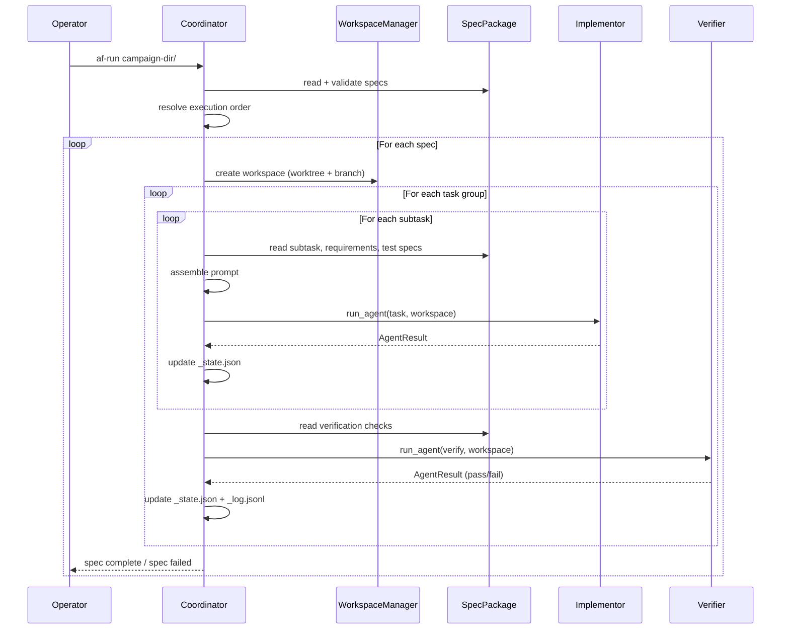
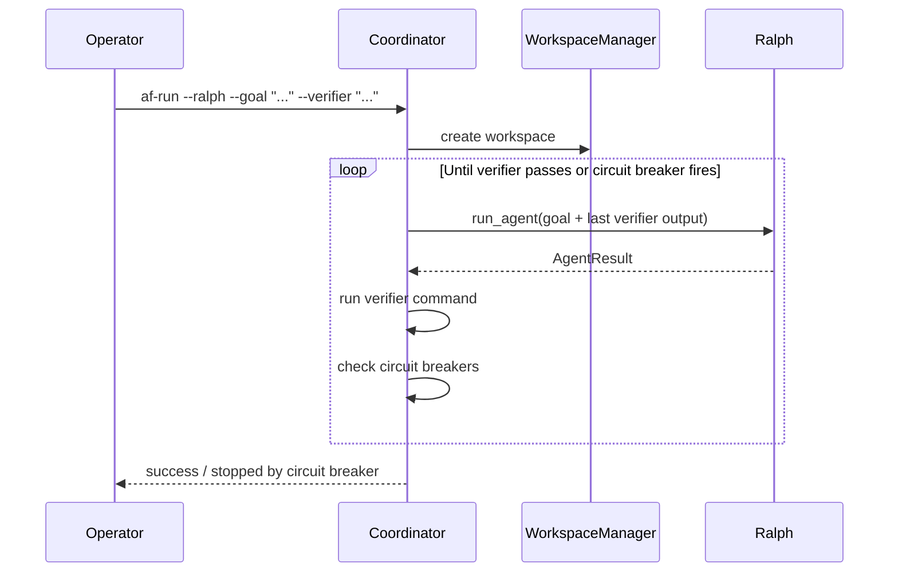

# MVP PRD: af Harness Bootstrap Implementation

## 1. Purpose

This document is a Product Requirements Document for the first working
implementation of the af agentic development harness. The MVP exists to
close the bootstrapping gap: once it works, the harness can execute spec
packages against itself, gradually building a better version of each
component. The audience is `af-spec`, which will turn this PRD into one or
more spec packages that guide the actual implementation.

### 1.1 Design philosophy

Every MVP component is a throw-away implementation behind a durable
contract. The contracts (interfaces, file formats, protocols) are the
investment; the code behind them is expected to be replaced. A component
that proves itself can be carried forward; the rest gets rebuilt when a
better implementation is spec'd.

The MVP deliberately cuts scope to the minimum that can execute a campaign
of spec packages end-to-end:

- No hub process. No SQLite database. No gRPC. No containers.
- No MCP bridge. Tools are exposed directly through the provider SDK.
- No retrieval engine, no CI/CD bridge, no notification service, no
  dashboard.
- No multi-machine deployment. Everything runs on the operator's laptop.

What remains is the core loop: read a spec, set up a workspace, run agents
against the spec's task plan, verify the results.

### 1.2 Success criteria

The MVP is done when:

1. An operator can point the harness at a campaign directory containing one
   or more spec packages and the harness executes them in order.
2. Each spec's task groups run sequentially, subtasks are delegated to an
   Implementor agent, and verification checks run after each group.
3. The output is a git branch per spec with committed, verified code.
4. The harness can execute specs written against its own codebase (the
   bootstrapping condition).

---

## 2. Architecture overview

The MVP is a Python application with five components, each behind an
interface that matches (or is a strict subset of) the full system design.

```
┌─────────────────────────────────────────────────────┐
│                    Coordinator                       │
│         (standalone process, no hub needed)          │
│                                                      │
│  ┌───────────┐  ┌──────────┐  ┌──────────────────┐  │
│  │  Campaign  │  │Workspace │  │    Provider       │  │
│  │  (fs dir)  │  │(worktree)│  │  (single SDK)    │  │
│  └─────┬─────┘  └────┬─────┘  └────────┬─────────┘  │
│        │              │                 │             │
│  ┌─────▼──────────────▼─────────────────▼──────────┐ │
│  │              Specialist agents                   │ │
│  │  Implementor · Verifier · Ralph                  │ │
│  └──────────────────────────────────────────────────┘ │
│                                                      │
│  ┌──────────────────────────────────────────────────┐ │
│  │              Context (null-service)               │ │
│  └──────────────────────────────────────────────────┘ │
└─────────────────────────────────────────────────────┘
```

The Coordinator is the entry point. It reads a campaign, creates workspaces,
delegates work to specialist agents through the Provider, and tracks
progress. Context is stubbed. Spec authoring is handled externally by
`af-spec` (already designed; not part of this MVP's implementation scope).

### 2.1 Technology choices

| Concern | Choice | Rationale |
| --- | --- | --- |
| Language | Python 3.12+ | Consistent with speclib. Single language across the harness MVP and the spec creation tool. |
| Provider SDK | LangChain / LangGraph | Mature agent framework with tool-use support, model-agnostic, good async primitives. Lets us swap models later without rewriting agent plumbing. Falls back to direct Anthropic SDK if LangChain proves too heavy. |
| Default model | Claude Sonnet (latest) | Best cost/performance for implementation agents. Configurable per specialist. |
| State tracking | JSON files in workspace directory | No database. `_state.json` per workspace tracks subtask progress. Matches the operational store's schema but stored as flat files. |
| Git operations | `subprocess` wrapping git CLI | GitPython is an option but subprocess is simpler and more transparent for an MVP. |
| Package structure | `src/af/` namespace package | Standard Python src layout. Each component is a subpackage with its own `__init__.py` exporting the public interface. |
| Configuration | `pyproject.toml` + `~/.af/settings.yaml` | Project metadata in pyproject.toml. Runtime config in settings.yaml (already specified in the full design). |

### 2.2 Reference material

The following documents from this repository define the contracts and data
models the MVP implements. Every component section below references the
relevant spec sections. When implementing, read the referenced sections
in full — they are the authority on structure and semantics.

| Document | What it defines for the MVP |
| --- | --- |
| [spec-format_v1.2.md](../spec-format_v1.2.md) | Spec package format: artifact schemas, EARS patterns, validation rules, ID formats, rendering. The MVP must read and validate against this format. |
| [coordination-layer.md](coordination-layer.md) | Domain model, workspace semantics, spec lifecycle, agent model, orchestration flow, specialist roles, the subtask state machine. The MVP implements a subset of the coordination layer. |
| [runtime-layer.md](runtime-layer.md) | Worktree management interface, harness adapter interface, agent lifecycle phases. The MVP implements worktree management directly (no containers) and a single adapter. |
| [services-architecture.md](services-architecture.md) | speclib session model and API, af-spec CLI, filesystem layout, storage schema. The MVP reuses speclib for validation/rendering and follows the filesystem layout. |

---

## 3. Component: Campaign

**Full design reference:** [coordination-layer.md §4](coordination-layer.md),
[services-architecture.md §8.1](services-architecture.md)

### 3.1 MVP scope

A Campaign in the MVP is a directory on the filesystem containing a
`campaign.yaml` and one or more spec subdirectories. This is identical to
the authoring-time campaign directory described in the full design — the MVP
simply uses it directly at execution time rather than submitting it to a hub.

There is no hub. There is no campaign table in a database. The filesystem
is the single source of truth.

### 3.2 What the Campaign component does

1. **Open** a campaign directory, reading `campaign.yaml` for metadata.
2. **List** spec directories within the campaign, ordered by numeric prefix.
3. **Read** a spec package from a directory, delegating to speclib for
   validation.
4. **Resolve dependencies** between specs by reading each spec's
   `tasks.json` `dependencies` array and building a DAG.
5. **Determine execution order** — topological sort of the dependency DAG.
   Specs with no dependencies come first. Circular dependencies are rejected.

### 3.3 Interface

```python
class Campaign:
    """Read-only view of a campaign directory for execution."""

    @classmethod
    def open(cls, path: Path) -> "Campaign": ...

    @property
    def name(self) -> str: ...

    @property
    def description(self) -> str: ...

    @property
    def path(self) -> Path: ...

    def specs(self) -> list["SpecPackage"]: ...

    def execution_order(self) -> list["SpecPackage"]:
        """Topological sort respecting dependencies.
        Raises CyclicDependencyError on cycles."""
        ...
```

### 3.4 Filesystem contract

```
<campaign-dir>/
  campaign.yaml           # required — schema per coordination-layer.md §4.2
  01_first_spec/
    prd.md
    requirements.json
    test_spec.json
    tasks.json
    architecture.md       # optional
  02_second_spec/
    ...
```

### 3.5 What the Campaign component does NOT do

- Create campaigns (that is `af-spec init`).
- Author or modify specs (that is `af-spec`).
- Track execution state (that is the Workspace and Coordinator).
- Manage campaign lifecycle transitions (no hub to enforce them).

### 3.6 Spec package reading

The Campaign component reads spec packages through **speclib** (the same
library used by `af-spec`). speclib provides:

- Schema validation per artifact.
- Cross-file integrity validation.
- Parsed, typed access to requirements, test specs, and tasks.
- Rendering to markdown.

The MVP does not reimplement any spec parsing or validation. It delegates
entirely to speclib. If speclib is not yet implemented when the MVP is
built, a minimal shim that reads the JSON files and does basic structure
checking is acceptable as a temporary measure — but it must be replaced
by speclib once available.

---

## 4. Component: Workspace

**Full design reference:** [coordination-layer.md §3](coordination-layer.md),
[runtime-layer.md §3](runtime-layer.md)

### 4.1 MVP scope

A Workspace is a git worktree on a dedicated branch, paired with execution
state tracked in a JSON file. No containers. No managed scripts. No
bootstrap step beyond creating the worktree.

### 4.2 What the Workspace component does

1. **Create** a worktree from the current repo on a new branch
   (`af/<spec-slug>`), based on the configured base branch (default:
   `main`).
2. **Track execution state** for subtasks in `_state.json` within the
   worktree (gitignored). This file mirrors the operational store's
   `SubtaskExecution` entity but as a flat JSON file.
3. **Provide file access** — the workspace path is the worktree path; agents
   read and write files there directly.
4. **Record git state** — current branch, HEAD commit, dirty status.
5. **Clean up** — remove the worktree and optionally the branch on
   completion or abandonment.

### 4.3 Interface

```python
@dataclass
class WorkspaceInfo:
    path: Path              # absolute path to worktree
    branch: str             # e.g. "af/01_data_models"
    base_branch: str        # e.g. "main"
    head: str               # current commit SHA
    spec_slug: str          # e.g. "01_data_models"

class WorkspaceManager:
    """Creates and manages git worktrees for spec execution."""

    def __init__(self, repo_path: Path, config: WorkspaceConfig): ...

    def create(self, spec_slug: str, base_branch: str = "main") -> WorkspaceInfo: ...

    def get(self, spec_slug: str) -> WorkspaceInfo | None: ...

    def remove(self, spec_slug: str, delete_branch: bool = False) -> None: ...

    def list(self) -> list[WorkspaceInfo]: ...

@dataclass
class WorkspaceConfig:
    branch_prefix: str = "af"
    worktree_dir: str = ".af_worktrees"  # relative to repo parent
```

### 4.4 Execution state

```json
{
  "spec_id": "01",
  "spec_name": "data_models",
  "status": "running",
  "started_at": "2026-06-11T10:00:00Z",
  "subtasks": {
    "1.1": {
      "state": "done",
      "started_at": "2026-06-11T10:01:00Z",
      "completed_at": "2026-06-11T10:05:00Z"
    },
    "1.2": {
      "state": "in_progress",
      "started_at": "2026-06-11T10:06:00Z"
    },
    "2.1": {
      "state": "pending"
    }
  },
  "verification_outcomes": {
    "1.V": {
      "result": "passed",
      "checks": [
        {"check": "pytest -q tests/spec/test_01.py -k group1", "result": "passed"},
        {"check": "ruff check", "result": "passed"}
      ],
      "recorded_at": "2026-06-11T10:10:00Z"
    }
  }
}
```

This schema is a simplified version of the operational store entities
defined in [coordination-layer.md §9.3](coordination-layer.md). The
subtask states follow the state machine from
[spec-format_v1.2.md §8.3.1](../spec-format_v1.2.md). The MVP adds
`awaiting_verification` as a harness extension per
[coordination-layer.md §7.3](coordination-layer.md).

### 4.5 What the Workspace component does NOT do

- Run bootstrap/setup scripts (manual responsibility).
- Container isolation (agents run natively).
- Managed scripts (dev servers, etc.).
- Activity logging (no event stream).

### 4.6 Worktree location

Follows [runtime-layer.md §3.2](runtime-layer.md):
`<repo-parent>/.af_worktrees/<spec-slug>/`. The `_state.json` file lives
inside the worktree root and is added to `.gitignore`.

---

## 5. Component: Context (null-service)

**Full design reference:** [coordination-layer.md §5.9](coordination-layer.md)

### 5.1 MVP scope

Context is the grounding abstraction — durable bundles of instructions,
files, MCP servers, and other sources that agents read while working. The
MVP implements the Context interface as a **null-service**: every method
returns an empty result. This means agents in the MVP work with only the
spec package and their system prompts, with no additional grounding.

The null-service exists so that:

- Code that calls Context methods compiles and runs without conditionals.
- When a real Context implementation exists, it can be swapped in without
  changing any call sites.
- The interface is exercised even before it does anything, catching design
  problems early.

### 5.2 Interface

```python
@dataclass
class ContextSearchResult:
    chunk: str
    path: str | None
    score: float
    start_line: int | None
    end_line: int | None

@dataclass
class ContextSource:
    id: str
    type: str
    content: str

class ContextService(Protocol):
    """Read-only grounding service. Agents call this to get context."""

    def search(
        self,
        query: str,
        context_id: str | None = None,
        source_id: str | None = None,
        max_results: int = 10,
    ) -> list[ContextSearchResult]: ...

    def get_source(
        self,
        context_id: str,
        source_id: str,
    ) -> ContextSource | None: ...

    def list_contexts(self) -> list[str]: ...


class NullContextService:
    """MVP stub. Returns empty results for all queries."""

    def search(self, query, context_id=None, source_id=None, max_results=10):
        return []

    def get_source(self, context_id, source_id):
        return None

    def list_contexts(self):
        return []
```

### 5.3 Integration points

The Context service is injected into agents as a tool. Even though the
null-service returns nothing, the tool is still registered so the agent's
system prompt can reference it and agents can attempt to use it. This
exercises the tool plumbing and lets us catch integration issues before a
real implementation exists.

### 5.4 Memory (also null-service)

Agent memory ([coordination-layer.md §6.6](coordination-layer.md)) is
similarly stubbed:

```python
class MemoryService(Protocol):
    def recall(self, scope: str, query: str, budget: int = 10) -> list[str]: ...
    def consolidate(self, scope: str, learnings: list[str]) -> None: ...

class NullMemoryService:
    def recall(self, scope, query, budget=10):
        return []
    def consolidate(self, scope, learnings):
        pass
```

---

## 6. Component: Provider

**Full design reference:** [coordination-layer.md §6.1](coordination-layer.md),
[runtime-layer.md §4](runtime-layer.md)

### 6.1 MVP scope

A Provider is an external agent backend. The full design supports Claude
Code, Gemini CLI, Codex, and OpenCode through harness adapters that each
implement a container-level interface. The MVP replaces this with a
**direct SDK integration**: the harness drives model calls through a Python
SDK (LangChain or the Anthropic SDK directly), not by launching an external
CLI process in a container.

This is the most significant architectural departure from the full design.
In the full system, agents are opaque processes inside containers, and the
harness communicates through the MCP bridge. In the MVP, agents are Python
objects that the Coordinator calls directly. The departure is acceptable
because:

1. The agent tool interface is preserved — the same set of tools is
   available, just exposed through the SDK's tool mechanism rather than MCP.
2. The specialist system prompts are identical.
3. The subtask state machine is identical.
4. When containers and the MCP bridge are built, the tools move to the
   bridge without changing the agent's experience.

### 6.2 SDK choice: LangChain / LangGraph

LangChain provides:

- **Model abstraction** — `ChatAnthropic`, `ChatOpenAI`, etc. share one
  interface. The MVP starts with Claude but can switch or mix models.
- **Tool binding** — `@tool` decorator, structured schemas, automatic
  parameter validation.
- **Agent framework** — `create_react_agent` or LangGraph's `StateGraph`
  for tool-loop execution with hooks for observation and control.
- **Async support** — `ainvoke` / `astream` for non-blocking execution.

If LangChain proves too heavy or opinionated for the MVP's needs, the
fallback is the **Anthropic Python SDK** (`anthropic.Anthropic`) with
manual tool-loop management. The key property is that the Provider interface
stays the same either way.

### 6.3 Interface

```python
@dataclass
class AgentConfig:
    specialist: str          # "implementor", "verifier", "ralph"
    model: str               # e.g. "claude-sonnet-4-6"
    system_prompt: str       # composed by the Coordinator
    tools: list[Any]         # tool definitions (SDK-specific)
    max_tokens: int = 200_000

@dataclass
class AgentResult:
    success: bool
    output: str              # final agent output
    tool_calls: list[dict]   # record of tool calls made
    token_usage: dict        # input/output/total tokens

class Provider(Protocol):
    """Drives a model through its SDK."""

    def run_agent(
        self,
        config: AgentConfig,
        task: str,
        workspace_path: Path,
    ) -> AgentResult: ...

    def supports_resume(self) -> bool: ...

    def name(self) -> str: ...
```

### 6.4 Tool exposure

In the full design, tools are exposed through the MCP bridge
([runtime-layer.md §8](runtime-layer.md)). In the MVP, tools are Python
functions registered with the SDK's tool mechanism. The set of tools
available to an agent matches [coordination-layer.md §6.5](coordination-layer.md)
minus the ones that require infrastructure that does not exist in the MVP:

| Tool | MVP status | Notes |
| --- | --- | --- |
| File read/write | **available** | Direct filesystem access within the worktree. |
| Exec / script | **available** | `subprocess.run()` in the worktree. |
| Spec read | **available** | Reads from the spec package via speclib. |
| Context search/get | **available (stub)** | Calls the null-service. Always returns empty. |
| Memory recall | **available (stub)** | Calls the null-service. Always returns empty. |
| Git | **available** | Stage, commit. No PR creation in MVP. |
| Subtask state | **available** | Writes to `_state.json`. |
| Browser control | **deferred** | Not needed for code-only tasks. |
| MCP call | **deferred** | No MCP bridge in MVP. |
| Issue tracker | **deferred** | Not needed for the core loop. |
| Web search | **deferred** | Not needed for the core loop. |
| CI/CD status | **deferred** | No CI integration in MVP. |

### 6.5 Model configuration

```yaml
# ~/.af/settings.yaml
provider:
  sdk: langchain                  # langchain | anthropic
  default_model: claude-sonnet-4-6

models:
  implementor: claude-sonnet-4-6
  verifier: claude-sonnet-4-6
  coordinator: claude-sonnet-4-6  # Coordinator uses a model for prompt composition
  ralph: claude-sonnet-4-6
```

---

## 7. Component: Specialists (agents)

**Full design reference:** [coordination-layer.md §6.4](coordination-layer.md)

### 7.1 MVP scope

The full design defines eight specialist roles. The MVP implements four,
defers two, and excludes two:

| Specialist | MVP status | Rationale |
| --- | --- | --- |
| Planner | **external** | Handled by `af-spec`. Not part of the execution harness. |
| Coordinator | **implemented** | Core of the MVP. See §8. |
| Implementor | **implemented** | Executes subtasks. The primary worker agent. |
| Verifier | **implemented** | Runs verification checks after each task group. |
| Ralph | **implemented** | Autonomous loop for exploratory tasks. |
| UI Designer | **deferred** | Requires browser control. Not needed for code-only work. |
| PR Reviewer | **deferred** | Requires GitHub integration beyond the core loop. |
| PR Shepherd | **deferred** | Same. |

### 7.2 Specialist definitions

Each specialist is defined by a system prompt template, a tool policy, and
a model tier. The templates below are the MVP versions — production
versions will be more detailed.

#### 7.2.1 Implementor

**Actor capability:** Archetype (can only transition its own subtask state).

**System prompt template:**

```
You are an Implementor agent working inside the af development harness.

## Your assignment

You are implementing subtask {subtask_id}: "{subtask_title}"

## Spec context

{rendered_spec_slice}

## Requirements you must satisfy

{requirement_details}

## Tests you must make pass

{test_spec_details}

## Rules

1. Work only within the worktree at {workspace_path}.
2. Implement the subtask as described. Do not exceed scope.
3. Run the test command after implementation: {test_command}
4. Commit your work with a descriptive message.
5. When done, transition your subtask state to awaiting_verification.
6. If you are stuck, explain what is blocking you in your output.
```

**Tool policy:** File read/write, exec, git (commit only), spec read,
subtask state (own subtask only).

**Model tier:** Sonnet (default). Configurable to Opus for complex subtasks.

#### 7.2.2 Verifier

**Actor capability:** Archetype.

**System prompt template:**

```
You are a Verifier agent working inside the af development harness.

## Your assignment

Verify task group {group_id}: "{group_title}"

## Verification checks

{verification_checks}

## Rules

1. Run each verification check in order.
2. Report pass or fail for each check with details.
3. Do not modify source code. You are read-only except for running commands.
4. If a check fails, describe what failed and what the Implementor
   needs to fix.
```

**Tool policy:** File read (no write), exec (read-only commands + test
runners), spec read.

**Model tier:** Sonnet.

#### 7.2.3 Ralph

**Actor capability:** None (operates outside the spec package).

**System prompt template:**

```
You are Ralph, an autonomous agent working inside the af development
harness.

## Your goal

{goal}

## Verifier command

Your work is verified by running: {verifier_command}
Exit code 0 means success. Any other exit code means you need to keep
working.

## Rules

1. Work only within the worktree at {workspace_path}.
2. Each iteration: review the verifier output, make changes, run the
   verifier again.
3. Commit your work after each meaningful change.
4. If the verifier passes, commit and report success.
5. You have a budget of {max_iterations} iterations and {max_tokens}
   tokens.
```

**Tool policy:** File read/write, exec, git.

**Circuit breakers:** Per [coordination-layer.md §6.7](coordination-layer.md):
- `max_tokens`: 2,000,000 (default)
- `max_iterations`: 30 (default)
- `max_duration`: 4 hours (default)

### 7.3 Prompt assembly

The Coordinator composes each agent's system prompt before launch by:

1. Starting with the specialist's template.
2. Substituting variables from the spec package:
   - `{subtask_id}`, `{subtask_title}`, `{rendered_spec_slice}` — from
     `tasks.json` and the rendered spec.
   - `{requirement_details}` — requirements traced by the subtask's
     `requirement_refs`.
   - `{test_spec_details}` — test specs traced by the subtask's
     `test_spec_refs`.
   - `{test_command}` — from `tasks.json` `test_commands`.
3. Appending any Context instructions (empty in the MVP null-service).
4. Appending recalled memory (empty in the MVP null-service).

This matches the prompt assembly flow described in
[coordination-layer.md §6.3](coordination-layer.md), minus the Context
and memory content that the null-services cannot provide.

---

## 8. Component: Coordinator

**Full design reference:** [coordination-layer.md §7](coordination-layer.md),
[coordination-layer.md §8.1](coordination-layer.md)

### 8.1 MVP scope

The Coordinator is a standalone Python process that orchestrates the
execution of a campaign. It is the entry point for the MVP harness. It
does not need the hub, the CLI socket, the MCP bridge, or any network
service. It reads spec packages from the filesystem, creates workspaces,
delegates subtasks to agents, runs verification, and tracks progress.

In the full design, the Coordinator is itself an agent (a specialist with
the Coordinator actor capability). In the MVP, the Coordinator is
**deterministic code**, not a model-driven agent. It follows a fixed
algorithm rather than reasoning about what to do next. This is simpler,
cheaper, more predictable, and sufficient for the core loop. The Coordinator
can be upgraded to a model-driven agent in a future spec.

### 8.2 The execution algorithm

```
for spec in campaign.execution_order():
    workspace = workspace_manager.create(spec.slug)
    validate(spec)   # via speclib

    for task_group in spec.task_groups:
        for subtask in task_group.subtasks:
            # Compose the agent prompt
            prompt = assemble_prompt(spec, subtask, workspace)
            config = agent_config(specialist="implementor", prompt=prompt)

            # Run the implementor
            transition(subtask, "queued")
            transition(subtask, "in_progress")
            result = provider.run_agent(config, subtask.title, workspace.path)

            if result.success:
                transition(subtask, "awaiting_verification")
            else:
                log_failure(subtask, result)
                # Stop this spec; operator must intervene
                break

        # Run group verification
        verifier_prompt = assemble_verifier_prompt(spec, task_group, workspace)
        verifier_config = agent_config(specialist="verifier", prompt=verifier_prompt)
        verification = provider.run_agent(verifier_config, f"verify group {task_group.id}", workspace.path)

        if verification.success:
            for subtask in task_group.subtasks:
                transition(subtask, "done")
            record_verification(task_group, "passed")
        else:
            for subtask in task_group.subtasks:
                transition(subtask, "pending_reevaluation")
            record_verification(task_group, "failed")
            # Retry or stop — configurable
            break

    # All groups passed → spec complete
    mark_spec_complete(workspace)
```

### 8.3 What the Coordinator does

1. **Reads the campaign** and determines execution order.
2. **Creates a workspace** (git worktree + branch) for each spec.
3. **Validates the spec** using speclib before execution.
4. **Iterates task groups** in order (group 1 is always tests-first).
5. **For each subtask:** composes the prompt, runs an Implementor agent,
   tracks the result.
6. **After each group:** runs a Verifier agent against the group's
   verification checks.
7. **On verification failure:** transitions subtasks to
   `pending_reevaluation` and either retries (configurable, default once)
   or stops and reports.
8. **On completion:** commits final state, reports success.
9. **On any failure:** commits partial progress, reports what failed and
   where to resume.

### 8.4 Interface

```python
@dataclass
class ExecutionConfig:
    campaign_path: Path
    repo_path: Path
    base_branch: str = "main"
    max_retries_per_group: int = 1
    provider_config: ProviderConfig = field(default_factory=ProviderConfig)
    dry_run: bool = False            # validate only, don't execute

@dataclass
class ExecutionResult:
    campaign: str
    specs_completed: list[str]
    specs_failed: list[str]
    workspaces: dict[str, WorkspaceInfo]

class Coordinator:
    """Orchestrates execution of a campaign's spec packages."""

    def __init__(
        self,
        config: ExecutionConfig,
        provider: Provider,
        context: ContextService = NullContextService(),
        memory: MemoryService = NullMemoryService(),
    ): ...

    def execute(self) -> ExecutionResult:
        """Run all specs in the campaign."""
        ...

    def execute_spec(self, spec_slug: str) -> ExecutionResult:
        """Run a single spec from the campaign."""
        ...

    def resume(self, spec_slug: str) -> ExecutionResult:
        """Resume a partially-completed spec from its last checkpoint."""
        ...
```

### 8.5 Resume support

The Coordinator supports resuming a partially-completed spec. On resume:

1. Read `_state.json` from the workspace.
2. Find the first subtask not in `done` state.
3. Continue the execution algorithm from that point.

This is possible because:
- The spec package is frozen (read-only).
- Execution state is persisted in `_state.json` after every transition.
- Committed code in the worktree is durable.

### 8.6 CLI entry point

```
af-run <campaign-dir> [options]

Options:
  --repo <path>          Path to the git repo (default: current directory)
  --base-branch <name>   Base branch for worktrees (default: main)
  --spec <slug>          Run only this spec (default: all in order)
  --resume               Resume a partially-completed spec
  --dry-run              Validate specs only, don't execute
  --max-retries <n>      Max retries per verification failure (default: 1)
  --model <model-id>     Override the default model
```

### 8.7 Logging and observability

The MVP does not implement the full activity log
([coordination-layer.md §9.3](coordination-layer.md)). Instead:

- **stdout/stderr** — structured log lines with timestamps, spec IDs,
  subtask IDs, and event types.
- **`_state.json`** — queryable execution state per workspace.
- **`_log.jsonl`** — append-only JSONL file in the workspace directory
  recording key events (subtask transitions, verification outcomes, agent
  outputs). This is a simplified precursor to the ActivityEvent stream.

Log format:

```json
{"ts": "2026-06-11T10:01:00Z", "event": "subtask_transition", "subtask": "1.1", "from": "pending", "to": "in_progress"}
{"ts": "2026-06-11T10:05:00Z", "event": "agent_complete", "subtask": "1.1", "success": true, "tokens": 15000}
{"ts": "2026-06-11T10:06:00Z", "event": "verification", "group": 1, "result": "passed"}
```

---

## 9. Execution flows

### 9.1 Spec-driven execution (primary flow)

This is the MVP version of the generic spec-driven flow from
[coordination-layer.md §8.1](coordination-layer.md).



### 9.2 Ralph execution



### 9.3 Single-agent execution

The MVP follows the single-agent-per-workspace model described in
[coordination-layer.md §7.1](coordination-layer.md). One agent runs at a
time. The Coordinator waits for the agent to finish before running the next
one. No file claims, no cross-agent coordination needed.

---

## 10. Package structure

```
src/
  af/
    __init__.py
    campaign/
      __init__.py            # Campaign class
      dependency.py          # DAG resolution
    workspace/
      __init__.py            # WorkspaceManager, WorkspaceInfo
      state.py               # _state.json read/write
      worktree.py            # git worktree operations
    context/
      __init__.py            # ContextService protocol
      null.py                # NullContextService, NullMemoryService
    provider/
      __init__.py            # Provider protocol, AgentConfig, AgentResult
      langchain.py           # LangChain implementation
      anthropic.py           # Fallback: direct Anthropic SDK
    agents/
      __init__.py            # Specialist definitions
      prompts/
        implementor.md       # System prompt template
        verifier.md          # System prompt template
        ralph.md             # System prompt template
      tools.py               # Tool definitions (file, exec, git, spec, etc.)
    coordinator/
      __init__.py            # Coordinator class
      executor.py            # The execution algorithm
      prompt_assembly.py     # Prompt composition from spec + Context + memory
    config.py                # Settings loading from ~/.af/settings.yaml
    cli.py                   # af-run entry point
```

### 10.1 Dependencies

```
# Core
python >= 3.12
pyyaml                        # campaign.yaml, settings.yaml
pydantic >= 2.0               # data models, validation
click                         # CLI framework

# Provider (one of)
langchain-core
langchain-anthropic            # Claude via LangChain
# OR
anthropic                      # Direct Anthropic SDK

# Spec handling (when available)
# speclib                      # spec validation, rendering — imported if available
```

---

## 11. Boundaries and contracts

### 11.1 What crosses a component boundary

Every component interaction goes through a typed interface (Protocol or
abstract class). No component reaches into another's internals. The
contracts:

| From | To | Contract |
| --- | --- | --- |
| Coordinator | Campaign | `Campaign.open()`, `.specs()`, `.execution_order()` |
| Coordinator | Workspace | `WorkspaceManager.create()`, `.get()`, `.remove()` |
| Coordinator | Provider | `Provider.run_agent()` |
| Coordinator | Context | `ContextService.search()`, `.get_source()` |
| Coordinator | Memory | `MemoryService.recall()`, `.consolidate()` |
| Provider | Tools | Tool functions registered with the SDK |
| Tools | Workspace | Direct file I/O within worktree path |
| Tools | SpecPackage | `speclib.validate()`, `.render()`, artifact access |
| Tools | Context | `ContextService.search()`, `.get_source()` |

### 11.2 What a replacement must satisfy

To replace a component, the new implementation must:

1. Implement the same Protocol (or a superset).
2. Accept the same configuration shape (or a superset).
3. Produce the same outputs for the same inputs (behavioral compatibility).
4. Not require changes to any other component.

For example, replacing `NullContextService` with a real implementation
requires implementing `ContextService` (Protocol) with actual retrieval
logic. The Coordinator and tools don't change.

### 11.3 Carry-forward criteria

A component "proves itself" and should be carried forward when:

1. It has been used to successfully execute real specs.
2. Its interface has stabilized (no breaking changes in the last N specs).
3. Its code quality meets the project's bar (tested, typed, documented).
4. It does not carry MVP shortcuts that would be technical debt (hardcoded
   paths, missing error handling at system boundaries, etc.).

---

## 12. What is NOT in scope

| Concern | Why excluded | Where it's spec'd |
| --- | --- | --- |
| af hub (stateful process) | The MVP has no services layer. The Coordinator runs directly. | [services-architecture.md §2](services-architecture.md) |
| SQLite database | State is JSON files. A database is needed when there are concurrent writers; the MVP has one. | [services-architecture.md §8.2](services-architecture.md) |
| Container isolation | Agents run natively. Containers are needed for untrusted code and multi-tenant; the MVP is single-user. | [runtime-layer.md §2](runtime-layer.md) |
| MCP bridge | Tools are SDK-native. The bridge is needed when agents are opaque processes in containers. | [runtime-layer.md §8](runtime-layer.md) |
| Multi-provider support | One SDK, one model family. Multiple providers come when we need provider-specific adapters. | [runtime-layer.md §4](runtime-layer.md) |
| Spec authoring | Handled by `af-spec` (speclib). The MVP consumes specs, it doesn't create them. | [services-architecture.md §7](services-architecture.md) |
| Context retrieval engine | Null-service. Real retrieval needs embeddings, indexing, vector search. | [services-architecture.md §12](services-architecture.md) |
| CI/CD bridge | Read-only CI status isn't needed for the core execution loop. | [services-architecture.md §13](services-architecture.md) |
| Notification service | The operator watches the terminal. Notifications matter for unattended runs. | [services-architecture.md §14](services-architecture.md) |
| Web dashboard | The operator uses the CLI. A dashboard matters for multi-workspace monitoring. | [services-architecture.md §15](services-architecture.md) |
| Browser control | Code-only tasks don't need browser verification. | [coordination-layer.md §6.5](coordination-layer.md) |
| PR creation and review | Git integration stops at commit. PRs are operator-driven. | [coordination-layer.md §6.5](coordination-layer.md) |
| Multi-agent concurrency | One agent at a time per workspace. Parallel agents need file claims and coordination. | [coordination-layer.md §7.1](coordination-layer.md) |

---

## 13. Spec decomposition guidance

This PRD is intended to be decomposed into multiple spec packages by
`af-spec`. The suggested decomposition follows the component boundaries:

| Spec | Scope | Dependencies |
| --- | --- | --- |
| 01 — spec-reader | Read and validate spec packages via speclib (or a shim). Campaign reading. Dependency resolution. | None |
| 02 — workspace | WorkspaceManager, worktree operations, execution state tracking. | None |
| 03 — provider | Provider interface, LangChain implementation, tool definitions. | None |
| 04 — agents | Specialist prompt templates, prompt assembly, tool wiring. | 03 (provider) |
| 05 — coordinator | The Coordinator, execution algorithm, resume, CLI entry point. | 01, 02, 03, 04 |
| 06 — ralph | Ralph loop, circuit breakers, verifier integration. | 02, 03 |

Specs 01, 02, and 03 have no cross-dependencies and can be developed in
parallel. Spec 04 depends on the provider. Spec 05 integrates everything.
Spec 06 is an independent extension.

### 13.1 Test strategy per spec

Each spec should include:

- **Unit tests** for its component in isolation (mocked dependencies).
- **Integration tests** that exercise the real interface with a test
  fixture (a small campaign directory with minimal spec packages for
  testing).
- **A test campaign** — a small campaign with one or two trivial specs
  (e.g., "create a file with these contents") that the harness can execute
  end-to-end. This test campaign lives in `tests/fixtures/` and is used
  by the integration tests of spec 05 (coordinator).

### 13.2 Cross-cutting concerns for all specs

- **Error handling at boundaries:** Every component must handle errors from
  its dependencies gracefully (subprocess failures, file-not-found,
  malformed JSON, model API errors) and surface them as structured errors
  to the caller.
- **Type safety:** All public interfaces must be fully typed. Use
  `pydantic.BaseModel` for data classes that cross component boundaries.
  Use `Protocol` for injectable interfaces.
- **Logging:** Use Python's `logging` module with structured formatters.
  Every log line includes a timestamp, component name, and relevant IDs
  (spec, subtask, workspace).

---

## 14. Open questions

These are decisions that can be deferred to the spec-creation phase or
resolved during implementation:

1. **LangChain vs. direct Anthropic SDK:** The MVP should start with one
   and not abstract over both. The spec for the provider component (03)
   should make a firm choice after evaluating whether LangChain's
   abstractions help or hinder for the tool-loop pattern used by the
   harness.

2. **speclib availability:** If speclib is not implemented when the MVP
   starts, the spec-reader component (01) needs a temporary shim. How
   thin should it be? Recommendation: just JSON loading + basic schema
   validation using the JSON Schema files from the spec format spec.

3. **Subtask granularity for agents:** Should each subtask get its own
   fresh agent (new conversation), or should the Implementor agent persist
   across subtasks within a group? Fresh agents are simpler and more
   isolated. Persistent agents accumulate context. Recommendation: fresh
   per subtask, with the spec slice providing all needed context.

4. **Ralph as a first-class CLI mode:** Should Ralph have its own
   `af-ralph` command, or is `af-run --ralph` sufficient? The full design
   treats Ralph as a distinct specialist with a different flow.
   Recommendation: `af-run --ralph` for the MVP; separate CLI if it proves
   to be a common pattern.

5. **Configuration loading:** Should the MVP implement the full
   `~/.af/settings.yaml` schema, or a minimal subset? Recommendation:
   minimal subset covering `provider`, `models`, and `worktrees` sections
   only. Other sections are no-ops.
