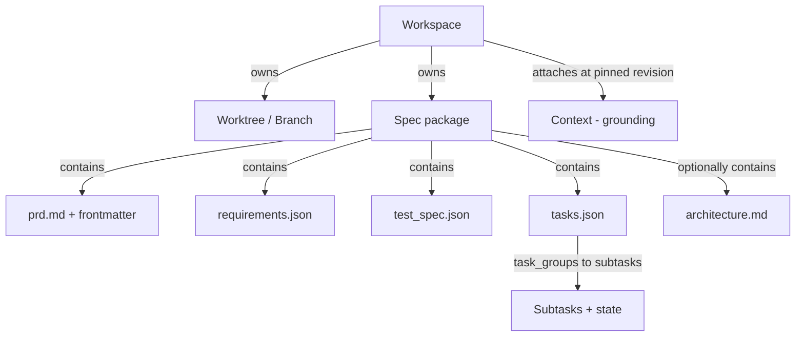

# PRD: Telos — Agentic Harness Core (Workspace, Spec Package & Multi-Agent Model)

**Status:** Draft for review

**Scope of this document:** the headless core of an agentic development harness, inspired by Intent (intentapp.dev) but not a clone of it, with the desktop application removed, with coordination rebuilt on the structured Spec Format Specification (v1.1), and with grounding unified under a single Context model (drawn from the GitHub Copilot Spaces concept).

---
## 1. Context and framing

> Naming note: capital-C **Context** is the grounding entity defined in section 7.10. To keep it unambiguous, this document does not use "context" as a loose common noun; it uses "prompt" for what an agent is given on a turn, "grounding" for the layer, and "token budget" for the model's input limit.

This work is inspired by Intent, a macOS application from Augment Code (https://www.intentapp.dev): a software development workspace where humans and AI agents plan and build software side by side. In Intent, each unit of work lives in its own workspace that bundles the repository (files, branches, and diffs), a layer of shared context (a spec, scratchpad notes, and agent tools such as MCP servers and skills), and a team of specialist agents that a Coordinator keeps pointed at one goal. That product is the reference point for the design below and the source of the vocabulary it borrows: workspace, spec, context, Coordinator, specialist.

What follows is not a specification of Intent, and the system it describes is not a clone. Intent is the starting point we reason from; the design here diverges on purpose. The harness is headless rather than a desktop application, its coordination is rebuilt on a validated spec package that freezes once approved, all grounding is unified under a single Context abstraction, and the provider, agent memory, and external tools sit behind pluggable interfaces. Where this PRD and Intent differ, this PRD governs what we are building; Intent is cited only to show where an idea came from. This document calls the system itself **Telos**, a working name (Greek for the end a thing is directed toward) that keeps the through-line to Intent while marking this as its own design.

Most of what a user touches in Intent is presentation: panels, layout presets, themes, keyboard shortcuts, the spaces switcher overlay. That surface is not what we are rebuilding.

The valuable part underneath is a runtime that does two things well. It gives each unit of work an isolated environment with its own branch, files, notes, and agents. And it lets several AI agents operate inside that environment without colliding, staying aligned to a single goal through shared documents rather than through ad-hoc chat between agents.

The harness assembles two distinct layers of input for every agent turn, and keeping them separate is the spine of this document. **Coordination** is the spec package: what to build and how it is verified, authored once through a validated contract and then frozen, owned per task. **Grounding** is the Context: what an agent should know while it works, supplied by a reusable, access-controlled object the agent reads but does not change. A Context grounds; the spec coordinates. They are orthogonal.

Two commitments shape this design. The first is the Spec Format Specification (v1.1) as the coordination substrate: requirements, tests, and tasks live in a validated four-artifact package rather than a single prose note. The second is grounding unified under one Context abstraction, so MCP servers, skills, and rules are kinds of source inside a Context rather than parallel mechanisms.

This PRD specifies the runtime as a standalone harness: a headless library or service that owns workspaces, runs agents against pluggable providers, coordinates multi-agent work through the structured spec package, and grounds agents in attached Contexts. A separate surface (a TUI, a web client, an API consumer) can sit on top later. Nothing here assumes a GUI.

Four terms recur. A **workspace** is the isolation boundary and state container for one task. An **agent** is a running instance of an AI model, driven by an external provider, that reads and writes inside one workspace. A **spec** is the validated four-artifact package (section 7) that captures what the work is and how it is verified. A **Context** is the durable, reusable, owned bundle of grounding (instruction plus typed sources) that a workspace attaches to ground its agents (section 7.10).

---

## 2. Goals

The harness should let a caller:

1. Open a workspace against an existing repo, a clone, or an empty directory, with each workspace isolated from the others at the filesystem and git level.
2. Run one or more agents inside a workspace, each backed by a configurable provider and model, with a tool set scoped to that workspace.
3. Author a structured spec package per unit of work, where humans own the PRD and its intent, and a Planner drafts the requirements, test specification, and task plan as validated JSON artifacts, which freeze once the spec is approved.
4. Enforce spec integrity while a spec is being authored: validate each draft write against its schema and against cross-artifact integrity rules, apply changes transactionally, and reject anything that would let an inconsistent package be approved.
5. Ground agents in one or more attached Contexts (reusable, access-controlled bundles of an instruction and typed grounding sources) pinned to a fixed revision for the duration of a run, so grounding is consistent within a run and reproducible across re-runs.
6. Coordinate multi-agent work, where a Planner decomposes intent into task groups and subtasks, a Coordinator delegates them, and worker agents execute subtasks in parallel, reporting progress only through the subtask state they own.
7. Stream a complete, ordered activity log of everything that happened, including the authoring patches behind the spec and the Context revisions pinned at run start, so any surface can render progress and so runs are auditable and reproducible.

A success criterion for the whole effort: a caller hands the harness a repo and a PRD, attaches the Contexts that describe the relevant domain, an agent drafts a validated spec package grounded in those Contexts, the human approves, agents implement and verify against that spec, and the caller gets back a branch with committed, verifiable changes whose traceability from requirement to test to task to executable test is intact.

---

## 3. Non-goals

Out of scope for this core, by request and by design:

- The desktop application and any GUI: panels, docks, drawers, layout presets, themes, fonts, command palette, keyboard shortcuts, the home screen, and the spaces switcher.
- Hosting, billing, authentication of end users, and any Augment-specific subscription logic. The harness is provider-agnostic.
- Building our own foundation model. Agents run on external providers.
- A merge queue or CI system. The harness reads CI status and drives PRs but does not run pipelines itself.
- The JSON Schema authoring tooling and the hosted schema URLs. Schemas are bundled with the validation library; the `$schema` URIs are informational.
- The Context authoring UI and the retrieval and embedding engine behind retrieved sources. This PRD specifies the contract a Context and its sources must satisfy and how the harness consumes them, not how a Context is edited in a UI or how indexing is implemented.
- Agent write-back into a Context. Contexts are read-only to agents by design (section 7.10). Editing a Context is an Operator action that happens outside a run.

The browser and terminal deserve a note. Their *UI* (an overlay console, a preview panel) is out of scope. Their *agent-facing capability* (running commands, controlling a headless browser to verify a web app) is in scope, because that is part of how agents do work.

---

## 4. Domain model

The workspace is the aggregate root. Two structures hang off it: the **spec package** (coordination) and one or more attached **Contexts** (grounding). A Context lives above the workspace and is referenced by it, because a Context is reused across many workspaces; the spec package lives inside the workspace, because it is per task.



| Entity | One-line definition |
| --- | --- |
| Workspace | Isolated environment for one task: a worktree, a spec package, attached Contexts, agents, and an activity log. |
| Worktree | A git working tree on a dedicated branch, giving each workspace its own files. |
| Spec package | The validated set of four required artifacts (and one optional) that define and verify the work. |
| PRD (`prd.md`) | The human-authored narrative: intent, goals, non-goals, background, plus machine-read frontmatter and a hashed Intent section. |
| Requirements (`requirements.json`) | EARS acceptance criteria, correctness properties, execution paths, and error handling. |
| Test spec (`test_spec.json`) | A language-agnostic test contract derived from the requirements, with computed coverage. |
| Tasks (`tasks.json`) | The implementation plan: task groups, subtasks with a defined state machine, dependencies, and traceability. |
| Architecture (`architecture.md`) | Optional, free-form module and interface design. No schema, not cross-validated. |
| Context | A durable, owned, reusable bundle of grounding: one instruction and a set of typed sources. Lives above the workspace and is read-only to agents. |
| Source | A typed reference inside a Context, carrying a resolution strategy (pinned or retrieved) and a freshness contract (snapshot or live). Content sources and capability sources (MCP, skills, rules) are both sources. |
| Agent | A running model instance, with a specialist role, an actor capability, a provider, a model, and a scoped tool set. |
| Actor capability | The permission tier (Operator, Planner, Coordinator, or Archetype) that governs what an agent or human may write in the spec package. |
| Provider | An external agent backend (for example Claude Code, Codex, OpenCode) the harness drives through one interface. |
| Agent memory | An agent-authored body of learnings that outlives a workspace, driven through one contract (`recall` at prompt assembly, `consolidate` at session end). May run in-process or as an independent service. Distinct from a Context: agent-authored and accumulated, not Operator-curated. |

The relationship that matters most: agents do not message each other to coordinate. They coordinate through a shared store. The Planner authors the spec package during `draft` through a validated contract; the package freezes on approval; the Coordinator then delegates work and monitors progress; workers read the frozen plan and write only their own execution state (section 7.7). They read attached Contexts but cannot change them. The structured package is the coordination medium; the Contexts are the grounding medium. The two never blur.

---

## 5. The Workspace

### 5.1 What a workspace is responsible for

A workspace is the unit of isolation and the unit of state. It bundles, for one task:

- a git worktree on its own branch, which holds the files agents read and edit;
- one spec package (the four required artifacts, plus an optional architecture doc), stored under a spec root;
- one or more attached Contexts, each pinned to a fixed revision for this workspace's runs, providing grounding;
- a registry of agents (active and finished) and their conversation histories;
- managed scripts, meaning long-running processes such as a dev server that an agent started;
- an append-only activity log.

The guiding rule from the source product holds: one workspace per real task. With the structured spec format this maps cleanly, since one workspace carries one spec package, and it attaches whichever Contexts describe the domain that task touches.

### 5.2 Isolation through worktrees

Isolation lets several workspaces run at once without stepping on each other. The harness implements it with `git worktree`. Creating a workspace creates a branch (named with a prefix, for example `telos/add-dark-mode`) and a separate working directory checked out to that branch. The user's main branch and main checkout are never touched.

A fresh worktree does not inherit untracked files. Environment files, local secrets, seeded data, and installed dependencies do not carry over. Workspace creation must run a bootstrap step (section 5.4) before agents start.

Where the spec package lives relative to the worktree is an open design decision: inside the worktree under a `specs/` root (versioned with the code) or in a sidecar store keyed by workspace. Attached Contexts are not part of the worktree at all; they live in a Context store above the workspace and are referenced by id and pinned revision.

### 5.3 Workspace lifecycle

Distinct from the spec lifecycle (section 7.6); a workspace contains a spec, and the two are tracked separately.

| State | Meaning | Transitions |
| --- | --- | --- |
| Created | Branch and worktree exist; bootstrap pending or running. | to Active on bootstrap success; to Failed on bootstrap error. |
| Failed | Bootstrap did not complete; no agents run. | to Created (retry bootstrap); to Deleted. |
| Active | Agents may run; the spec and files are live. | to Archived; to Deleted. |
| Archived | Read-only; kept for reference, hidden from default listings. | to Active (reopen); to Deleted. |
| Deleted | Harness metadata removed. | Terminal. |

Creation accepts one of three origins: a local repo path, a remote URL the harness clones, or an empty start where the caller supplies a PRD and the first agent scaffolds the project. Creation also accepts the set of Contexts to attach and, per Context, whether to pin its current revision (the default) or track it live (section 7.10).

Deletion removes the harness's record of the workspace and its metadata. The git branch is left in place unless the caller asks to remove it. Attached Contexts are never deleted by deleting a workspace; the workspace only held references to them.

### 5.4 Bootstrap and setup scripts

Each workspace carries setup commands that run when its worktree initializes, before any agent acts: install dependencies, copy a `.env`, run a seed script. The harness runs these in the worktree, captures output into the activity log, and only marks the workspace Active when they succeed. Setup scripts are workspace configuration with inheritance from a creation template.

### 5.5 State surfaces

The harness exposes the workspace's live state through read APIs (query endpoints, not UI):

- file listing and file contents for the worktree;
- git status and per-file diffs;
- the spec package: each artifact in raw JSON or markdown, and a rendered combined view (section 7.9);
- the spec's computed coverage and traceability;
- the attached Contexts and the revision each is pinned to, plus, for debugging, the prompt assembled for a given turn;
- the activity log, filterable by agent and by time.

### 5.6 Per-workspace configuration

A workspace can override global defaults for: git remote and base branch, attached Contexts and their pin mode, setup scripts, the default provider and model, and the spec root location. Anything not set falls back to harness-wide configuration.

---

## 6. Campaigns

Using a Campaign is optional. Single-workspace flows (a solo task, a coordinated feature, a Ralph loop) work exactly as described in the rest of this document without any Campaign involved. A Campaign is an additive layer for work that naturally decomposes into multiple dependent specs, where the human wants the harness to track the graph and gate workspace activation automatically.

### 6.1 What a Campaign is

A Campaign is a named container for a goal too large for one spec. It owns a set of workspaces, a dependency graph across their specs, a goal document, and the orchestration state that tracks which specs are ready to activate. It sits above the workspace: a Campaign references workspaces, it does not own their internals. The workspace, spec, and agent model underneath is identical whether a workspace is part of a Campaign or not.

A Campaign does not decompose the goal upfront. The Planner works against one PRD at a time, as always. The human registers specs into the campaign incrementally — start with spec 01 (data models), see what it reveals, register spec 02 (auth) with a declared dependency on spec 01, and so on. The dependency graph grows as the work is understood, not as a prerequisite to starting it.

### 6.2 Campaign goal document

Each Campaign has a short human-authored goal document: a title, a description of the top-level intent, and any cross-cutting constraints (shared Contexts, shared conventions, integration points between specs). This is lighter than a spec PRD: no Intent hash, no schema validation, no freeze. It exists for human orientation and as a reference when authoring individual PRDs within the campaign.

### 6.3 The dependency graph

Dependencies between specs in a Campaign are declared at task-group granularity, reusing the `depends_on_spec` / `from_group` / `to_group` field names from `tasks.json`. The Campaign stores these edges centrally in the `CampaignMember` record (section 11), which is canonical; they are not duplicated into any spec's `tasks.json`. This lets the harness evaluate the graph without reading every spec's artifacts, and lets edges be registered before a downstream spec's `tasks.json` exists. Because a downstream spec is often registered before it is planned, its `to_group` may be unknown at registration; the edge then targets the downstream spec as a whole, recorded as a `to_group` of `0`. This is a harness-level extension (the format spec defines `from_group: 0` with an associated `sentinel` flag for unplanned upstreams, but has no corresponding `to_group: 0`), so the sentinel lives only in the Campaign store, not in any artifact. The edge resolves to a concrete group once that spec's `tasks.json` exists. Until then the harness gates the whole downstream workspace on the edge.

An edge reads: "spec B's workspace may not activate until spec A's task group N is complete." "Complete" means the group's own verification subtask `{N}.V` has passed, not just the individual subtask states within it. This reuses the existing definition of group completion rather than inventing a new one.

Specs with no declared dependencies on incomplete specs are ready to activate immediately. Specs that declare dependencies stay blocked, their workspaces held in `Created` (section 5.3), until their upstream groups clear. Two specs with no dependency on each other may run in parallel; the Campaign activates both as soon as they are ready.

### 6.4 Campaign lifecycle

| State | Meaning |
| --- | --- |
| `active` | Specs are being registered and workspaces are running. New specs may be added at any time. |
| `complete` | All registered specs are `sealed`. No further specs may be added. |
| `abandoned` | Stopped before completion. Workspaces are archived; no further activation. |

A Campaign starts `active` when the human creates it with its goal document and at least one spec registered. It does not have a `draft` state; there is nothing to approve before work can begin. It reaches `complete` automatically when the last registered spec seals. The human may abandon a Campaign at any time.

### 6.5 Workspace activation

A campaign-gated workspace defers bootstrap until its dependency gate clears. Section 5.3 defines `Created → Active` as triggered by bootstrap success, and that remains true: the difference is when bootstrap runs. For an ungated workspace, bootstrap runs immediately at creation. For a gated workspace, the harness holds it in `Created` without bootstrapping; once the harness detects that all upstream dependencies are satisfied, it runs bootstrap, and the normal `Created → Active` (on success) or `Created → Failed` (on error) transition follows. This avoids a race between two triggers for the same transition.

On activation the harness notifies the Operator, who then authors a PRD for that spec (informed by what the upstream work produced) and hands it to a Planner, continuing the normal single-spec flow from there. The harness subscribes to `status_change` activity events from each member workspace (section 11) to detect when an upstream group's verification subtask passes; that is the signal that clears the dependency edge and potentially unblocks downstream workspaces.

The harness does not author PRDs or make planning decisions across specs. Cross-spec intelligence stays with the human. The harness's job is to watch the dependency graph and signal when a workspace is unblocked.

### 6.6 Shared Contexts across a Campaign

A Campaign may declare one or more Contexts that are automatically attached to every workspace registered in it, in addition to any workspace-specific Contexts. This is the natural home for cross-cutting grounding: the shared API conventions, the monorepo structure, the integration test harness. Each workspace still pins its own revision of these Contexts at run start; the Campaign attachment is a default, not a lock.

### 6.7 What a Campaign is not

A Campaign is not a spec. It has no `requirements.json`, no freeze, no traceability. It is not a workspace; it has no worktree and runs no agents directly. It does not replace the Planner: spec authoring still happens one spec at a time, driven by a human handing a PRD to a Planner. It is not required, and most work never needs it.

---

## 7. The Spec Package

The coordination layer is a validated package of artifacts, not a single prose note. The reference is the **Spec Format Specification (v1.1)** at `1_workspace/telos/3_resources/spec-format.md`; that document is the authority on field-level detail. Where this PRD and the format spec disagree on structure or field semantics, the format spec wins; where the harness adopts a stricter operating policy than the format permits (such as the freeze in section 7.7), that policy stands. Here we cover only what the harness builds around it. Section 7.10 then covers the grounding layer, which is the other layer of input attached to a workspace.

### 7.1 The package structure

The spec separates four concerns that are easy to conflate in a single document:

- narrative intent (`prd.md`),
- what the system must do and guarantee (`requirements.json`),
- how each requirement is verified (`test_spec.json`),
- what work to do and in what order (`tasks.json`).

Architectural detail has an explicit, optional home in `architecture.md`. The harness treats the package as a unit: a workspace's spec is valid only when all four required artifacts are present and consistent.

### 7.2 The artifacts

| Artifact | Format | Required | Owner of writes | Purpose |
| --- | --- | --- | --- | --- |
| `prd.md` | Markdown + YAML frontmatter | yes | Operator (human) | Narrative intent, goals, non-goals, background; machine-read frontmatter and Intent. |
| `requirements.json` | Schema-validated JSON | yes | Planner (Operator reviews) | EARS acceptance criteria, correctness properties, execution paths, error handling. |
| `test_spec.json` | Schema-validated JSON | yes | Planner | Test cases, property tests, edge-case tests, smoke tests, computed coverage. |
| `tasks.json` | Schema-validated JSON | yes | Planner (Operator reviews) | Task groups, subtasks, dependencies, traceability. |
| `architecture.md` | Free-form markdown | no | Operator and Planner | Module and interface design. No schema, not cross-validated. |

The PRD is the only artifact authored primarily by humans; its `## Intent` section is hashed at the `draft` to `active` transition and protected thereafter (section 7.6). `architecture.md` is outside validation: the harness checks only that it exists when referenced, and never parses its content.

### 7.3 Folder layout, completeness, and bootstrap

Specs live under a spec root, by convention `<spec_root>/specs/{NN}_{snake_case_name}/`, where `NN` is a monotonically increasing integer assigned as `max(existing) + 1`, with collisions rejected at creation.

Completeness is a hard rule: a spec directory is valid only with all four required files. During creation the harness operates in bootstrap mode, writing the four files sequentially and deferring cross-file validation until all four exist. A partially created spec is "incomplete," distinct from "invalid": incomplete means not yet validatable. A spec cannot move from `draft` to `active` while incomplete. The optional `architecture.md` may be added at any point without affecting validity.

### 7.4 The task model

`tasks.json` is the canonical task store. Tasks are organized into ordered task groups, each holding subtasks plus exactly one verification subtask.

Structural rules the harness enforces through schema validation:

- Task group 1 is always `kind: "tests"`.
- The final task group is always `kind: "wiring_verification"`, and there is at most one.
- `"checkpoint"` and `"standard"` groups may appear between.
- Each group targets three to six subtasks (a guideline) and carries one verification subtask `{group}.V` whose checks include the test commands.

Subtask state is a fixed machine:

| State | Meaning | Allowed next |
| --- | --- | --- |
| `pending` | Not started | `queued`, `dropped` |
| `queued` | Selected for dispatch | `in_progress`, `pending`, `dropped` |
| `in_progress` | An archetype is executing it | `awaiting_verification` |
| `awaiting_verification` | Implementation complete; queued for verification | `done`, `pending_reevaluation` |
| `done` | Verification passed | `pending_reevaluation` |
| `pending_reevaluation` | Verification failed; needs rework or review | `pending`, `dropped` |
| `dropped` | Removed with explicit rationale | terminal |

Illegal transitions are rejected. Under the freeze (section 7.7) the format spec's original trigger for `pending_reevaluation`, an upstream requirement changing, cannot occur, so in this harness the state captures a verification bounce-back instead: a group check or the final wiring gate failing a subtask. This machine defines the legal transitions, but the live state of each subtask is not stored in `tasks.json`: that state, along with runtime metadata (run ID, started_at, agent assignment), lives in the harness operational store (section 11), because the spec freezes on approval and `tasks.json` stays declarative (section 7.7).

The final `wiring_verification` group is the integration gate. It traces each execution path through production code, confirms return values propagate, runs the smoke tests with real components, and audits for unreplaced stubs. An execution path that is not live in production code fails this group, and no deferral satisfies it.

Traceability links every requirement through its test spec and task to an executable test path, one entry per `(requirement_id, test_spec_id)` pair. The harness computes and exposes this so the human and the Planner can see which requirements lack a test, a task, or a live test. Because the spec freezes on approval (section 7.7) while the tests themselves are written during execution, a not-yet-written test leaves `test_path` null in the frozen `tasks.json`; the harness tracks the live requirement-to-executable-test mapping in the operational store (section 11) and exposes the merged view, so the full requirement-to-test-to-task-to-executable-test chain stays observable without reopening the artifact.

### 7.5 Requirements, properties, paths, and errors

`requirements.json` carries four arrays the harness validates references against:

- **Requirements** are EARS acceptance criteria, each a discriminated union on one of six EARS patterns, with the schema enforcing the field set per pattern. A spec targets at most ten requirements.
- **Correctness properties** are invariants that must hold across all valid executions, each validating one or more acceptance criteria.
- **Execution paths** trace a feature from entry point to side effect using logical actors, each ending at a concrete side effect, each needing a smoke test.
- **Error handling** maps error conditions to behavior, cross-referencing requirement IDs.

### 7.6 Spec lifecycle and intent protection

The spec carries its own lifecycle in `prd.md` frontmatter, separate from the workspace lifecycle.

| State | Meaning | Mutations allowed |
| --- | --- | --- |
| `draft` | Being authored | All, including Intent edits |
| `active` | Work in progress | None to the artifacts; the spec is frozen on approval (section 7.7). Execution state lives in the operational store, and `architecture.md` may still be revised. |
| `sealed` | Complete; no further mutation | None |
| `superseded` | Replaced by another spec | None; deprecation banner applied automatically |
| `archived` | Moved to `archive/` | None |

Transitions are library-enforced. At the `draft` to `active` transition the harness hashes the trimmed Intent section into `intent_hash`. A spec moves from `active` to `sealed` by an explicit Operator action, taken once the wiring verification has passed and the branch has been reviewed and merged; reporting "ready for review" (section 9) does not itself seal a spec, since the human seals only after accepting the work. Because the spec is frozen thereafter (section 7.7), the Intent cannot change through the library, and the stored hash becomes the integrity seal against out-of-band edits to `prd.md` on disk. The harness recomputes and checks that hash whenever it loads the spec (on workspace reopen, on render, and in the standalone `validate()` of section 7.8), reporting a mismatch rather than trusting the file.

### 7.7 The write contract: author once, then freeze

A spec is authored once and is not changed after that. The Planner composes the four artifacts while the spec is in `draft`, the human reviews, and the `draft` to `active` transition freezes the package. From that point the declarative content (`prd.md`, `requirements.json`, `test_spec.json`, and the `tasks.json` plan) is immutable. No agent and no human edits an active spec. When the requirements turn out to be wrong, the response is a new spec that supersedes this one (sections 7.6 and 10), not an in-place edit.

("Authored" here refers to the spec as an approved, usable artifact, not the moment bootstrap finishes writing the files. The authoring that produces the spec happens during `draft`; freezing applies once the spec is approved into `active`.)

Authoring writes happen only in `draft`. The Planner composes the package as a unit and validates it whole: a requirement, its test, and its task are present together before the spec can leave `draft`, rather than arriving as a stream of post-hoc patches. The schema and cross-file integrity checks (section 7.8) run on the draft and must pass for the spec to become `active`. Within `draft`, writes are still expressed as RFC 6902 JSON Patches validated against each artifact's schema, so the authoring path keeps the same validation guarantees; what goes away is any post-freeze mutation path.

Execution state is not spec state. The one thing that legitimately changes during a run (a subtask moving from `pending` through `in_progress` and `awaiting_verification` to `done`) is progress against a fixed plan, not a change to the plan. That state lives in the harness operational store (section 11), keyed by spec and subtask; the frozen `tasks.json` is never rewritten to record it. Run IDs, agent assignments, and subtask `state` all live in the operational store, so the artifact stays purely declarative.

Write authority reduces accordingly:

| Scope | Operator | Planner | Coordinator | Archetype |
| --- | --- | --- | --- | --- |
| `prd.md` body and Intent, `draft` only | write | — | — | — |
| `requirements.json`, `test_spec.json`, `tasks.json`, `draft` only | review | author | — | — |
| `architecture.md`, any time, not validated | write | write (`draft` only) | — | — |
| Any frozen artifact, `active` and later | — | — | — | — |
| Subtask execution state, operational store | — | — | read | own subtask only |

Protected frontmatter (`status`, `spec_id`, `spec_name`, `created_at`, `supersedes`, `intent_hash`) remains library-managed and is set only through lifecycle transitions. `architecture.md` is the one exception to the freeze: it carries no validated, machine-read content, so it may be revised at any point in the lifecycle without reopening the spec.

The Spec Format Specification (section 7) permits mutating an `active` spec; this harness deliberately does not use that latitude and freezes at approval instead. That is a stricter operating policy, not a disagreement about the format, so the format spec stays authoritative on structure and field semantics while the freeze governs what the harness actually allows.

### 7.8 Validation

Two layers run on every authoring write while a spec is in `draft`, after schema-checking the patch and before it commits. Schema validation rejects malformed structure, unknown fields, missing fields, EARS mismatches, illegal transitions, and invalid IDs, sub-millisecond. Cross-file integrity then checks the four artifacts together:

1. Every referenced `requirement_id` exists in `requirements.json`.
2. Every requirement and edge case has a test case.
3. Every correctness property has a property test.
4. Every execution path has a smoke test.
5. Every referenced `test_spec_id` exists in `test_spec.json`.
6. The glossary covers every backtick-wrapped domain term in the checked fields.
7. `spec_id` and `spec_name` are consistent across all four files.
8. No two traceability entries share a `(requirement_id, test_spec_id)` pair.

A mutation that breaks integrity is rejected during drafting, so an inconsistent spec cannot be approved. The harness also exposes a standalone `validate()` for CI and pre-commit hooks. `architecture.md` is exempt from both layers.

Validation rejects at the commit gate without exception, but the harness eases the path to a clean commit with a repair pass that runs first, on near-misses. A required field left empty but with an inferable value, EARS field names that map cleanly to the declared pattern, or an ID that is one transform from valid are the kinds of fixable structural errors it catches: trivial corrections auto-apply and are logged, while anything less than obvious is surfaced as a proposed patch the author accepts in one step. Hard rejection is reserved for semantic failures that need a human or Planner decision, such as a criterion with no testable action or a reference to an ID that does not exist. Because the committed artifact must still pass schema and integrity validation clean, the repair pass moves the ergonomics without moving the bar: a strong Planner rarely triggers it, while a weaker agent or a human authoring by hand leans on it. Repair suggestions are recorded in the activity log so the authoring trail stays auditable.

### 7.9 Rendering

The harness provides a deterministic renderer: the same JSON in produces the same markdown out, byte for byte. It offers per-file rendering and a combined view (PRD, then `architecture.md` if present, then requirements, test spec, and tasks in order). EARS sentences are rendered from their decomposed fields; the rendered sentence is a derived view, never the source of truth.

### 7.10 Grounding: the Context

Grounding is the second layer of input attached to a workspace, distinct from the spec package. Where the spec package says what to build, a Context says what to know while building it. This section unifies MCP servers, skills, and rules, which could otherwise be wired as three parallel mechanisms, into one abstraction, so there is a single place grounding comes from and a single precedence order.

**A Context is one instruction plus a set of typed sources, owned by a principal and reusable across workspaces.** It lives above the workspace; many workspaces attach the same Context. A Context outlives any one task, which is the property that distinguishes it from the spec package: it is the durable, evergreen description of a domain ("the payments service," "our API conventions"), maintained once and reused. The name is literal: the object exists to provide an agent with the grounding it works against.

**Sources are typed, and every source declares two contracts the harness acts on:**

- *Resolution strategy* — `pinned` or `retrieved`. A pinned source is materialized in full and included in the assembled prompt on every turn. A retrieved source is indexed and only the chunks relevant to the current turn are pulled in, reached through a tool rather than injected. This is the mechanism that lets section 8.3 decide what enters the prompt versus what stays tool-reachable.
- *Freshness contract* — `snapshot` or `live`. A snapshot source is captured at a revision and does not change. A live source tracks its origin and re-resolves when the origin changes.

| Source type | Default resolution | Default freshness | Notes |
| --- | --- | --- | --- |
| Repository | retrieved | live | Indexed and searched per turn; never loaded whole. |
| File (in-repo) | pinned | live | Full contents in the prompt every turn. |
| Linked PR / issue | retrieved or pinned by size | live | |
| Linked file | pinned | live | |
| Uploaded blob | pinned | snapshot | |
| Free text | pinned | snapshot | |
| MCP server (capability source) | n/a (capability) | live | Exposes external tools; availability follows the attached Context. |
| Skill (capability source) | pinned (loaded on demand) | snapshot | Named instruction set loaded for a task kind. |
| Rule (capability source) | pinned | live | `AGENTS.md` and user-level rules. |

The consolidation point: MCP, skills, and rules are not separate grounding systems in this design. They are source types inside a Context. A workspace that needs an external database tool, a project rule set, and a domain document attaches the Context that holds them, rather than wiring three mechanisms.

The Context is the single grounding abstraction; consolidate, don't accumulate. The harness keeps no separate context set beside it; grounding directives arrive through the sources of attached Contexts rather than through parallel mechanisms. This is what keeps the precedence order in section 8.4 unambiguous.

When a workspace attaches a Context, the harness pins that Context to its current revision by default, and that pin holds for the duration of the workspace's runs. Pinning is what makes a run reproducible: the same query against the same pinned Context resolves the same content, so re-running a turn reconstructs the same grounding. Tracking a Context live (evergreen, re-resolving as the source of truth changes) is an explicit opt-in per attached Context, chosen when reproducibility matters less than freshness. The pinned revisions are recorded in the activity log at run start (section 11), alongside the spec patches, so a run's grounding is auditable.

Agents read a Context; they never write to it. There is no tool that mutates a Context (section 8.5) and no harness API by which an agent edits one (section 12). Editing a Context (adding a source, changing the instruction) is an Operator action performed outside a run. This keeps the Context and spec boundaries crisp: the spec package is the one place agents write, and grounding cannot drift mid-run because an agent decided to change it. The "add a file to a Context as you work" affordance from the source product, if wanted, routes through the Operator, not the agent.

A Context is owned by a principal (a user or an organization) and carries an access policy. A Context's effective grounding for a given run is filtered by the access of the principal the run acts for: a source the acting principal cannot read is treated as absent. Inside a single workspace this is usually moot, since all agents act for the same caller, but it matters for org-owned Contexts shared across teams, and it raises the unresolved question of how credentials are scoped when Contexts are shared across principals with different access levels.

---

## 8. Agents

### 8.1 The provider abstraction

The harness contains no model. It drives an external provider, and "bring your own agent" is first-class: Claude Code, Codex, and OpenCode must all be usable, and different agents in the same workspace may use different providers and models. One interface every adapter implements:

```
interface Provider {
  // Run an agentic turn. The harness supplies the assembled prompt,
  // the tool definitions the agent may call, and the model.
  // The provider streams back events: text, thinking, tool calls,
  // and completion. The harness executes tool calls and feeds
  // results back until the provider signals done.
  run(input: {
    model: string
    systemPrompt: string          // role + composed instructions + rendered spec excerpt
    messages: Message[]
    tools: ToolDefinition[]
    workspaceId: string
  }): AsyncStream<AgentEvent>
}
```

The harness owns the tool loop and the workspace state. The provider owns the model call and which tool to call next.

### 8.2 The agent runtime loop

A single agent turn: the harness assembles the prompt, calls `run`, streams events (text and thinking to the activity log; a tool call pauses the stream), executes the tool call against the workspace, logs the action and result, returns the result, and repeats until completion or stop. An agent can be stopped mid-generation with history retained, and a conversation can be forked from any earlier message.

### 8.3 Prompt assembly

Before each turn the harness builds the system prompt and message set from both layers of input, pinned for the run:

- the agent's specialist role and the applicable rules and instructions, composed per the precedence in section 8.4;
- the always-on pinned sources of the attached Contexts (content and rules), materialized in full;
- a rendered slice of the spec relevant to the agent , specifically for a worker Archetype its assigned subtask plus the requirements and test specs that subtask references through traceability;
- any skills loaded on demand for this task kind, which are also sources of an attached Context but pulled in when the task calls for them rather than materialized every turn (section 7.10);
- the agent memory recalled for this work: learnings relevant to the subtask, retrieved from the agent-memory service against a revision pinned at run start (section 8.6);
- conversation history.

Retrieved grounding sources are not injected. They are reached through a Context search tool (section 8.5) when the agent needs them, which is what keeps the assembled prompt scoped. This pinned-versus-retrieved split decides exactly what enters the prompt and what stays tool-reachable. Recalled agent memory follows the same discipline: it is retrieved, not dumped in whole, and the same memory-read tool is available mid-turn (section 8.5). The Context revisions and the agent-memory revision are fixed at run start, so re-running a turn assembles the same prompt.

### 8.4 Specialists, actor capabilities, and instruction precedence

A specialist is a role: a system prompt, a tool policy, a model tier, and a behavior pattern. Each specialist also carries an **actor capability** that determines its write authority over the spec package (section 7.7). Specialists remain data, not code paths.

| Specialist  | Actor capability      | Role                                                                                                                          |
| ----------- | --------------------- | ----------------------------------------------------------------------------------------------------------------------------- |
| Planner     | Planner               | Drafts the requirements, test spec, and task plan from the PRD while the spec is in `draft`; hands off to the Coordinator on approval. |
| Coordinator | Coordinator           | Delegates subtasks to Implementors, reads execution state, triggers verification, and reports ready for review.               |
| Implementor | Archetype             | Implements one assigned subtask; transitions only that subtask's state.                                                       |
| Verifier    | Archetype             | Runs a group's verification checks and the wiring verification; reports pass or fail, with outcomes recorded in the operational store (section 9.5). The harness applies any bounce-back to implementation subtasks. |
| UI Designer | Archetype             | Builds and visually checks interfaces for assigned subtasks.                                                                  |
| Ralph       | n/a                               | Runs an autonomous loop against a goal and verifier, outside the spec package. Uses the harness infrastructure (workspace, worktree, Contexts, tools) but bypasses spec authoring and the actor capability model entirely. |
| PR Reviewer | Archetype             | Reviews a pull request and gives feedback.                                                                                    |
| PR Shepherd | Archetype             | Drives a PR to merge-ready.                                                                                                   |

The Operator capability is reserved for the human caller: only the Operator writes the PRD body and the hashed Intent. No agent holds Operator capability.

The format spec's actor model defines three tiers (Operator, Coordinator, and Archetype), with the Coordinator defined as the role that drafts and mutates JSON artifacts. This harness splits that role into two: a Planner (who authors the artifacts during `draft`) and a Coordinator (who drives execution after the spec is approved), adding a fourth tier. The split does not contradict the format spec's field semantics: the format spec's `actor` field values remain valid, and the Planner maps to the format's Coordinator for artifact-write purposes. The harness enforces narrower permissions on each half (Planner writes only during `draft`; Coordinator reads only during execution) as a stricter operating policy, the same pattern as the freeze in section 7.7.

Because both a specialist role and an attached Context carry directive text, the harness composes them in a fixed order, and the order matters. The specialist role says *what kind of agent* this is (its behavior and its actor capability); a Context instruction says *what domain it is grounded in*. They compose as: harness policy, then the actor-capability constraints, then Context instructions, then any task-level instruction. A Context instruction can narrow behavior within a domain but never widens an agent's actor permissions — a Context cannot turn an Archetype into something that writes requirements. When more than one Context is attached, the order in which their instructions compose is an open design decision (attachment order, explicit priority, or another rule).

### 8.5 Tools available to agents

Tools are the agent's only way to affect the world.

| Tool                 | What it does                                                                                                 | Notable constraint                                                                                                                                                         |
| -------------------- | ------------------------------------------------------------------------------------------------------------ | -------------------------------------------------------------------------------------------------------------------------------------------------------------------------- |
| File read/write      | Reads and edits files in the worktree.                                                                       | Confined to the workspace's worktree; honors file claims (section 9.3).                                                                                                  |
| File claim           | Claims, renews, and releases an advisory lease on a file or path before editing it (section 9.3).            | Advisory and best-effort: enforced at the file-write tool, not against exec writes. Leases auto-release on expiry or when the agent's run ends.                            |
| Exec / script        | Runs a shell command; long-running ones become managed scripts.                                              | Output streamed to the activity log; scripts tracked for cleanup.                                                                                                          |
| Browser control      | Drives a headless browser over CDP to load, screenshot, inspect, click.                                      | Used for end-to-end UI verification before a subtask is marked done.                                                                                                       |
| Context search / get | Reads grounding from attached Contexts: searches retrieved sources and fetches pinned-but-on-demand sources. | Read-only against pinned revisions; never mutates a Context.                                                                                                               |
| Memory recall        | Searches agent memory for learnings relevant to the current work.                                            | Read-only against the memory revision pinned at run start; the agent never writes memory mid-turn; writes happen only at session end through `consolidate` (section 8.6). |
| MCP call             | Invokes a tool exposed by an MCP server that is a capability source of an attached Context.                  | Availability follows the attached Contexts, not a separate mechanism.                                                                                                      |
| Git                  | Stages, commits, opens a PR, reads PR and CI status.                                                         | Commits land on the workspace branch only.                                                                                                                                 |
| Issue tracker        | Reads, searches, creates, comments on, and updates issues through a generic, tracker-agnostic interface (defined below). | Backend-agnostic; writes are external side effects scoped to the workspace's configured project. Distinct from a linked-issue grounding source, which is read-only background. |
| Web search           | Discovers and reads public web content through a generic, provider-agnostic search service: `search` for ranked results, `fetch` for a result's readable text. | Read-only; queries and results land in the activity log. Always live; results are not pinned across runs. All returned content is treated as untrusted data and never as instructions; the harness enforces this through structure, not prompt wording (see the "Untrusted external content" paragraph below). Interactive pages route through Browser control. |

A few constraints are worth drawing out. The MCP-call tool is not a parallel mechanism; its availability flows from the attached Contexts. There is no spec-write tool and no Context-write tool in the runtime toolset: an active spec is frozen and authored only during `draft` through the orchestration surface (sections 7.7 and 12), and a Context is read-only and edited only by the Operator outside a run (section 7.10). Memory has the same shape, a read tool but no write tool, because it is written once per session by the harness rather than by the agent mid-turn (section 8.6). A worker running against an active spec affects the world through code, commands, commits, issues, and grounding reads, never by rewriting the contract it works against.

The issue tool is driven by a generic adapter, the same "bring your own backend" pattern as the provider (section 8.1) and the memory service (section 8.6). The harness normalizes GitHub Issues, GitLab, Jira, Linear, and the like behind one interface and exposes its operations to agents as the tool above:

```
interface IssueTracker {
  // Read. Searching and fetching never change anything in the tracker.
  search(query: IssueQuery): Promise<IssueRef[]>      // by state, label, assignee, free text
  get(ref: IssueRef): Promise<Issue>                  // full issue with comments

  // Write. Each is an external side effect on the configured project.
  create(input: NewIssue): Promise<IssueRef>
  comment(ref: IssueRef, body: string): Promise<void>
  update(ref: IssueRef, patch: IssuePatch): Promise<void>   // state, labels, assignee, title, body
}

type IssueRef = { tracker: string; project: string; key: string }   // e.g. github / org-repo / 42
type IssueQuery = { text?: string; state?: "open" | "closed"; labels?: string[]; assignee?: string }
type NewIssue = { title: string; body: string; labels?: string[]; assignee?: string }
type IssuePatch = Partial<NewIssue> & { state?: "open" | "closed" }
type Issue = IssueRef & { title: string; body: string; state: string; labels: string[]; comments: { author: string; body: string; at: string }[] }
```

This stays orthogonal to two neighbors. A linked PR or issue can already be a read-only grounding source inside a Context (section 7.10); that is passive background, whereas this interface is active interaction with the tracker. And pull requests stay with the Git tool; the issue interface covers work items, not code review.

Web search follows the same "as a service" pattern: a generic, provider-agnostic interface the harness drives behind a pluggable adapter (Brave, Bing, Google, Exa, Tavily, or an internal enterprise search), so the backend is swappable like the provider, the memory service, and the issue tracker. It exists for needs that arise in almost any task regardless of domain, such as looking up an error message, consulting library documentation, or verifying whether a version introduced a breaking change. Because those needs are domain-independent, web search is a base capability available to every agent rather than a capability source gated behind an attached Context (contrast MCP, skills, and rules in section 7.10); a search provider could still be wired as an MCP server if someone wanted it Context-scoped.

```
interface WebSearch {
  // Discovery. Ranked results for a query; read-only, no side effects.
  search(query: string, opts?: {
    count?: number
    site?: string                                // restrict to a domain
    recency?: "day" | "week" | "month" | "year"  // freshness filter
  }): Promise<SearchResult[]>

  // Read the readable content of a result. Static fetch, distinct from the
  // interactive Browser control tool, which is for clicking and screenshotting.
  fetch(url: string): Promise<{ url: string; title: string; text: string; retrievedAt: string }>
}

type SearchResult = { title: string; url: string; snippet: string; publishedAt?: string }
```

**Untrusted external content and prompt injection.** Web search and `fetch` return content from arbitrary third parties. That content must be treated as data and never as instructions. The harness enforces this structurally: results are injected into the message stream as `tool_result` events with a fixed schema, not as free text in the system prompt or as a continuation of the agent's turn. The agent sees them as the output of a tool call it made, inside a typed wrapper, so the model receives them in a context where instruction-following is not active. No prompt wording alone is sufficient to enforce this boundary; the structure must do it.

Web search is the first input the harness cannot pin. The rest of grounding is snapshot-pinned at run start so a re-run reconstructs the same prompt; the live web does not hold still. In the freshness vocabulary of section 7.10, web search is always a `live` source. The harness keeps it auditable: every query and its returned results are recorded through the ordinary `tool_call` and `tool_result` events (section 11), so a run shows exactly what the agent saw even though a later run may see something different. The boundary with Browser control holds the same way it does for issues: search and `fetch` are read-only discovery and static page text, while driving an interactive page stays with the browser tool.

### 8.6 The agent-memory contract

The harness contains no memory store, the same way it contains no model. Agent memory is an agent-authored body of learnings that outlives a single workspace, and the harness drives it through one contract. The backend may run in-process or as an independent service; that choice sits behind the interface, exactly as it does for providers (section 8.1).

Memory is grounding, not coordination, so it never touches the spec package. It also differs from a Context on the one axis that matters: a Context is read-only and Operator-curated, the durable human-authored truth about a domain; memory is agent-authored and accumulates from what agents actually did. The two compose without overlapping: Context says what is known to be true, memory says what past work found to work.

Two operations carry the whole contract. `recall` runs at prompt assembly (and backs the memory-read tool in 8.5), returning the learnings relevant to the current work. `consolidate` runs once at session end, when the workspace hands its learnings back and the service advances memory to a new revision.

```
interface AgentMemory {
  // Called at prompt assembly, and behind the memory-read tool (8.5).
  // Returns the learnings relevant to the current work, scoped and pinned.
  recall(input: {
    scope: MemoryScope            // which body of memory to read
    query: string                 // current task framing: the subtask plus the
                                  // requirements it traces to, or an agent's tool query
    revision?: string             // pin; omit for latest, in which case the returned
                                  // revision is fixed for the run and logged
    budget?: { maxItems?: number; maxTokens?: number }
  }): Promise<{
    revision: string              // the revision actually read (recorded in the activity log)
    items: MemoryItem[]
  }>

  // Called once at session end. The workspace provides what it learned;
  // the service stores it and advances memory to a new revision.
  consolidate(input: {
    scope: MemoryScope
    baseRevision: string          // the revision this session read, for provenance
    learnings: Learning[]         // distilled units produced from the session
    session?: SessionRef          // optional pointer to the activity log, if the
                                  // service prefers to distill further itself
  }): Promise<{
    revision: string              // new revision after this session's learnings land
    accepted: number              // how many were stored (the service may dedupe or reject)
  }>
}

type MemoryScope = {
  principal: string               // owner the memory belongs to; the access boundary
  namespace: string               // repo or domain key; groups memories that recall together
}

type MemoryItem = {
  id: string
  content: string                 // the recalled learning, ready to fold into the prompt
  provenance: string              // which past workspace, run, or spec it came from
  recordedAt: string
  confidence?: number             // optional service-supplied signals the harness may rank by
  relevance?: number
}

type Learning = {
  content: string                 // the lesson, in the agent's words
  provenance: string              // the subtask, requirement, or file it came out of
  kind?: "episodic" | "semantic" | "procedural"   // optional hint; the service may ignore
}
```

The harness owns the timing; the service owns storage, retrieval, and distillation. Recall pins a revision at run start and the harness logs it as a `memory_pin` event next to the existing `context_pin` (section 11). Consolidate advances the revision only after the run, so memory grows between sessions and never during one, and a re-run reads the same snapshot. This gives memory the reproducibility discipline already applied to Contexts.

Three points are left as defaults here with alternatives noted. By default `consolidate` fires at the end of a run; whether a session boundary should instead be the whole workspace is open. By default the harness stages structured `learnings` through a consolidation step, with the `session` pointer offered as the alternative where the service distills its own; which side owns distillation is open. And `scope.namespace` defaults to the workspace's repo, with an attached Context's domain or an explicit value as alternatives.

### 8.7 Ralph: the autonomous loop

Ralph is a distinct operating mode for tasks where the goal is clear but the path is not. Rather than a Planner producing a validated spec that a Coordinator executes, Ralph runs a tight agent loop against a goal statement and a verifier, iterating until the verifier passes or a circuit breaker fires. It uses the full harness infrastructure (a dedicated workspace and worktree, attached Contexts, the tool set, the activity log) but operates entirely outside the spec package. There are no artifacts to author, no validation gates, no freeze. The loop is the coordination.

**Input.** Ralph takes two required inputs and one optional one:

- *Goal* — a free-text statement of what success looks like, supplied as a prompt. This is the human-readable intent: "add dark mode support", "get the test suite green", "port the auth module to the new SDK."
- *Verifier* — a machine-checkable exit condition: a shell command whose exit code determines pass or fail (`make test`, `./scripts/verify.sh`, `go test ./...`). The verifier is required. Without one, Ralph has no objective criterion for done and self-assessment alone is not sufficient.
- *Contexts* — one or more attached Contexts, pinned at run start, providing domain grounding exactly as they do for any other agent. Optional but strongly recommended for anything beyond a trivial task.

**The loop.** Each iteration: assemble the prompt from the goal, the verifier result from the previous iteration (if any), the attached Contexts, and the conversation history; run one agent turn; execute any tool calls; run the verifier; check circuit breakers; repeat. The loop does not decompose, delegate, or produce intermediate planning artifacts. The agent figures out what to do next from the verifier output and its own assessment of the worktree state.

**Done.** The loop exits cleanly when the verifier passes. At that point Ralph commits whatever is on the branch, records a `loop_complete` event in the activity log with the final verifier output, and signals ready for review. The human reviews the branch as a PR, the same as any other worker's output.

**Circuit breakers.** All three are always active; the first to fire wins:

| Breaker | What it guards against | Default |
| --- | --- | --- |
| `max_tokens` | A runaway model spending unbounded budget on a single task | 2,000,000 tokens |
| `max_iterations` | A tight loop making no meaningful progress across turns | 30 iterations |
| `max_duration` | A slow crawl that ties up a workspace indefinitely | 4 hours |

When a circuit breaker fires, Ralph commits the current branch state, records a `loop_stopped` event in the activity log with the breaker that fired and the last verifier output, and stops. The branch is left open for human review or manual continuation. The harness does not roll back; partial progress is more useful than a clean slate. The default thresholds can be tightened or loosened per workspace in configuration.

**Activity log.** Each loop iteration produces a discrete set of events: the assembled prompt, the agent's tool calls and their results, and the verifier run with its exit code and output. This gives a complete, auditable record of what Ralph tried and how far it got, regardless of whether it exited cleanly or hit a breaker.

**What Ralph is not.** Ralph does not hold Planner, Coordinator, or Archetype capability; those tiers govern spec package write authority, and Ralph has no spec. It does not produce a spec as output; the deliverable is a branch. It is not a shortcut for tasks that should have a proper spec: if the work is complex enough that parallel Implementors, traceability, and a wiring verification gate are warranted, the Planner/Coordinator flow is the right choice. Ralph is for tasks where iteration is cheaper than upfront planning.

---

## 9. Multi-agent orchestration

### 9.1 The coordinator pattern

```mermaid
sequenceDiagram
    participant H as Operator (human)
    participant S as Spec package (frozen on approval)
    participant CX as Attached Contexts (pinned, read-only)
    participant P as Planner
    participant C as Coordinator
    participant I as Implementors (parallel, Archetypes)
    participant V as Verifier (Archetype)
    participant RT as Worktree + operational store

    H->>S: author prd.md (intent, goals, non-goals)
    H->>CX: attach Contexts; pin revisions
    H->>P: request a plan from the PRD
    P->>CX: read grounding (domain, conventions)
    P->>S: draft requirements.json, test_spec.json, tasks.json (validated, while draft)
    P-->>H: present rendered spec
    H->>S: approve (draft to active; spec frozen; Intent hashed)
    H->>C: hand off approved spec for execution
    C->>I: delegate subtasks
    I->>CX: read grounding for the subtask
    I->>S: read assigned subtask, requirements, tests
    I->>RT: implement, commit, transition own subtask state
    C->>V: request verification
    V->>RT: run verification + wiring checks; transition subtask state
    V-->>C: pass / fail per subtask
    C-->>H: ready for review and merge
```

The human stays in the loop at two points: authoring and approving the PRD and the drafted spec (which seals the Intent), and reviewing before merge. The Planner drafts the spec grounded in the attached Contexts, so requirements and plan reflect the real codebase and conventions. Once approved, the Coordinator takes over: it delegates subtasks to Implementors, monitors execution state, and drives to completion. Every grounding read during execution is against a pinned, read-only Context.

### 9.2 Why coordination is a blackboard, and grounding is not

The orchestration is a blackboard model: independent workers coordinate through a shared store rather than calling each other. The store has two layers the freeze (section 7.7) keeps distinct. The spec package is the shared plan, frozen and read-only during a run. The operational store (subtask status and file claims) is where workers actually write as they make progress. A worker reads its subtask and the requirements and tests it traces to from the frozen package, does the work, and advances its own subtask state in the operational store. Workers start, stop, and restart without renegotiating a protocol, because each writes only its own execution state, scoped and serialized by the store, and two workers cannot leave the execution state inconsistent. Source files in a shared worktree are the one surface this guarantee does not cover; the advisory file-claim mechanism in section 9.3 handles them on a best-effort basis.

Grounding sits outside this loop on purpose. Contexts are read-only and pinned, so grounding is a stable input to every agent rather than a shared mutable surface. Coordination flows through the shared store, the frozen plan plus the operational execution state; grounding flows in through prompt assembly and the Context search tool. Keeping grounding off the blackboard is what lets it be reused across workspaces and pinned for reproducibility without becoming a coordination hazard.

### 9.3 Concurrency and file claims

Concurrent writes to runtime state are already safe: subtask-state transitions go through the operational store (section 7.7), where the harness serializes them and scopes each to its owning Archetype, so parallel workers cannot corrupt the plan's execution state. The spec artifacts are frozen during a run, so there are no concurrent artifact writes to reconcile at all.

That leaves the hard case, and the highest-risk one: parallel Implementors editing the same source files in a shared worktree. The harness coordinates this with an advisory file-claim mechanism, a mutex-like lease an agent takes on a file before editing it, which other agents are expected to wait on.

It is advisory by necessity. The harness mediates the file-read/write tool and can enforce a claim there, rejecting a tool write to a file another agent holds. But an agent can also write files through the exec tool (a `sed`, a code generator, a formatter), which the harness does not intercept. So a claim is best-effort: enforced at the file tool, a coordination signal everywhere else. An agent about to edit through exec is expected to claim the files first, since the harness cannot detect those writes for it.

The mechanism, kept deliberately small:

- **Granularity.** A claim is on a file path by default; a path prefix or glob claim covers an agent doing a wider refactor. Claims are exclusive, and reads never need one.
- **Leases, not holds.** A claim is a lease with a TTL, renewed by heartbeat while the agent works. It auto-releases when the agent releases it, when its run ends, or when the lease expires, so a crashed or hung agent never blocks others indefinitely.
- **Yield, don't block.** A claim attempt returns immediately, granted or denied with the current holder. A denied agent takes other work or is rescheduled by the Coordinator rather than blocking a turn on a held file. A FIFO queue hands the file to the next waiter on release.
- **Deadlock avoidance.** An agent claims the set of files a subtask needs up front, or acquires them in canonical path order, so two agents cannot circularly wait. Leases are the backstop if a cycle forms anyway.
- **Atomic acquisition.** Taking a claim is a compare-and-set against the claim table, so two agents cannot both believe they hold the same file.

Claims are runtime state, so they live in the operational store (section 11), not in any artifact. In a single-process harness the claim table is in memory; across processes it is database-backed with the same atomic acquisition. Every claim and release is an activity-log event, so file-level coordination is auditable alongside everything else.

This is the dynamic answer to the shared-worktree concurrency question. Static disjoint-file scoping assumed each subtask's file set was known in advance, which it rarely is; a claim lets agents reserve files as they discover they need them. The nested-worktree-per-worker option remains the configurable alternative for stronger isolation, trading in-flight coordination for a merge at the end.

### 9.4 Subtask delegation and state

When the Coordinator delegates, the harness records the assignment in its operational store (not in `tasks.json`) and starts the worker with the subtask as its primary prompt and the attached Contexts as grounding. The worker transitions its subtask state as it progresses, ending at `awaiting_verification` when implementation is complete. The Coordinator reads subtask state rather than watching the worker's stream, and triggers verification when a subtask reports `awaiting_verification`.

### 9.5 Verification gate

An Implementor signals completion by moving its subtask to `awaiting_verification`, not to `done`. The Verifier then runs the group's verification subtask checks and, at the end, the wiring verification group: tracing each execution path through production code, confirming return-value propagation, running smoke tests with real components, and auditing for unreplaced stubs. On success the harness transitions the implementation subtask from `awaiting_verification` to `done`. On failure the harness transitions it to `pending_reevaluation` (and from there to `pending` if rework is needed — the two-hop path through the state machine, never a direct jump), with the Verifier's notes attached. The Verifier reports pass or fail per check; the harness records these outcomes in the operational store. This is a deliberate extension: the format spec's verification subtask schema carries only `id` and `checks` with no `state` field, so verification outcomes are operational data tracked by the harness, not artifact state. Transitioning implementation subtasks on a failure is likewise the harness's action, which keeps the Archetype's "own subtask only" rule intact. Only when the wiring verification passes does the work roll up to "ready for review."

---

## 10. Key flows

**Ralph task.** Caller opens a workspace, attaches relevant Contexts (pinned), and gives Ralph a goal statement and a verifier command. Ralph loops (editing files, running tools, checking the verifier) until the verifier passes or a circuit breaker fires. On clean exit it commits the branch and signals ready; on a breaker it commits whatever progress it made and stops. Caller reviews the branch as a PR.

**Solo task.** Caller opens a workspace, attaches the relevant Context (pinned), authors a short PRD, and sends it to a Planner. The Planner drafts a small validated spec grounded in the Context and presents it for review. The caller approves (sealing Intent), and a Coordinator picks up the approved spec, runs the Implementor against the requirements and tests, and reports ready. Caller reviews the diff and merges.

**Coordinated feature.** Caller authors a PRD, attaches the Contexts that describe the domain (pinned), and sends it to a Planner. The Planner reads the grounding, drafts `requirements.json`, `test_spec.json`, and `tasks.json` as validated, mutually consistent artifacts, and presents the rendered spec. Caller approves, moving the spec to `active` and hashing the Intent. The Coordinator takes over, delegates subtasks to parallel Implementors, each grounded in the same pinned Contexts, each transitioning their own state and committing. The Verifier runs verification and the wiring group, bouncing failures back. The Coordinator reports ready.

**Campaign (new app).** Caller creates a Campaign with a goal document and registers spec 01 (e.g. data models) with no dependencies. A Planner drafts spec 01's package; the caller approves; a Coordinator drives it to sealed. As spec 01's task groups complete, the harness signals that spec 02 (e.g. auth, which declared a dependency on spec 01 group 3) is now unblocked and activates its workspace. The caller authors spec 02's PRD informed by spec 01's output and repeats the single-spec flow. Specs with no cross-dependency (say a frontend scaffold that only depends on spec 01 group 1) run in parallel with spec 02 once their gate clears. The Campaign reaches `complete` when all registered specs are sealed.

**From scratch.** Caller opens an empty workspace, attaches Contexts if any apply, and authors a PRD. The first agent scaffolds the project, the Planner drafts the spec package, and the flow proceeds as a coordinated feature.

**Superseding a spec.** A new spec sets `supersedes` to the prior spec's ID. The harness applies a deprecation banner to the superseded spec's PRD, transitions it to `superseded`, and moves its folder to the archive. No work is lost.

**Superseding mid-flight.** The verification loop in section 9.5 bounces subtasks to `pending_reevaluation` or `pending`, which re-runs the same frozen plan. When the plan itself is wrong (a requirement is incorrect, not just unmet), re-running cannot converge and the loop is unproductive. The escape is an Operator-initiated supersede. When the Operator supersedes an `active` spec, the harness stops all running agents in the workspace, transitions every in-progress or awaiting-verification subtask to `dropped` with the rationale "spec superseded," commits any partial work on the branch, and transitions the spec to `superseded`. The workspace stays `Active`; the Operator authors a corrective PRD and a Planner drafts the replacement spec in a new spec directory, inheriting the same workspace and branch so partial commits carry forward. The superseding spec's `tasks.json` may reference completed work from the prior spec's branch rather than re-implementing from scratch. This is the only modeled escape from "the frozen plan is wrong," and the Operator must recognize and initiate it — the harness does not detect requirement defects on its own.

---

## 11. Data model and persistence

The harness persists per-workspace state so a process restart resumes cleanly. The spec artifacts persist as files under the spec root (their canonical form). Contexts persist in a Context store above the workspace, keyed by Context id and revision. The operational store below holds runtime state the artifacts exclude.

| Entity | Key fields |
| --- | --- |
| Workspace | id, name, status, origin, branch, worktree path, base branch, remote, spec_root path, campaign_id (nullable), timestamps. |
| Campaign | id, name, status, goal document, shared context ids, timestamps. (Optional; lives above workspaces.) |
| CampaignMember | campaign id, workspace id, spec_id (nullable), dependency edges (depends_on_spec, from_group, to_group). A registered-but-unplanned spec has a workspace and dependency edges but no spec_id until the Operator authors a PRD and the harness bootstraps the spec artifacts. |
| WorkspaceConfig | workspace id, setup scripts, default provider, default model, spec_root location. |
| SpecRef | workspace id, spec_id, spec_name, status, intent_hash (nullable in `draft`), schema_version. Created when the spec is bootstrapped, not when the workspace is registered into a Campaign. |
| Context | id, name, owner principal, access policy, instruction, current revision, timestamps. (Lives in the Context store, not per workspace.) |
| Source | id, context id, type, locator, resolution strategy, freshness contract, revision. |
| ContextAttachment | workspace id, context id, pinned revision, pin mode (pinned/live). |
| MemoryPin | workspace id, run id, memory scope (principal, namespace), pinned revision. The memory itself lives in the memory store or service, not here; this records only what a run read. |
| Agent | id, workspace id, specialist role, actor capability, provider, model, state, parent agent id. |
| SubtaskAssignment | workspace id, spec_id, subtask id, assigned agent id, run id, started_at. |
| FileClaim | workspace id, file path or glob, holder agent id, run id, acquired_at, lease expiry, state (held / released / expired). Operational store only; in-memory single-process, database-backed across processes, with atomic acquisition. |
| Message | id, agent id, role, content, parent message id, timestamp. |
| ActivityEvent | id, workspace id, agent id, type (text, thinking, tool_call, tool_result, spec_patch, context_pin, memory_pin, file_claim, commit, status_change, loop_complete, loop_stopped), payload, timestamp. |

The spec artifacts are not duplicated into this store beyond the `SpecRef` summary; the files are the source of truth. Contexts are referenced, not copied into the workspace; a `ContextAttachment` records which revision a workspace is pinned to. Agent memory is likewise external and referenced: a `MemoryPin` records the scope and revision a run read, and the consolidated learnings live in the memory store or service. The `ActivityEvent` stream is append-only and ordered: it records the authoring patch behind every spec change as a `spec_patch` event, the pinned Context revisions at run start as a `context_pin` event, and the pinned memory revision as a `memory_pin` event, so the spec's evolution and the run's full grounding are reconstructable.

---

## 12. Harness public surface

- Campaign (optional): create with a goal document and optional shared Contexts; register a workspace into a campaign with dependency edges; query campaign status and the dependency graph; abandon.
- Workspace: create (with the set of Contexts to attach and their pin mode), get, list, archive, delete; read files, diffs, git status; run and observe bootstrap.
- Spec lifecycle: create a spec (bootstrap the four files), get the next spec number, transition status, read `intent_hash` and lifecycle state.
- Spec authoring (`draft` only): apply a validated JSON Patch, single or atomic multi-file; the harness runs schema validation, cross-file integrity, and the actor-permission check inside one transaction, repairing near-misses or returning a proposed patch before the commit gate (section 7.8). Available only while the spec is in `draft`; an active spec is frozen (section 7.7).
- Spec read and render: fetch any artifact as JSON or markdown; fetch the combined render; fetch coverage and traceability; run standalone `validate()`.
- Contexts (Operator-facing, outside a run): create, get, list a Context; add and remove sources; set the instruction; set ownership and access; cut a new revision. Attach a Context to a workspace with a pin (revision plus pin mode); detach. There is no API by which an agent mutates a Context; Context edits are Operator actions.
- Agent memory: configure which memory backend a workspace uses and its scope; the harness drives `recall` and `consolidate` internally per section 8.6. There is no agent-facing memory-write API; learnings land only through the harness's session-end `consolidate`.
- Grounding read (debug): fetch the prompt assembled for a given turn, and the pinned Context and memory revisions in effect.
- Agents: start with a specialist role and actor capability; send a follow-up; stop; fork; subscribe to the event stream.
- Orchestration: start a Planner on a PRD; approve or amend a drafted spec; hand off to the Coordinator for execution; query subtask and verification status.
- Activity: subscribe to or page through the event stream, including `spec_patch`, `context_pin`, and `memory_pin` events.
- Config: set global and per-workspace providers, models, attached Contexts and pin mode, the memory backend and scope, the issue-tracker and web-search backends, setup scripts, and spec root.

The API stays transport-neutral at the core, with a thin server wrapper if a remote surface needs one.

---

## 13. Non-functional requirements

The harness streams agent output with low latency. Workspace operations do not block each other. Tool execution is sandboxed to the owning workspace's worktree. Every state-changing action lands in the activity log, including the authoring patches behind the spec and the Context revisions pinned at run start, so runs are reproducible and auditable. Provider failures and tool errors surface as events. Long-running scripts are tracked and cleaned up on archive or delete.

From the structured spec: schema validation is sub-millisecond, authoring writes are atomic across files, and rendering is deterministic.

From grounding: a Context's pinned revision is immutable for the duration of a run, so re-running reproduces the same grounding. Retrieval over retrieved sources should add acceptable latency to a turn and must not block other workspaces. Per-principal access on a Context is enforced at prompt-assembly time, so a run never sees a source the acting principal cannot read.

---

## Appendix A: terminology

| Term | Meaning in this document |
| --- | --- |
| Campaign | An optional named container for multi-spec work. Owns a goal document, a set of workspaces, a dependency graph across their specs, and the orchestration state that gates workspace activation. Not required for single-spec flows. |
| Worktree | Git working tree on the workspace's dedicated branch. |
| Spec package | The validated four-artifact set (plus optional `architecture.md`) defining and verifying the work. |
| PRD | `prd.md`: human-authored intent, goals, non-goals, with hashed Intent and frontmatter. |
| Requirements | `requirements.json`: EARS criteria, correctness properties, execution paths, error handling. |
| Test spec | `test_spec.json`: language-agnostic test contract with computed coverage. |
| Tasks | `tasks.json`: task groups, subtasks, dependencies, traceability. |
| Architecture | `architecture.md`: optional, free-form, unvalidated module and interface design. |
| EARS | Easy Approach to Requirements Syntax; the six-pattern language for acceptance criteria. |
| Context | A durable, owned, reusable bundle of grounding: one instruction and a set of typed sources. Read-only to agents. The reserved term for the grounding entity; "context" is not used as a loose common noun in this document. |
| Source | A typed reference inside a Context, with a resolution strategy and a freshness contract. Includes content sources and capability sources (MCP, skills, rules). |
| Resolution strategy | Whether a source is `pinned` (full content in the prompt every turn) or `retrieved` (indexed, pulled in per turn through a tool). |
| Freshness contract | Whether a source is a `snapshot` (fixed at a revision) or `live` (re-resolves as its origin changes). |
| Pinned revision | The Context revision a workspace is fixed to for its runs, recorded in the activity log for reproducibility. |
| Ralph | An autonomous loop specialist that operates outside the spec package. Takes a goal, a verifier command, and optional Contexts; iterates until the verifier passes or a circuit breaker fires; delivers a branch. |
| Planner | The agent actor that drafts the JSON artifacts from PRD input while the spec is in `draft`; hands off on approval. |
| Coordinator | The agent actor that drives execution after the spec is approved: delegates subtasks, monitors state, triggers verification. |
| Archetype | An agent actor that executes a subtask and may transition only its own subtask's state. |
| Actor capability | The permission tier (Operator, Planner, Coordinator, Archetype) a specialist carries. |
| Specialist | A named agent role: prompt, tool policy, model tier, behavior, and actor capability. |
| Intent hash | SHA-256 of the PRD Intent section, set at draft-to-active and protected thereafter. |
| Provider | External agent backend the harness drives through one interface. |
| Activity log | Append-only, ordered event stream, including spec-authoring patches, Context- and memory-pin events, and file-claim events. |
