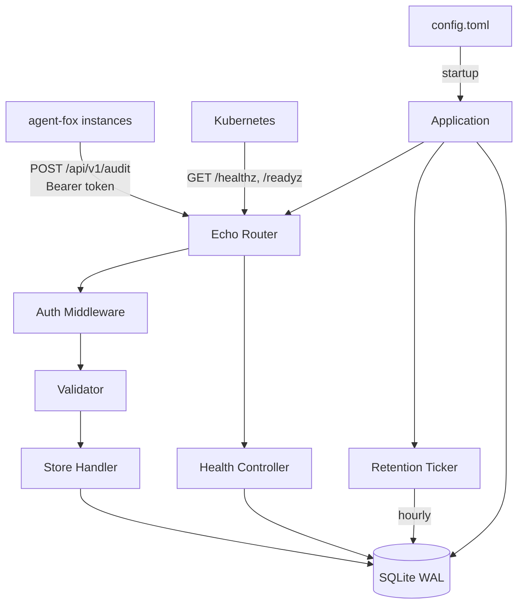
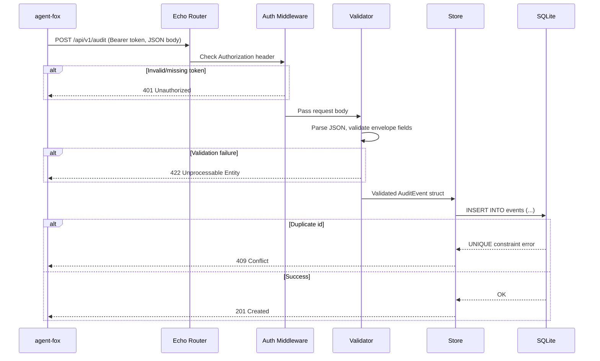

# Design Document: Audit Hub

## Overview

Audit Hub is a single-binary Go service built on the Echo HTTP framework. It
receives agent-fox audit events via a single authenticated endpoint, validates
them against the envelope schema, and persists them in an embedded SQLite
database running in WAL mode. A background goroutine handles time-based data
retention. The service exposes unauthenticated Kubernetes health probes and
performs graceful shutdown on SIGTERM/SIGINT.

## Architecture





### Module Responsibilities

1. **cmd/audit-hub** — Application entry point: parses CLI flags, loads config, wires dependencies, starts server, handles OS signals.
2. **internal/config** — TOML configuration loading, validation, and defaults.
3. **internal/server** — Echo server setup, route registration, middleware wiring, graceful shutdown.
4. **internal/middleware** — Bearer token authentication middleware for Echo.
5. **internal/handler** — HTTP request handler for the audit ingest endpoint.
6. **internal/validator** — Envelope schema validation logic for incoming audit events.
7. **internal/store** — SQLite database initialization (WAL mode, table creation), event insertion, health check query, retention purge.
8. **internal/retention** — Background ticker goroutine that triggers periodic purge via the store.
9. **internal/health** — Health and readiness endpoint handlers.
10. **internal/model** — Data types: `AuditEvent` struct, `Config` struct.

## Execution Paths

### Path 1: Audit event ingestion (happy path)

1. `cmd/audit-hub/main.go: main()` — starts Echo server
2. `internal/server/server.go: New(cfg, store)` → `*Server` — creates Echo instance, registers routes and middleware
3. `internal/middleware/auth.go: BearerAuth(token)` → `echo.MiddlewareFunc` — validates Authorization header
4. `internal/handler/audit.go: AuditHandler.Ingest(c)` → `error` — reads and binds request body
5. `internal/validator/validator.go: Validate(event)` → `error` — validates envelope fields
6. `internal/store/store.go: Store.InsertEvent(ctx, event)` → `error` — inserts row into SQLite
7. Side effect: event persisted in SQLite, HTTP 201 returned to caller

### Path 2: Health check (readiness)

1. `cmd/audit-hub/main.go: main()` — starts Echo server
2. `internal/server/server.go: New(cfg, store)` → `*Server` — registers health routes (no auth middleware)
3. `internal/health/health.go: HealthHandler.Readyz(c)` → `error` — handles GET /readyz
4. `internal/store/store.go: Store.Ping(ctx)` → `error` — executes `SELECT 1` against SQLite
5. Side effect: HTTP 200 or 503 returned to caller

### Path 3: Data retention purge

1. `cmd/audit-hub/main.go: main()` — starts retention ticker
2. `internal/retention/retention.go: StartRetention(ctx, store, interval, retentionDays)` — launches goroutine with hourly ticker
3. `internal/store/store.go: Store.PurgeOlderThan(ctx, cutoff)` → `(int64, error)` — deletes expired rows, returns count
4. Side effect: expired rows deleted from SQLite, count logged

### Path 4: Graceful shutdown

1. `cmd/audit-hub/main.go: main()` — listens for OS signals
2. OS delivers SIGTERM or SIGINT
3. `cmd/audit-hub/main.go: main()` — cancels context, triggers Echo shutdown
4. `internal/server/server.go: Server.Shutdown(ctx)` → `error` — drains in-flight requests with 15s timeout
5. `internal/retention/retention.go: StopRetention()` — stops ticker goroutine via context cancellation
6. `internal/store/store.go: Store.Close()` → `error` — closes SQLite connection
7. Side effect: process exits with code 0

### Path 5: Configuration loading

1. `cmd/audit-hub/main.go: main()` — reads --config flag
2. `internal/config/config.go: Load(path)` → `(*Config, error)` — reads TOML file, applies defaults, validates
3. Side effect: `Config` struct returned to main for dependency wiring; exits with non-zero code on validation error

## Components and Interfaces

### CLI

```
audit-hub [--config <path>]

Flags:
  --config string   Path to TOML configuration file (default "config.toml")
```

### Core Data Types

```go
// internal/model/event.go

type AuditEvent struct {
    ID        string          `json:"id"`
    Timestamp string          `json:"timestamp"`
    RunID     string          `json:"run_id"`
    EventType string          `json:"event_type"`
    NodeID    string          `json:"node_id"`
    SessionID string          `json:"session_id"`
    Archetype string          `json:"archetype"`
    Severity  string          `json:"severity"`
    Payload   json.RawMessage `json:"payload"`
}
```

```go
// internal/config/config.go

type Config struct {
    Server   ServerConfig   `toml:"server"`
    Database DatabaseConfig `toml:"database"`
    Auth     AuthConfig     `toml:"auth"`
    Logging  LoggingConfig  `toml:"logging"`
}

type ServerConfig struct {
    Port        int    `toml:"port"`
    BindAddress string `toml:"bind_address"`
}

type DatabaseConfig struct {
    Path          string `toml:"path"`
    RetentionDays int    `toml:"retention_days"`
}

type AuthConfig struct {
    BearerToken string `toml:"bearer_token"`
}

type LoggingConfig struct {
    Level string `toml:"level"`
}
```

### Module Interfaces

```go
// internal/store/store.go

type Store struct { /* contains *sql.DB */ }

func New(dbPath string) (*Store, error)
func (s *Store) InsertEvent(ctx context.Context, event model.AuditEvent) error
func (s *Store) Ping(ctx context.Context) error
func (s *Store) PurgeOlderThan(ctx context.Context, cutoff time.Time) (int64, error)
func (s *Store) Close() error
```

```go
// internal/validator/validator.go

func Validate(event model.AuditEvent) error
```

```go
// internal/middleware/auth.go

func BearerAuth(token string) echo.MiddlewareFunc
```

```go
// internal/handler/audit.go

type AuditHandler struct { store *store.Store }

func NewAuditHandler(store *store.Store) *AuditHandler
func (h *AuditHandler) Ingest(c echo.Context) error
```

```go
// internal/health/health.go

type HealthHandler struct { store *store.Store }

func NewHealthHandler(store *store.Store) *HealthHandler
func (h *HealthHandler) Healthz(c echo.Context) error
func (h *HealthHandler) Readyz(c echo.Context) error
```

```go
// internal/retention/retention.go

func StartRetention(ctx context.Context, store *store.Store, interval time.Duration, retentionDays int)
```

```go
// internal/server/server.go

type Server struct { /* contains *echo.Echo */ }

func New(cfg *config.Config, store *store.Store) *Server
func (s *Server) Start() error
func (s *Server) Shutdown(ctx context.Context) error
```

```go
// internal/config/config.go

func Load(path string) (*Config, error)
```

## Data Models

### SQLite Schema

```sql
CREATE TABLE IF NOT EXISTS events (
    id          TEXT PRIMARY KEY,
    timestamp   TEXT NOT NULL,
    run_id      TEXT NOT NULL,
    event_type  TEXT NOT NULL,
    node_id     TEXT NOT NULL DEFAULT '',
    session_id  TEXT NOT NULL DEFAULT '',
    archetype   TEXT NOT NULL DEFAULT '',
    severity    TEXT NOT NULL,
    payload     TEXT NOT NULL,
    received_at TEXT NOT NULL
);

CREATE INDEX IF NOT EXISTS idx_events_timestamp ON events(timestamp);
CREATE INDEX IF NOT EXISTS idx_events_run_id ON events(run_id);
CREATE INDEX IF NOT EXISTS idx_events_event_type ON events(event_type);
CREATE INDEX IF NOT EXISTS idx_events_severity ON events(severity);
```

### TOML Configuration Example

```toml
[server]
port = 8080
bind_address = "0.0.0.0"

[database]
path = "./data/audit.db"
retention_days = 30

[auth]
bearer_token = "your-secret-token-here"

[logging]
level = "info"
```

## Operational Readiness

### Observability

- **Structured logs**: All log output is JSON via logrus, suitable for
  ingestion by Kubernetes log aggregators (Fluentd, Loki, etc.).
- **Request logging**: Every HTTP request is logged with method, path, status
  code, and duration.
- **Retention logging**: Each purge cycle logs the number of deleted events.

### Rollout / Rollback

- Single binary deployment; rollback is a container image revert.
- Database schema is forward-only (single table, additive changes in future
  versions).
- Configuration changes require a pod restart (no hot-reload in v0.0.1).

### Migration / Compatibility

- v0.0.1 creates the schema on first run; no migration framework needed yet.
- Future schema changes should use a migration library (e.g., golang-migrate).

## Correctness Properties

### Property 1: Schema Validation Completeness

*For any* JSON object submitted to `POST /api/v1/audit`, the service SHALL
accept the event if and only if all required envelope fields (`id`,
`timestamp`, `run_id`, `event_type`, `severity`, `payload`) are present and
conform to their type constraints (non-empty strings, valid ISO 8601 with
timezone, dot-separated event type, valid severity enum, JSON object payload).

**Validates: Requirements 01-REQ-2.1, 01-REQ-2.2, 01-REQ-2.3, 01-REQ-2.4**

### Property 2: Storage Integrity

*For any* audit event that passes validation and receives HTTP 201, the event
SHALL be retrievable from the SQLite database with all envelope metadata fields
matching the submitted values exactly, and the `payload` field matching the
original JSON object.

**Validates: Requirements 01-REQ-1.1, 01-REQ-3.1**

### Property 3: Authentication Enforcement

*For any* HTTP request to `/api/v1/audit`, the service SHALL return HTTP 401
if the Bearer token is missing, malformed, or does not match the configured
value, and SHALL only proceed to validation and storage when the token matches.

**Validates: Requirements 01-REQ-4.1, 01-REQ-4.2, 01-REQ-4.3**

### Property 4: Idempotent Rejection of Duplicates

*For any* audit event with an `id` already present in the database, the
service SHALL return HTTP 409 Conflict without modifying the existing stored
event.

**Validates: Requirements 01-REQ-3.E1**

### Property 5: Retention Correctness

*For any* event stored in the database, after the retention process runs, the
event SHALL be present if its `timestamp` is within the retention period, and
SHALL be absent if its `timestamp` is older than the retention period.

**Validates: Requirements 01-REQ-7.1, 01-REQ-7.3**

### Property 6: Health Probe Independence

*For any* HTTP request to `/healthz` or `/readyz`, the service SHALL return a
response regardless of the presence or absence of an Authorization header.
`/healthz` SHALL always return 200 when the process is running. `/readyz`
SHALL return 200 if and only if the database is accessible.

**Validates: Requirements 01-REQ-5.1, 01-REQ-5.2, 01-REQ-5.3**

### Property 7: Configuration Validation Completeness

*For any* TOML configuration file, the service SHALL start successfully if and
only if the file is syntactically valid TOML, contains a non-empty
`auth.bearer_token`, and all numeric fields are within valid ranges
(`server.port` in 1–65535, `database.retention_days` > 0).

**Validates: Requirements 01-REQ-6.1, 01-REQ-6.2, 01-REQ-6.3, 01-REQ-6.4, 01-REQ-4.5, 01-REQ-6.E1, 01-REQ-6.E2**

### Property 8: Concurrent Write Safety

*For any* set of N valid audit events submitted concurrently, the service SHALL
store exactly N events in the database (assuming no duplicate IDs) without
returning `SQLITE_BUSY` errors under normal load.

**Validates: Requirements 01-REQ-10.1, 01-REQ-10.2**

### Property 9: Graceful Shutdown Completeness

*For any* in-flight request at the time SIGTERM is received, the service SHALL
either complete the request and return a response, or terminate the connection
after the 15-second timeout. In both cases, the database connection SHALL be
closed before the process exits.

**Validates: Requirements 01-REQ-8.1, 01-REQ-8.2**

## Error Handling

| Error Condition | Behavior | Requirement |
|----------------|----------|-------------|
| Empty request body | HTTP 400 Bad Request | 01-REQ-1.E1 |
| Request body exceeds 1 MB | HTTP 413 Payload Too Large | 01-REQ-1.E2 |
| Invalid JSON body | HTTP 400 Bad Request | 01-REQ-1.E3 |
| Wrong content type | HTTP 415 Unsupported Media Type | 01-REQ-1.2 |
| Missing/invalid envelope fields | HTTP 422 Unprocessable Entity | 01-REQ-2.4 |
| Timestamp without timezone | HTTP 422 Unprocessable Entity | 01-REQ-2.E1 |
| Payload is null | HTTP 422 Unprocessable Entity | 01-REQ-2.E2 |
| Event type without dot | HTTP 422 Unprocessable Entity | 01-REQ-2.E3 |
| Duplicate event ID | HTTP 409 Conflict | 01-REQ-3.E1 |
| Database open failure | Log error, exit non-zero | 01-REQ-3.E2 |
| Missing/empty bearer token in config | Log error, exit non-zero | 01-REQ-4.5 |
| Missing Authorization header | HTTP 401 Unauthorized | 01-REQ-4.2 |
| Invalid bearer token | HTTP 401 Unauthorized | 01-REQ-4.3 |
| Database unreachable (readyz) | HTTP 503 Service Unavailable | 01-REQ-5.E1 |
| Config file not found | Log error, exit non-zero | 01-REQ-6.3 |
| Invalid TOML syntax | Log parse error, exit non-zero | 01-REQ-6.4 |
| Invalid retention_days (<= 0) | Log warning, use default 30 | 01-REQ-6.E1 |
| Invalid port range | Log error, exit non-zero | 01-REQ-6.E2 |
| Retention purge DB error | Log error, retry next cycle | 01-REQ-7.E1 |
| Invalid logging.level value | Log warning, default to info | 01-REQ-9.E1 |
| SQLite busy timeout exhausted | HTTP 503, log at warning | 01-REQ-10.E1 |
| Shutdown timeout (15s) exceeded | Force-close connections, exit 0 | 01-REQ-8.2 |
| Second SIGTERM during shutdown | Exit immediately with code 1 | 01-REQ-8.E1 |

## Technology Stack

| Component | Technology | Version/Notes |
|-----------|-----------|---------------|
| Language | Go | 1.22+ |
| HTTP framework | Echo | v4 |
| Database | SQLite | via `modernc.org/sqlite` (pure Go, CGo-free) |
| Configuration | TOML | via `github.com/BurntSushi/toml` |
| Logging | logrus | `github.com/sirupsen/logrus` |
| Testing | Go stdlib | `testing`, `net/http/httptest` |
| Property testing | rapid | `pgregory.net/rapid` |
| Build | Go modules | `go.mod` |
| Container | Docker | Multi-stage build |

## Definition of Done

A task group is complete when ALL of the following are true:

1. All subtasks within the group are checked off (`[x]`)
2. All spec tests (`test_spec.md` entries) for the task group pass
3. All property tests for the task group pass
4. All previously passing tests still pass (no regressions)
5. No linter warnings or errors introduced
6. Code is committed on a feature branch and merged into `develop`
7. Feature branch is merged back to `develop`
8. `tasks.md` checkboxes are updated to reflect completion

## Testing Strategy

- **Unit tests**: Each module (validator, store, config, middleware, handler,
  health, retention) has dedicated unit tests covering happy path and error
  paths. Use `httptest.NewRecorder` for handler tests and in-memory SQLite for
  store tests.
- **Property tests**: Use `pgregory.net/rapid` for property-based testing of
  validation logic, storage integrity, and concurrent write safety.
- **Integration tests**: End-to-end tests that start the Echo server, send
  HTTP requests, and verify database state. Use in-memory SQLite to avoid
  filesystem dependencies.
- **Smoke tests**: Full-path tests from HTTP request through middleware,
  validation, storage, and back to response.
